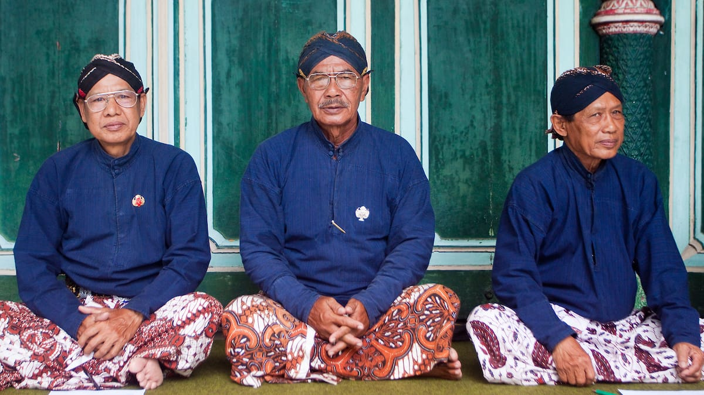
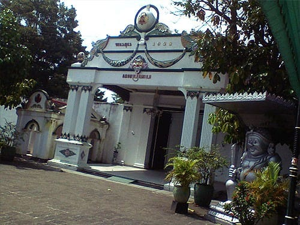
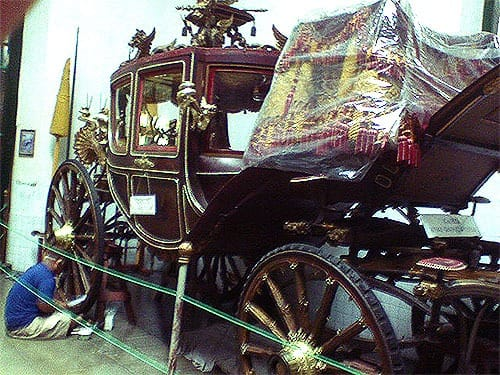
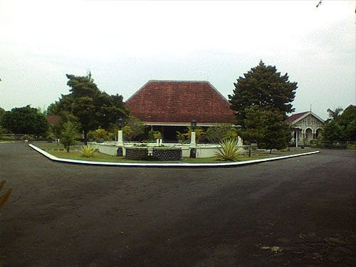
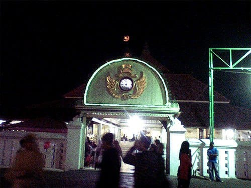

Matahari tampak masih malu-malu. Ia bersembunyi dibalik iring-iringan awan. Cuaca yang menyenangkan untuk berjalan-jalan di Kota Jogja. Jalan-jalan mulai ramai oleh hiruk pikuk kendaraan dan orang-orang yang berlalu lalang. Tampak segerombol anak sekolah berjalan beriringan, mereka tertawa melontarkan guyonan. Seorang siswi bersemangat mengayuh sepedanya, meliuk-liuk di tengah lautan sepeda motor. Sekelompok turis asing tengah sibuk mengabadikan suasana kota dengan kameranya. Kehidupan Kota Jogja kembali berdetak.

Selepas mengagumi arsitektur deretan bangunan tua di Kilometer Nol, aku beranjak ke arah Selatan. Menyusuri Jalan Trikora, aku pun disambut oleh lapangnya Alun-Alun Utara Kraton. Lapangan yang diselimuti pasir ini tampak tandus dan berdebu, sesekali rumput liar ditemui tumbuh di pinggir-pinggir lapangan. Beberapa remaja tampak asyik bermain bola, mengacuhkan debu-debu yang beterbangan. Di seberang alun-alun berdiri kokoh bangunan Kraton. Aku pun meneruskan langkahku menuju Kraton.

## Kraton Yogyakarta

Semenjak perjanjian Giyanti, Belanda sukses memecah belah Kerajaan Mataram menjadi dua bagian, Kasunanan Surakarta dan Kesultanan Yogyakarta. Kraton Yogyakarta yang dibangun sekira abad ke-18, tidak lama setelah perjanjian Giyanti ini, menjadi bukti dan saksi kejayaan Kesultanan Ngayogyakarta Hadiningrat.

Kraton yang hingga hari ini masih menjadi tempat tinggal Sultan dan keluarganya menjadi ruh dan pusat kebudayaan Yogyakarta. Setiap hari disajikan berbagai kesenian tradisional seperti wayang kulit, wayang orang, wayang golek, tari-tarian tradisional, hingga macapat yang ditembangkan oleh abdi dalem. Selain itu pengunjung juga dapat melihat berbagai koleksi alat musik, pakaian, foto-foto, sampai senjata milik Kraton yang dipajang di sini.

## Museum Kareta Kraton

Tidak jauh dari Kraton, terdapat Museum Kareta Kraton. Di museum ini dipajang berbagai kereta kencana milik Kraton. Kereta Kencana dari berbagai generasi sultan ini memiliki bentuk yang unik dan megah. Jauh lebih megah daripada kereta kencana yang pernah aku lihat dalam film *Cinderella*. Kereta-kereta ini masih sering dipakai dalam acara-acara Kraton.

## Tamansari

Beranjak ke Selatan Kraton, terdapat komplek Tamansari. Komplek Tamansari ini dahulunya menjadi salah satu pesanggrahan Sultan Yogyakarta. Di Tamansari ini terdapat Sumur Gemuling yang dahulu berfungsi sebagai Mesjid. Dalam komplek Tamansari juga terdapat Pesanggrahan Umbul Binangun yang digunakan sebagai tempat pemandian Sultan dan keluarganya.

## Pura Pakualaman

Tidak hanya sampai disitu, jejak sejarah dan budaya Kesultanan Ngayogyakarta bisa kita lihat di Pura Pakualaman. Pura Pakualaman merupakan istana kadipaten yang menjadi tempat tinggal dari Sri Paduka Paku Alam. Ketika kekuasaan Belanda jatuh ke tangan Inggris, Gubernur Jendral Rafles mengangkat dan membagi sebagian wilayah Kesultanan kepada Paku Alam. Setelah merdeka, kini Sri Paduka Paku Alam menjadi wakil gubernur D.I. Yogyakarta mendampingi Sri Sultan.

## Mesjid Gedhe Kauman

Perjalananku menengok sejarah Kesultanan Yogyakarta berakhir di Mesjid Gedhe Kauman atau Mesjid Agung. Mesjid ini terletak tidak jauh dari alun-alun Utara Kraton. Mesjid yang merupakan bagian dari komplek Kampung Kauman ini menjadi pusat kegiatan keagamaan Kraton. Desain arsitekturnya yang kental akan budaya jawa mengundang decak kagum bagi siapapun yang mengunjunginya.

Perjalanan kali ini seolah-olah membawaku pada sebuah lorong waktu. Menjajaki kembali sejarah lampau yang mengurat di kota ini.

Foto cover dari [Flickr](https://www.flickr.com/photos/peternijenhuis/4303781542/) oleh [Peter Nijenhuis](https://www.flickr.com/photos/peternijenhuis/).

