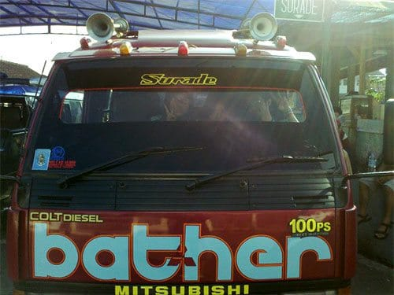
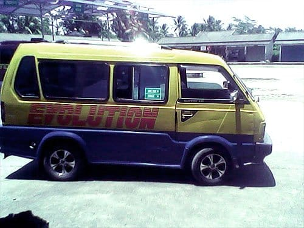
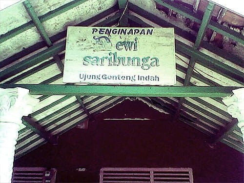
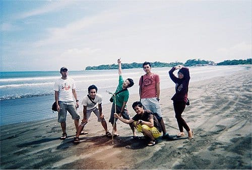

Tubuh kami terasa lebih bugar setelah semalam menginap di kediaman kerabat Mas Febri di Kampung Gandasoli, Sukabumi. Di pagi hari kami melanjutkan perjalanan kami yang tertunda ke pesisir Selatan Sukabumi. Dari Kampung Gandasoli kami menyewa angkot untuk mengantarkan kami ke Terminal Lembursitu. Sempat terjadi ketegangan antara sopir angkot kami yang masih muda dengan sopir angkot lain yang lebih senior. Alasannya tidak lain karena berebut penumpang. Lagi-lagi masalah perut gumamku.

Terminal Lembursitu merupakan terminal yang berada di pinggiran Kota Sukabumi. Dari terminal ini kami naik Elf jurusan Surade. Dari Terminal Lembursitu menuju Surade memakan waktu hampir 4 jam perjalanan. Akses jalannya terkadang rusak dan berbatu, terkadang mulus berlapis aspal. Jalanannya berliku naik-turun bukit. Namun tak perlu khawatir, karena sepanjang perjalanan kita akan dimanjakan oleh rapatnya perkebunan karet dan hijaunya hamparan perkebunan teh.

Selepas adzan zuhur, kami akhirnya sampai di daerah Surade. Sebetulnya kami bisa langsung turun di pertigaan Mesjid Surade, lalu menyambungnya dengan angkot warna merah ke Ujung Genteng. Namun kami lebih memilih untuk berhenti di terminal Surade untuk berbelanja makanan dan minuman.

Terminal Surade tidak seperti yang aku bayangkan. Terminal ini sangat sepi. Benar-benar senyap, seolah tidak ada kehidupan. Sangat kontras dengan keadaan terminal pada umumnya. Tidak ada kendaraan umum yang lalu-lalang, hanya ada beberapa Elf yang terparkir tanpa sopir. Warung-warung tampak tutup. Hanya dua warung kecil di pintu keluar terminal yang masih menjajakan dagangannya. Selain kami, calon penumpang lain tidak tampak sama sekali, hanya ada sekelompok lelaki paruh baya yang tengah asyik bermain catur di bawah *shelter* terminal.

Dari Terminal Surade kami menyewa sebuah angkot milik Pak Budi. Beliau pemilik salah satu warung di terminal yang sepi ini. Dengan harga 70 ribu rupiah, kami diantar Pak Budi hingga ke Ujung Genteng. Jalan menuju Ujung Genteng sudah beraspal namun kondisinya rusak parah. Lubang-lubang menganga di sepanjang jalan Surade—Ujung Genteng. Pak Budi bercerita kalau tahun lalu jalan di sini masih cukup mulus. Namun semenjak liburan tahun baru kemarin, jalan di sini langsung rusak penuh lubang. Saat tahun baru wisatawan ke Ujung Genteng tumpah ruah, ujarnya. Motor, mobil, hingga bis membludak di ruas jalan ini, alhasil kini kondisinya memprihatinkan. Sambil bercerita, Pak Budi dengan cekatan memainkan stir mobilnya. Meliuk menghindari lubang-lubang di sepanjang jalan.

Di sepanjang perjalanan ke Ujung Genteng kami disuguhi deretan pohon-pohon kelapa yang menjulang tinggi. Kata Pak Budi, perkebunan kelapa yang luas ini milik salah satu mantan pejabat tinggi negara. Pun begitu warga masih diperbolehkan untuk memanfaatkan air nira dari bunga kelapanya. Air nira dari bunga kelapa ini ditampung dan dimanfaatkan warga untuk membuat gula merah. Tak heran di tengah-tengah rimba kelapa banyak berdiri saung-saung dari bilik bambu yang dijadikan tempat mengolah gula tersebut. Sementara itu dari balik rapatnya pohon-pohon kelapa, sesekali kami bisa melihat hamparan samudera yang membiru. Pemandangan yang sangat cantik.

Selain deretan kebun kelapa, sesekali kami melihat padang rumput yang luas. Kambing dan sapi tampak berkeliaran di padang itu. Hewan-hewan ternak ini sengaja dilepaskan pemiliknya untuk mencari makan sendiri. Terlihat juga sebuah kolam semen besar tak jauh dari bibir pantai. Dari cerita Pak Budi, akhirnya aku tahu kalau kolam itu dulunya dijadikan tambak udang. Dahulu tambak udang tersebut produksinya melimpah, bahkan hasil tambaknya sampai di ekspor. Namun entah kenapa kini tambak itu terbengkalai begitu saja.

Ada kisah Pak Budi yang sempat membuat bulu kudukku bergidik. Saat melewati sebuah daerah dengan pepohonan kayu yang rindang di kiri jalan, Pak Budi menuturkan bahwa di daerah ini sering ditemukan mayat korban pembunuhan. Korban-korban tersebut sengaja dibuang jauh kesini untuk menghilangkan jejak. Pak Budi pun menambahkan, kalau hingga sekarang di daerah ini kerap terjadi perampokan. Oleh karenanya tidak disarankan untuk menuju Ujung Genteng jika malam sudah tiba.

Satu jam perjalanan, akhirnya kami pun sampai di Ujung Genteng. Kami berhenti di Penginapan Dewi Sari Bunga. Beres menyimpan tas, kami langsung menghambur ke luar penginapan. Mencari pantai!

Kami berjalan meniti bukit kecil yang landai di belakang penginapan. Terdengar ombak berdebur di baliknya. Benar saja dugaan kami, ada sebuah pantai yang tersembunyi di balik bukit-bukit kecil yang hijau oleh rerumputan ini. Pantainya sangat luas dan melengkung panjang, seperti membentuk sebuah busur. Meski menghadap langsung ke Samudera Hindia, ombak di pantai ini sangat kecil dan bersahabat. Buih ombaknya tampak kecoklatan, hal ini disebabkan butiran pasir pantainya yang sangat halus, sehingga mudah teraduk bersama gulungan ombak.

Suasana pantai sangat sepi. Kala itu tidak ada pengunjung lain di pantai selain kami, rasanya pantai milik sendiri. Benar-benar surga yang tersembunyi!

Foto cover dari [Unsplash](https://unsplash.com/photos/3V8gdLbwDOI) oleh [Ameen Fahmy](https://unsplash.com/@ameenfahmy_).
