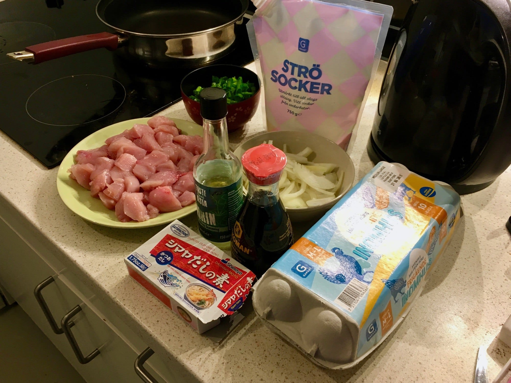
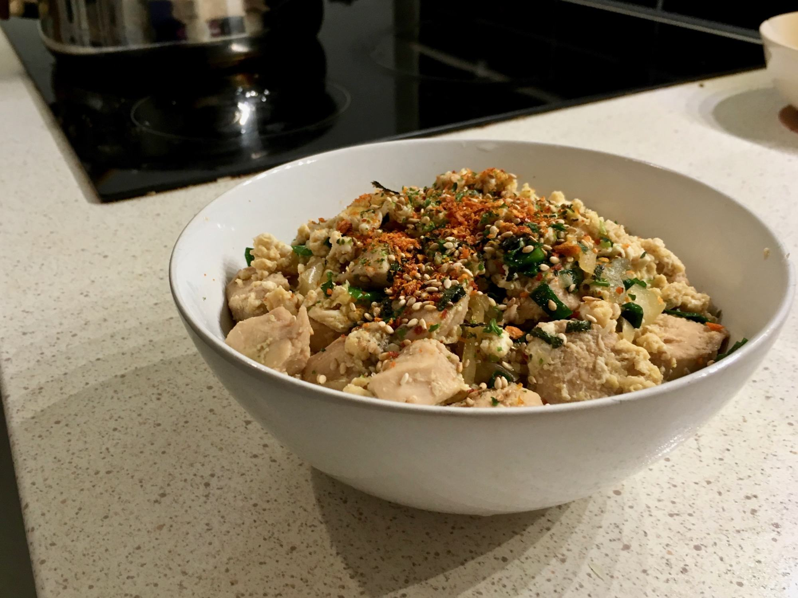

Untuk makan malam kali ini saya memasak Oyakodon—*donburi* atau nasi dengan lauk berupa potongan ayam, telur, dan daun bawang. Secara harfiah Oyakodon dapat diartikan "ibu dan anak dalam mangkuk". Tentu penamaan ini merujuk pada bahan ayam sebagai ibu dan telur sebagai anaknya.

Saya sendiri sebetulnya baru mengenal Oyakodon tadi pagi, lewat sebuah video singkat di YouTube tentang restoran Tamahide di Tokyo, Jepang. Restoran yang berdiri sejak tahun 1760 ini terkenal akan sajian *shamo-nabe*—sajian *hot pot* dengan lauk ayam khas Utara Kanto. Restoran ini juga yang menjadi tempat lahirnya Oyakodon.

  <iframe width="560" height="315" src="https://www.youtube-nocookie.com/embed/A_ehH20Nv_A" frameborder="0" allow="accelerometer; autoplay; encrypted-media; gyroscope; picture-in-picture" allowfullscreen></iframe>

Sejarah Oyakodon bermula dari tahun 1887, saat seorang pengunjung menyarankan pengelola restoran Tamahide agar memanfaatkan sisa ayam dan kaldu dari sajian *shamo-nabe*-nya. Empat tahun berselang, menu Oyakodon lahir dari ide Toku Yamada—istri juru masak dari generasi ke-5.

Mulanya restoran Tamahide hanya menjual menu Oyakodon untuk dibawa pulang atau diantarkan ke pelanggan langsung; bukan untuk dimakan di tempat. Pun begitu menu ayam-telur ini kian populer dan meluas ke daearah-daerah di sekitarnya. Dan kini Oyakodon pun terkenal ke seantero penjuru Jepang.

## Bahan-Bahan yang Diperlukan

Cukup mudah untuk menyiapkan Oyakodon, bahan-bahan utama yang diperlukan pun terbilang sederhana. Untuk satu porsi Oyakodon diperlukan:

* 1 paha ayam—atau bagian yang lain—dipotong kecil-kecil;
* 1 atau 2 butir telur ayam yang dikocok (cukup dikocok sebentar sehingga kuning dan putih telur tidak benar-benar tercampur);
* 1/2 potong bawang bombay diiris memanjang; dan
* Irisan daun bawang untuk taburannya.

Sementara untuk kuahnya, kita perlu mencapurkan bahan-bahan berikut:

* 1/4 cup *dashi*;
* 1 sendok makan kecap jepang;
* 1/2 sendok makan mirin; dan
* 1/2 sendok makan gula.

## Cara Memasak Oyakodon

Langkah untuk memasaknya pun tidak merepotkan:

1. Didihkan campuran kuah Oyakodon;
2. Saat kuah mendidih, masukan irisan bawang bombay dan biarkan kurang-lebih 1 menit;
3. Gunakan panas sedang dan masukan potongan ayam, masak hingga matang;
4. Kemudian tuangkan hasil kocokan telur ayam, masak hingga telur setengah matang (bila ragu dengan kualitas telur, masak hingga benar-benar matang);
5. Angkat dan tuangkan masakan di atas nasi panas. Jangan lupa taburkan potongan daun bawang untuk menambah cita rasa.

