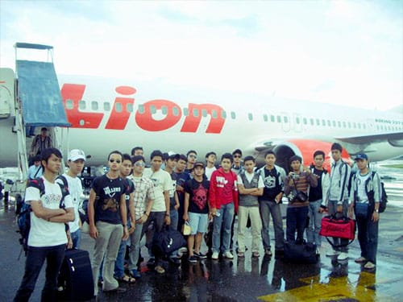

Mataku tak jemu-jemunya menatap ke luar kaca. Hamparan awan yang disiram kemilau sinar mentari benar-benar menghipnotisku. Tanpa terasa waktu berlalu dan pesawat yang kutumpangi mendaratkan roda-rodanya di tanah Borneo. Untuk kali pertama diriku menjejakan kaki di Kalimantan!

Perjalanan ke Kalimantan Selatan bersama pasukan Belitung Merantau merupakan salah satu perjalanan paling seru yang pernah aku alami. Saat itu liburan semester. Para personil Belitung Merantau, jauh-jauh hari sudah merencakan perjalanan panjang sebelum menjalani UAN (Ujian Akhir Nasional). Tercetuslah ide untuk melakukan perjalanan ke Bali, namun kemudian Bos Adzan mengusulkan untuk menghabiskan liburan di kampung halamannya: Kalimantan Selatan! Kontan saja para anggota menyetujui tawaran Bos Adzan. Kami pun melancong seminggu penuh ke Kalimantan Selatan!

Bos Adzan tinggal di Kabupaten Tapin, Kalimantan Selatan. Di sana kami semua benar-benar dijamu dan dimanjakan. Terimakasih Bos Adzan dan keluarga!

Selama di Kalimantan Selatan, kami mengunjungi berbagai tempat. Berburu makanan khas Banjarmasin: ikan patin, ikan tenggiri, dan bebek panggang. Melihat-lihat dan berbelanja cinderamata di perdagangan intan Martapura. Treking menuju Goa Batu Hapu—gua karst yang terletak di Kabupaten Tapin. Menyusuri Sungai Barito dan sarapan di pasar apungnya yang khas. Bertandang ke Pulau Kembang—pulau kecil yang berada di delta Sungai Barito yang dihuni ratusan kera ekor panjang. Menjenguk hewan khas Kalimantan: Bekantan. Sampai memancing di sekitar danau yang dihuni ribuan kelelawarnya.

Foto cover dari [Unsplash](https://unsplash.com/photos/1tvEABhy8io) oleh [Vincent Versluis](https://unsplash.com/@studiovers).

