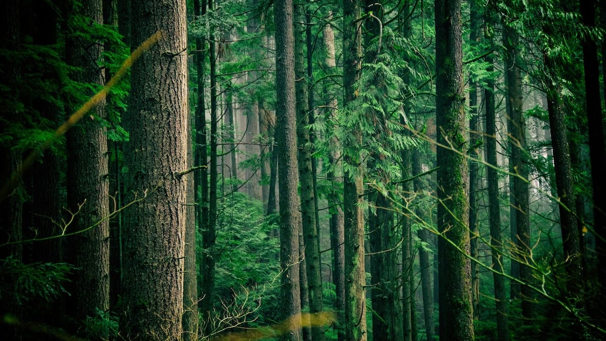

Kami berpikir kalau kami berjalan terus mengikuti bibir pantai di Ujung Genteng, kami bisa mencapai pantai lainnya yang bertetangga: seperti Cibuaya, Pangumbahan, atau Ombak Tujuh. Kalau dilihat dari peta, pantai-pantai ini memang berada dalam satu garis. Namun kenyataan berkata lain.

Kami berjalan menyusuri Pantai Ujung Genteng. Akhirnya kami tahu kalau karakteristik Pantai Ujung Genteng di Kecamatan Ciracap ini sangat unik dan beragam. Di satu bagian, pantai terlindungi oleh bukit-bukit kecil yang hijau oleh rerumputan. Pasir pantainya berwarna coklat dan sangat halus. Di bagian ini ombak bergulung kecil. Warna airnya terlihat keruh karena teraduk bersama pasir pantai yang sangat halus.

Di bagian lain, bukit yang hijau berganti menjadi hutan dataran rendah yang lebat. Pantai di bagian inipun tidak berombak, hanya terdapat riak-riak kecil. Pasir pantai di bagian ini lebih didominasi oleh pecahan-pecahan karang yang kasar.

Di bagian pantai yang penuh dengan pecahan karang itu, kami menemukan ular air yang tengah tetirah di atas batuan karang. Warnanya belang, hitam dan putih berselang. Kami sempat merasa waswas, karena di bagian pantai ini kami sering menemukan jejak-jejak bekas ular. Kita harus berhati-hati jika bermain air di daerah ini, mengingat bisa ular air yang tergolong mematikan.

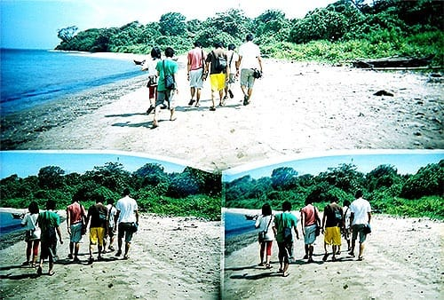

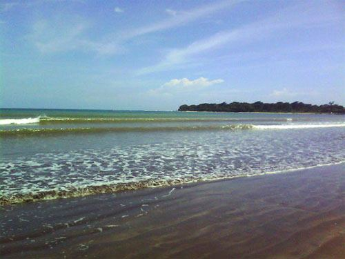

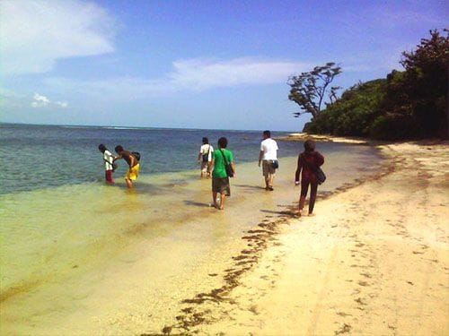

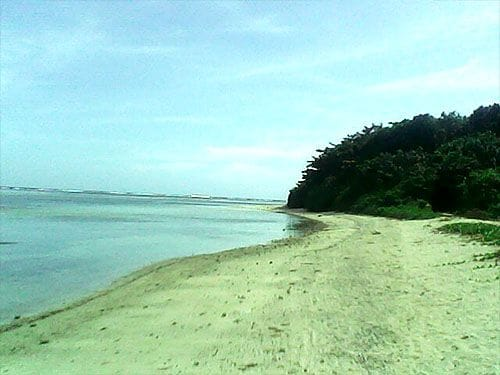

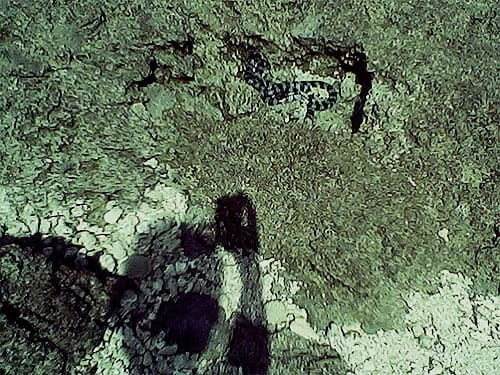

Lepas dari pantai yang dipenuhi pecahan batu karang, kami menemui pantai dengan pasirnya yang berwarna putih. Airnya sangat tenang dan berwarna biru jernih. Pantai ini pun dikelilingi hutan lebat di tepiannya. Sesekali ditemui juga pohon bakau yang tumbuh berkelompok di perairannya yang dangkal.

Kami terus berjalan, menyusuri lekuk bibir pantai Ujung Genteng. Sesekali kami terpaksa harus keluar masuk lebatnya hutan dataran rendah. Sampai akhirnya jalan kami terhalang oleh pepohonan yang tumbuh rapat dan melintang hingga ke tepian pantai. Tidak menyisakan jalan sedikit pun.

Ada sebuah pondokan tak jauh dari akses jalan yang tertutup itu. Kami bertanya kepada seorang bapak yang tinggal di sana. Dugaan kami ternyata salah, kami tidak bisa terus menyusuri garis pantai Ujung Genteng untuk mencapai pantai lainnya. Di daerah ini bibir pantai tidak tersisa sama sekali, tertutupi pepohonan yang rapat.

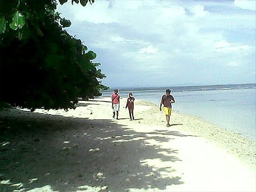

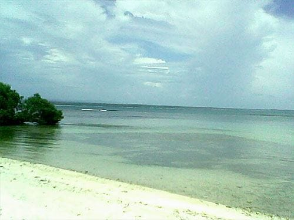

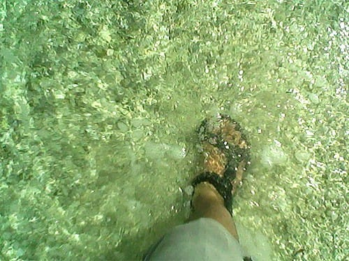

Untuk mencapai pantai lain, kami harus kembali ke jalan utama menuju Ujung Genteng. Di ujung jalan utama menuju Ujung Genteng tersebut terdapat jalan ber-*paving block* yang dapat digunakan sebagai akses menuju pantai lainnya, seperti Cibuaya atau Pangumbahan. Beruntung kami tidak perlu kembali memutar arah. Bapak tersebut menunjukan jalan setapak yang mengarah ke hutan, jalan pintas tersebut akan berakhir di ujung jalan utama Ujung Genteng.

Kami pun mengikuti arahan Bapak itu. Berjalan mengikuti jalan setapak di dalam hutan. Suasananya sangat sepi. Pohon-pohon tumbuh tinggi menjulang. Menaungi kami dari terik matahari.

Setelah cukup lama kami berjalan di dalam hutan, akhirnya kami pun berhasil keluar dari hutan dan kembali ke tepian pantai. Di pantai ini berderet kapal-kapal nelayan. Beberapa tukang tampak sibuk memperbaiki kapal-kapal itu.

Benar saja kata si Bapak, tak jauh dari bibir pantai ada sebuah jalan beraspal, Jalan Ujung Genteng. Di pinggir jalan itu juga ada sebuah Pos TNI-AU yang berdiri. Rupanya hutan yang kami lewati tadi adalah hutan lindung Ujung Genteng, hutan itu biasa digunakan sebagai tempat latihan para tentara. Untuk memasuki kawasan hutan itu sebenarnya harus meminta izin dan didampingi pihak TNI. Tapi untuk kasus yang kami alami, tentu saja sebuah pengecualian. *Wong* kami nyasar.

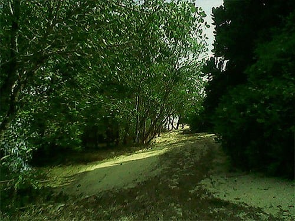

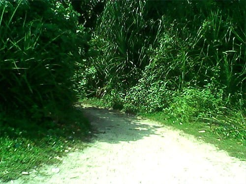

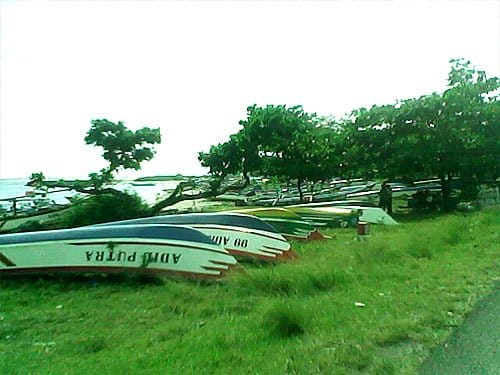

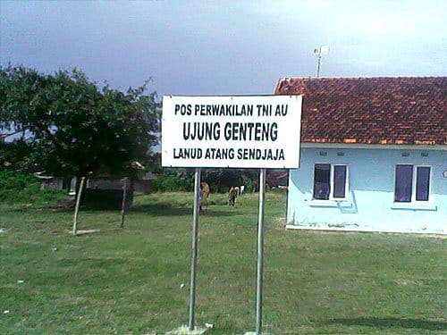

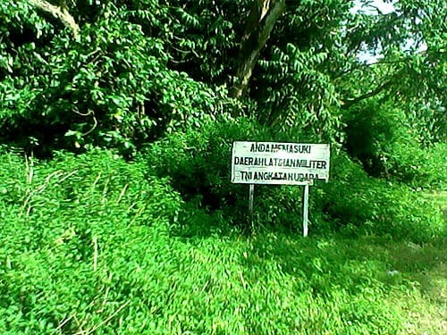

Foto cover dari [Unsplash](https://unsplash.com/photos/xY_6ZENqcfo) oleh [Jachan DeVol](https://unsplash.com/@jachan_devol).
