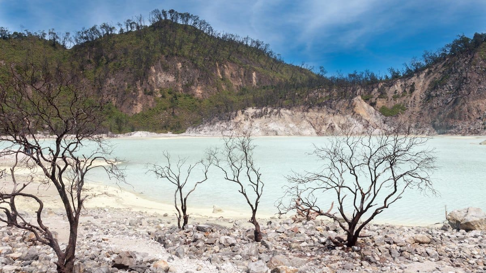
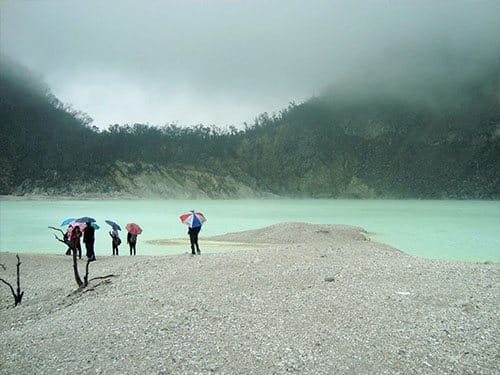
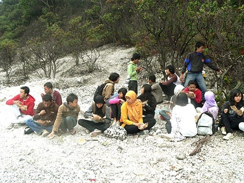
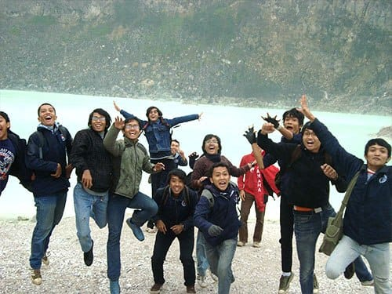
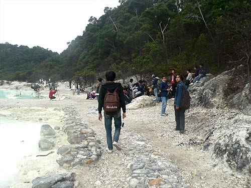

Mesin motor mengerang, meliuk melibas tikungan-tikungan menanjak di daerah Ciwidey. Dinginnya udara pagi pegunungan tidak henti-hentinya menampar kulit wajah. Dingin namun menyegarkan. Pagi itu aku bersama keluarga baruku, *touring* ke Kawah Putih di Ciwidey.

Keluarga baruku ini terdiri dari puluhan mahasiswa Teknik Telekomunikasi. Kala itu aku berstatus sebagai mahasiswa tingkat satu di Politeknik Negeri Bandung. Bersama teman satu angkatan dan beberapa kakak tingkat, kami pergi menikmati panorama dan kesejukan wilayah Bandung Selatan.

Untuk mencapai lokasi Kawah Putih, diperlukan waktu sekira 2,5 sampai 3 jam perjalanan dari Kota Bandung. Topografi jalan yang berkelok-kelok, menanjak, dan menurun, menuntut kondisi kendaraan yang prima. Belum lagi cuaca pegunungan yang terkadang turun hujan lebat, mengharuskan para pengendara ekstra hati-hati. Meski begitu di sepanjang perjalanan kita disuguhi pemandangan yang indah: pesawahan yang berundak-undak, hutan-hutan lebat di kiri dan kanan jalan, hijaunya kebun teh yang berbukit-bukit, dan masih banyak lagi.

Dari gerbang Kawah Putih ke lokasi kawah sendiri masih cukup jauh. Jalan yang rusak dengan kelokan-kelokan tajam serta curam siap menguji ketangkasan anda. Berhati-hatilah jika anda membawa kendaraan pribadi, terlebih bila jalanan licin sehabis diguyur hujan.

Kawah Putih sendiri terletak di Gunung Patuha, lebih dari 2.000 meter di atas permukaan air laut. Letaknya yang tinggi, membuat suhu di kawasan Kawah Putih ini begitu sejuk. Sering pula turun hujan gerimis atau bahkan hujan deras mendadak di kawasan ini. Pengunjung tidak usah khawatir, karena di sekitar bibir kawah sudah dibangun beberapa bangunan untuk berteduh.

Gunung Patuha merupakan gunung api yang masih aktif. Tidak heran bila kita berada di bibir kawah tercium kuat aroma belerang. Di beberapa titik bahkan dilarang untuk didekati, karena keberadaan gas beracun ini. Kawah vulkanik dari Gunung Patuha ini sangat luas dan di kelilingi oleh tebing-tebing cadas yang memukau. Warna air kawahnya sendiri kerap berubah, terkadang hijau toska, terkadang putih susu, bahkan berwarna coklat. Perubahan warna air kawah ini tergantung dari sinar matahari dan kadar belerang di kawah.

Tanah dan bebatuan yang mengitari kawasan ini pun sangat unik. Baik tanah atau bebatuannya berwarna putih, maka tidak mengherankan kawasan kawah ini dinamai Kawah Putih. Karena keeksotisan tanah, air danau, serta tebing cadasnya, Kawah Putih kerap dijadikan lokasi foto *pre-wedding*.

Jika Anda bertandang ke Bandung, tidak ada salahnya jika menyempatkan diri berkunjung ke Kawah Putih. Selain Kawah Putih, masih banyak lokasi wisata menarik lainnya di Bandung Selatan, seperti Kebun Stroberi di Rancabali, bumi perkemahan Rancaupas, Situ Patengan, serta pemandian air panas Ciwalini dan Cimanggu. Yuk ke Bandung!

Foto cover dari [Flickr](https://www.flickr.com/photos/132466470@N05/37632552540/in/photostream/) oleh [Bruno Vanbesien](https://www.flickr.com/photos/132466470@N05/).
