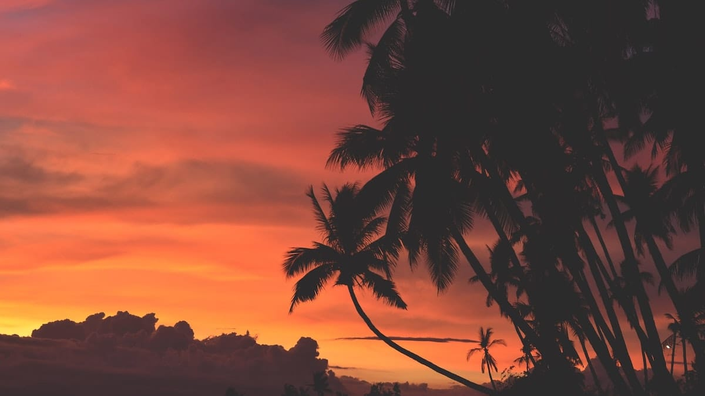
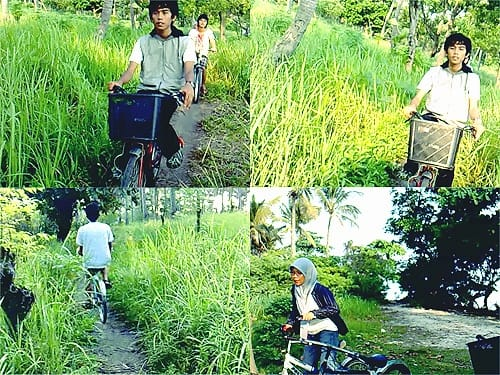
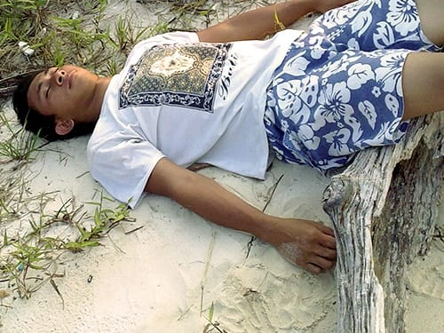
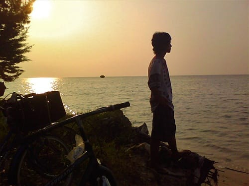
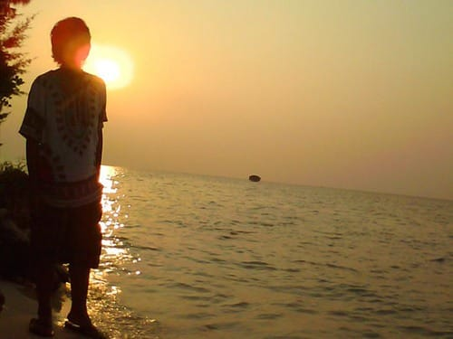
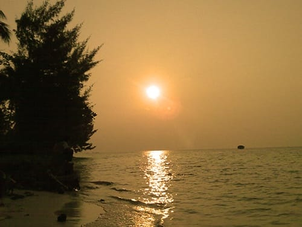

Rantai sepeda beradu ramai dengan gerigi roda. Suara decitnya membuat ngilu gendang telinga. Sadelnya yang tidak terikat kencang berayun turun naik mengikuti berat tubuhku. Soal pengereman tidak perlu kau tanyakan. Nyaris tidak berfungsi! Beruntung masih ada sepasang kaki yang selalu siaga menghentikan laju sepeda yang sudah uzur ini. Satu hal yang bisa dibanggakan dari sepeda usang ini adalah: sebuah keranjang yang bertengger di depannya. Keranjang sayur ini kumanfaatkan untuk menyimpan tas, baju kering, dompet, dan telepon genggam. Praktis.

Sore itu langit sangat cerah. Penuh suka cita aku dan keempat temanku bersepeda menyusuri jalan-jalan ber-*paving block* di Pulau Tidung Besar. Aroma garam masih lekat menempel pada tubuh kami. Sisa *kecipak-kecipuk* di pantai siang tadi.

Sepeda melaju menerobos deretan rumah-rumah di perkampungan nelayan. Rumah-rumahnya sangat sederhana. Sebagian dari tembok semen, sebagian yang lain masih berupa bilik kayu. Rumah-rumah itu berderet di sepanjang bibir pantai. Perahu-perahu kayu tertambat di tepian, bergerak naik-turun mengikuti riak air. Anak-anak juga tampak bermain dengan riang di depan rumahnya, sembari sesekali menelan suapan dari ibu mereka.

Selepas dari perkampungan, kami melewati jalan setapak yang lebarnya hanya cukup untuk satu sepeda. Kami berjalan beriringan di atas jalan tanah yang bergelombang itu. Di kiri dan kanan jalan lautan terhampar luas. Sinar keemasan mentari pun memantul-mantul di permukaannya. Sesaat kumenahan nafas, mengagumi keindahan alam yang tersaji di hadapanku.

Sepeda terus kami pacu menyusuri jalan setapak ke arah Barat. Kami memang berniat untuk menikmati senja di bagian paling Barat pulau ini. Jalan setapak itu membelah semak belukar dan ilalang yang tumbuh dengan liar. Selepas belukar, jalan ini mengarah ke dalam sebuah perkebunan kelapa. Sesekali ditemui saung sederhana di tengah perkebunan. Saung-saung itu sepertinya dijadikan tempat untuk mengolah kelapa menjadi kopra.

Sehabis perkebunan kelapa, jalan setapak ini membawa kami memasuki hutan. Pohon-pohon kayu tumbuh tinggi menjulang. Rindangnya menghalangi sinar mentari untuk masuk. Lautan yang sedari tadi menemani kami, kini seolah hilang tertelan rapatnya pepohonan.

Tidak lama meliuk-liuk di dalam hutan, akhirnya kami pun sampai di ujung paling Barat. Pepohonan masih saja tumbuh rindang di tepi pantainya, sehingga pandangan ke lautan lepas terhalang. Kami terpaksa beranjak, menyusuri bibir pantai, mencari lokasi yang pas untuk menikmati tenggelamnya matahari.

Tidak jauh dari ujung pulau, di sebelah Utara hutan terdapat pantai yang cukup landai. Di pinggirnya tumbuh rerumputan hijau dan pohon-pohon kelapa. Ombaknya pun sangat tenang, bergulung menyisir pasir pantai yang lembut. Di lepas pantai tampak pohon-pohon bakau berkololoni membentuk pulau-pulau kecil di tengah lautan.


{{}}

{{}}

{{}}

{{}}

{{}}

{{}}


Mentari semakin condong ke Barat. Semburat jingganya menyeruak mewarnai langit senja. Aku duduk di atas batang pohon yang sudah mati, membiarkan kakiku dijilati ombak, membiarkan wajahku dibelai tiupan angin. Mentari pun tergelincir, tertelan cakrawala, tenggelam di lautan. Kini petang menjelang, kami pun beranjak pulang.

Foto cover dari [Unsplash](https://unsplash.com/photos/yYSnv8meSMY) oleh [Mike Aunzo](https://unsplash.com/@maunzo).
