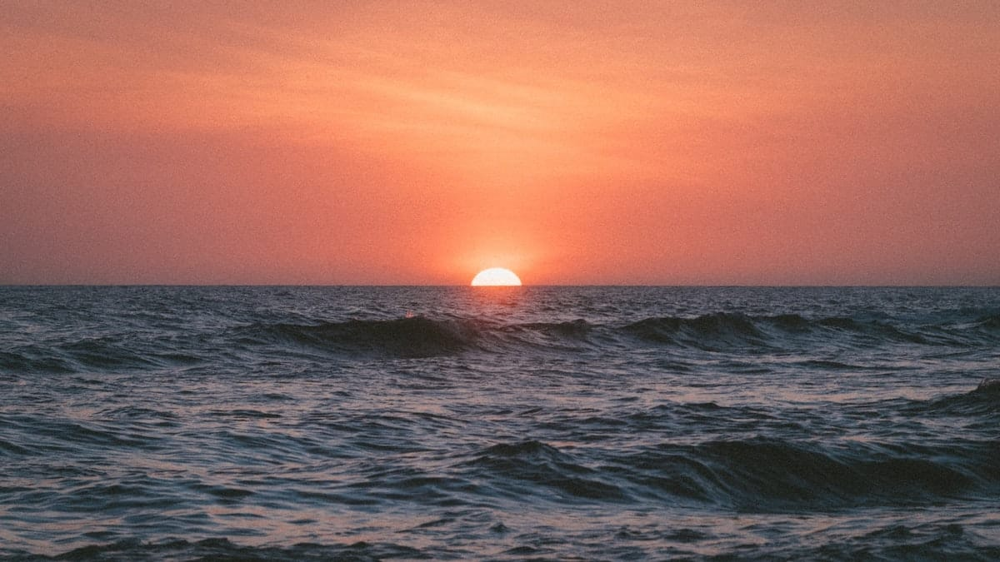
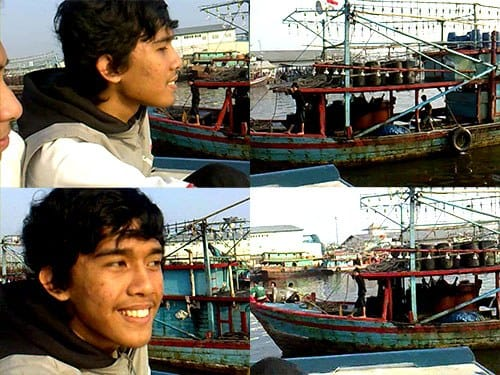

Hari masih sangat pagi, kami sudah beranjak pergi menuju dermaga Muara Angke. Kapal motor yang akan membawa kami ke Pulau Tidung bersandar di balik kapal lainnya di bibir dermaga. Kami harus melompat-lompat dari kapal ke kapal untuk mencapainya.

Jangan membayangkan tentang kapal mewah besar yang terbuat dari logam. Kapal yang kami tumpangi hanyalah kapal nelayan yang disulap menjadi kapal penumpang. Kapal yang terbuat dari kayu ini panjangnya tidak mencapai 15 meter. Kapal ini terdiri dari dua buah dek. Dek bawah yang beralaskan lambung kapal serta dek atas yang merupakan atap dari kapal. Atap kapal ini ditambahi pagar pelindung dan terpal untuk melindungi para penumpang dari sengatan matahari.

Kapal masih sepi. Hanya ada beberapa penumpang yang tampak sibuk menaik-naikan barang kebutuhan pokok seperti beras, minyak, dan gula ke atas kapal. Seorang ibu juga tengah sibuk menghitung rupiah yang ia raup. Banyak sekali uang ibu itu, jutawan gumamku dalam hati.

Bagian atas kapal masih basah oleh embun pagi. Kami tidur-tiduran membayar rasa ngantuk semalam yang tidak tuntas.

Fajar menyingsing, membiaskan warna jingga di lepas Teluk Jakarta. Matahari perlahan menyembul dari batas cakrawala, memberi kehangatan kepada kami. Perahu-perahu nelayan pulang berlabuh ke dermaga, setelah semalaman mengarungi ganasnya ombak untuk menghidupi keluarganya.

Kapal-kapal nelayan yang hilir mudik di Muara Angke unik sekali bentuknya. Kapal-kapal kayu itu didominasi oleh warna biru dari hulu hingga ke buritan. Puluhan tiang tinggi berjejer di pinggir kapal. Di setiap ujung tiang itu tergantung lampu minyak yang berpendar. Lampu-lampu minyak ini berguna untuk memancing gerombolan ikan mendekati kapal, sehingga tangkapan lebih melimpah.

Nelayan-nelayan itu sangat ramah. Sering kali mereka melambaikan tangan sambil menyapa kami yang tengah tiduran di atas kapal. Kami hanya bisa tersenyum dan sesekali membalas lambaian tangan mereka. Ah, bukankah hidup para nelayan sangat keras kawan? Lihat saja wajah dan perawakannya yang dengan jelas mengguratkan kerasnya kehidupan mereka. Nelayan-nelayan itu masih dapat tersenyum penuh kebahagiaan di tengah melambungnya harga solar. Semoga saja tangkapan ikan mereka melimpah.

Mentari semakin pekat menyinari. Hangatnya terasa manis dan menyenangkan. Sinarnya keemasannya ikut memantul dalam riak air, bergoyang-goyang mengikuti gelombang. Sudah jam 7 tepat, tapi kapal enggan juga mangangkat sauhnya dari dermaga ini.

Foto cover dari [Unsplash](https://unsplash.com/photos/11Sw1SVPPKo) oleh [Jakob Owens](https://unsplash.com/@jakobowens1).
