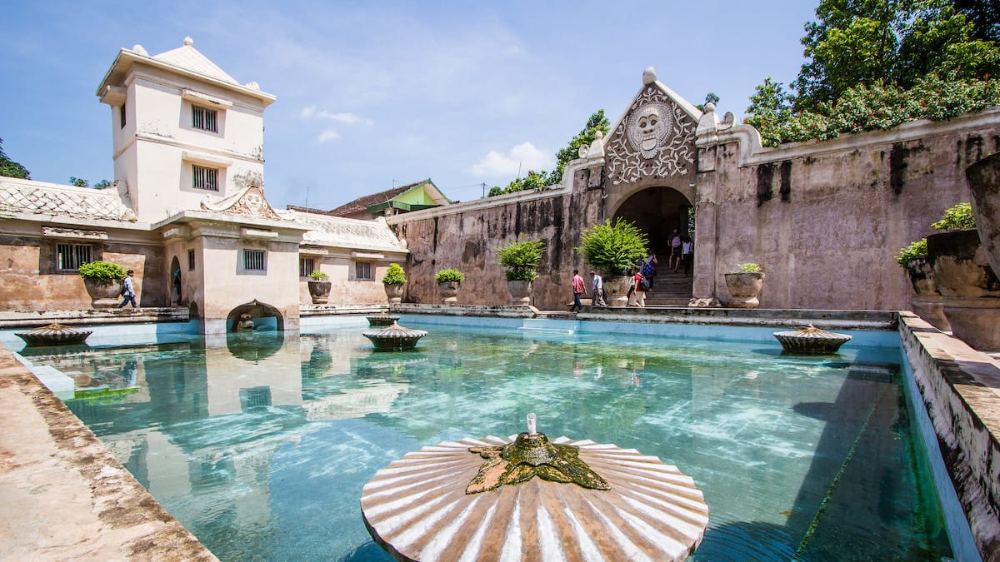
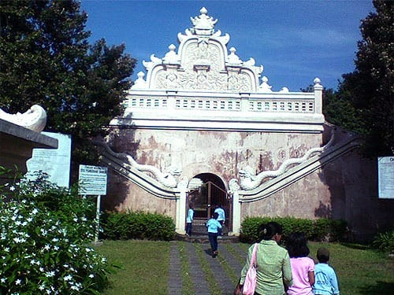
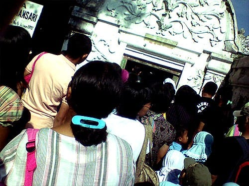
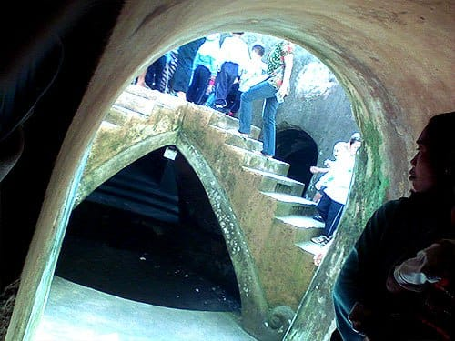
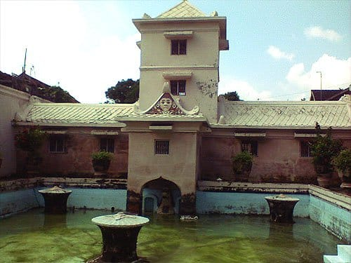
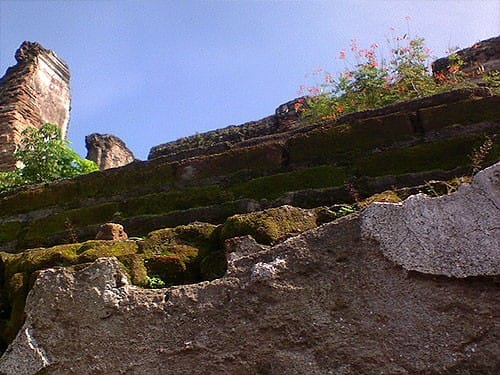

Sepanjang Jalan Taman, tembok-tembok tinggi menjulang di kiri dan kanan jalan. Tembok-tembok tebal berwarna putih ini menjadi benteng yang menaungi sekeliling komplek Kraton. Cat kapur yang melapisi tembok-tembok ini seolah menjadi jebakan bagi para pejalan kaki.

Jalan Taman yang berada di Selatan Kraton ini tidak memiliki trotoar sama sekali. Saat bis-bis berbadan lebar lewat, si pejalan kaki terpaksa menempelkan badannya ke tembok untuk menghindari serempetan bis. Kontan sebagian badannya putih ditempeli serbuk-serbuk kapur. Pun demikian dengan diriku, nahas. Setengah bagian badanku berlumuran bubuk putih seperti bedak. Tidak masalah gumamku dalam hati, toh pagi ini aku belum mandi.

Tujuanku melangkahkan kaki ke Jalan Taman ini tidak lain untuk mengunjungi Tamansari. Dahulu Tamansari merupakan salah satu pesanggrahan atau tempat tetirah Sultan dan keluarganya. Selain tempat beristirahat, Tamansari kala itu juga berfungsi sebagai benteng dan tempat perlindungan. Tidak mengherankan apabila di sini kita bisa melihat lorong-lorong serta bekas kanal-kanal air.


Siang itu aku masuk melalui Gapuro Panggung, gerbang tinggi dengan bentuk arsitektur yang unik. Di kiri dan kanan gerbang Gapuro Panggung terdapat naga yang seolah menjaga pintu menuju komplek Tamansari. Bagian atas Gapuro Panggung memiliki bentuk seperti mahkota. Cantik sekali.

Anak-anak TK berbaris tak jauh dari Gapuro Panggung sambil ditemani orang tua, kakak, atau pengasuhnya. Dari rautnya mereka tampak senang dengan acara kunjungan ke Tamansari ini. Beberapa dari mereka tampak tidak sabar dan berlari keluar barisan. Mereka berlari mendekati gerbang Gapuro Panggung yang belum juga dibuka. Mereka jingkrak-jingkrak kegirangan sambil mencoba mengintip ke dalam komplek Tamansari.

Tidak lama berselang pihak pengelola Tamansari muncul dengan menenteng sebuah pengeras suara. Gerbang di buka, dengan komandonya bapak ini memandu rombongan TK memasuki area Tamansari. Aku yang saat itu berada di tengah-tengah kerumunan anak TK, turut mengikuti langkah Sang Pemandu. Karena berbaris di antara rombongan anak-anak TK, alhasil aku pun tidak ditarik bayaran oleh pihak Tamansari. Sungguh perbuatan seperti ini jangan ditiru!


## Sumur Gemuling

Sumur Gemuling yang terdapat di komplek Tamansari ini dahulu berfungsi sebagai mesjid. Arsitekturnya luar biasa unik. Bagian bawah dari Sumur Gemuling yang tidak memiliki ventilasi, karena dahulunya berada di bawah permukaan air. Sedang pelataran yang berada di tengah Sumur Gemuling dan dihubungkan oleh lima buah tangga berfungsi sebagai tempat imam. Lima buah tangga yang menyangganya juga melambangkan rukun Islam.


## Pesanggrahan Umbul Binangun

Pesanggrahan Umbul Binangun dahulu merupakan tempat istirahat Sultan dan keluarganya. Kolam-kolam yang berada di sini juga dahulunya digunakan sebagai tempat mandi para anggota keluarga Kraton. Menurut Bapak Pemandu, bangunan bertingkat yang menghadap kolam di Pesanggrahan Umbul Binangun ini digunakan Sultan untuk mengamati para selirnya yang tengah berada di kolam. Selir yang terpilih kemudian menemani Sultan di ruangan khusus pada bangunan itu.


## Pulo Kenanga

Pulo Kenanga atau Pulo Cemeti yang juga berada di dalam komplek Tamansari ini dahulu berfungsi sebagai pusat kegiatan tari dan batik Kraton. Nama Pulo Kenanga sendiri diberikan karena dahulu saat air dialirkan lewat kanan-kanal, bangunan Pulo Kenanga ini seolah-olah terapung di atas permukaan air seperti bunga kenanga. Kala cuaca cerah, kita bahkan bisa melihat Gunung Merapi dari Pulo Kenanga ini.

Mengunjungi Tamansari benar-benar membuat aku kagum akan rancang bangun yang dimilikinya. Tidak terbayang bagaimana indahnya Tamansari dahulu.

Foto cover dari [Flickr](https://www.flickr.com/photos/ginomempin/28714513802/in/photostream/) oleh [ginomempin](https://www.flickr.com/photos/ginomempin/).
