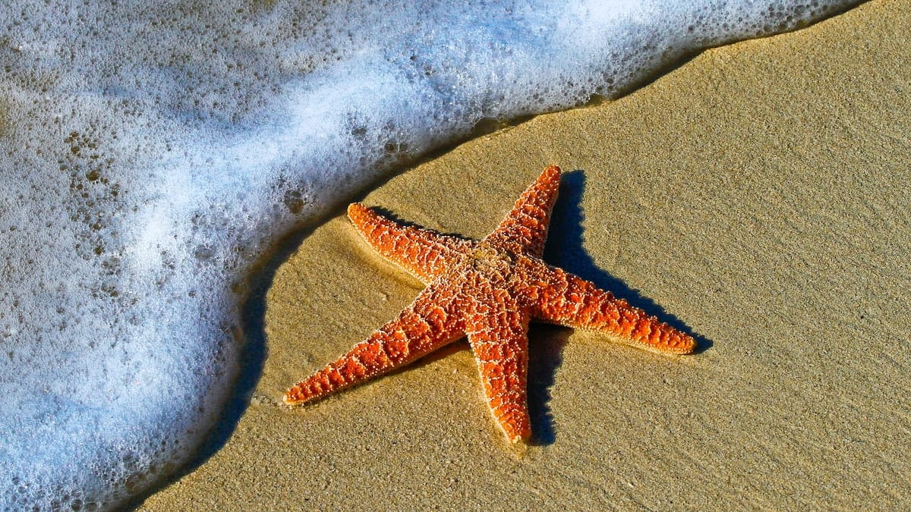

Mentari bersinar terik tepat di atas kepala kami. Dengan cepat sinar keemasannya mengeringkan tubuh kami yang basah oleh air garam. Sekeliling kami laut sangat tenang, warnanya perlahan berubah dari hijau toska menuju biru di lautan lepas. Ikan-ikan kecil nampak jelas berlarian di antara karang-karang. Kami berjalan terus ke Timur, meniti jembatan kayu yang meliuk di atas lautan.

Pulau Tidung Kecil yang berada di sebelah Timur Pulau Tidung Besar, suasananya sangat tenang. Tidak ada penduduk yang menghuni pulau kecil ini. Pohon-pohon kayu dan kelapa tumbuh lebat di pulau ini. Pohon-pohon jambu air pun banyak kami temukan di bagian tengah pulau ini. Buahnya yang merah tampak ranum dan siap untuk dipetik. Teduh rasanya saat kami berjalan menyusuri jalan setapak yang dinaungi pepohonan yang rindang di pulau ini.

Kami menyusuri Pulau Tidung Kecil mulai dari sisi Selatan. Pohon dan tumbuhan tropis lainnya tumbuh lebat di bibir pantai, sehingga memakasa kami untuk berjalan di dalam air. Tak perlu khawatir. Air lautnya yang bersih dan jernih, tingginya hanya sebatas lutut kaki. Di bagian ini juga banyak ditemui koloni pohon bakau. Hal ini tidak mengherankan karena di pulau ini terdapat pusat pembibitannya. Di sisi Selatan kita juga bisa menemukan pantai kecil yang dinaungi pohon yang besar. Beberapa kursi kayu juga nampak disediakan untuk para pengunjung yang ingin berleha-leha.

Lain halnya dengan sisi Utara Pulau Tidung Kecil. Di bagian ini bibir pantainya lebih panjang dan landai. Sangat cocok untuk berjemur. Tepian pantainya lebih banyak di dominasi oleh pohon-pohon kelapa dan semak belukar. Perairannya juga jauh lebih jernih dan dangkal. Sesekali kita dapat menyaksikan sekelompok ikan kecil yang berenang tidak jauh dari tepi pantai. Bibit-bibit pohon bakau yang baru ditanam juga tampak di pantai ini.

Tidur-tiduran di bawah rindangnya pepohonan, sambil sesekali merasakan hembus angin yang sepoi-sepoi. Duduk santai menikmati es kelapa sambil menikmati ombak yang pecah jauh di lepas pantai. Berjemur di atas pasir pantainya yang lembut sembari menatap birunya langit. Atau berjalan di tepi pantai, membiarkan kaki kita di sapu riak air. Pulau kecil yang memukau!

Foto cover dari [Unsplash](https://unsplash.com/photos/br-Xdb9KE0Q) oleh [Pedro Lastra](https://unsplash.com/@peterlaster).
