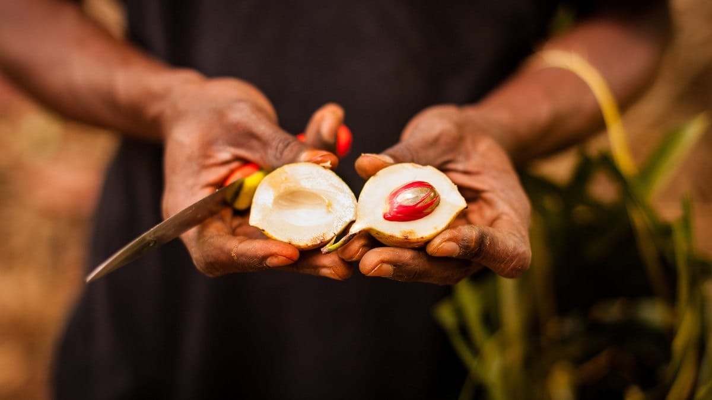

Buku ketiga yang lahir dari tangan dingin Ary Amhir ini akan membawa kita menjelajahi Kepulauan Banda. Mulai dari Pulau Neira, Lonthoir, Gunung Api, Ay, Run hingga Hatta. Sama halnya dengan karya-karya Ary sebelumnya, buku ini merupakan manifestasi catatan perjalanannya selama melancong selama satu bulan di Negeri Pala itu.

Tidak seperti catatan perjalanan biasa yang sifatnya lebih seperti panduan wisata. Pada buku ini Anda tidak akan menemukan detail transportasi, ulasan penginapan murah, tempat makan favorit atau rincian lainnya seperti "*what to do*" dan "*what to see*". Catatan perjalanan Ary ini lebih menitikberatkan pada kisah manusia yang tinggal di Negeri Pala itu. Tentang sekelumit masalah yang dihadapi mereka. Tentang sejarah yang membentuknya.

Ada yang unik nan segar dari buku karya Ary ini. Buku yang dibagi kedalam lima subbab ini, menyisipkan kisah-kisah yang dibalut fiksi pada subbab terakhirnya. Perpaduan catatan perjalanan dengan fiksi inilah yang bisa membuat imaji kita berkelana dengan liar. Menghadirkan sosok-sosok tak kasat mata pada benak kita. Eksperimen Ary yang tidak ingin diikat pakem soal menulis dan gaya bahasa ini berbuah manis. Penuturannya begitu renyah untuk diikuti.

Meski gaya bahasa Ary pada buku ini banyak berubah, lebih luwes dan *nyastra*. Ary tetaplah Ary, sensitifitasnya terhadap isu-isu sosial tetap kentara pada karyanya ini. Ia masih tajam menyorot permasalahan-permasalahan yang menyekap penduduk Banda. Mulai dari trauma yang masih tersisa paska kerusuhan agama pada tahun 1999 hingga 2002. Atau tentang PT Banda Permai yang dengan seenaknya menentukan jumlah buah pala yang harus disetor, padahal bantuan pupuk atau bibit baru pun tidak pernah diberikannya lagi. Tentang bangunan-bangunan tua bersejarah di Neira yang banyak dijual kepihak asing karena ketiadaaan dana untuk merawatnya. Tentang minimnya tenaga kesehatan di kepulauaan tersebut. Tentang Negeri Pala yang mayoritas penduduknya mengkonsumsi beras. Padahal sangat jelas padi tak mungkin tumbuh di sana.

Di buku ini juga kita akan menemukan kisah-kisah yang akan membuat kita terkejut. Ada Pongki yang keluarganya menjadi korban amuk masa, imbas dari kerusuhan antar-agama yang terjadi tahun 1999 hingga 2002 di Ambon. Istri dan kedua anaknya dibantai, digorok. Beruntung satu putranya itu berhasil diselamatkan saat terkapar bersimbah darah di pantai. Atau tentang Pak Guru Ali—seorang guru Bahasa Inggris—yang sosoknya tercetak dalam lembaran buku panduan Lonely Planet. Pak Guru Ali yang dengan segela keterbatasannya itu masih memiliki keinginan kuat untuk melanjutkan pendidikannya ke program magister. Atau tentang jejak pendekar Lim yang tersisa di sebuah kelenteng tua di Banda. Pendekar Lim ini adalah murid dari Wing Chun—pemrakarsa Kungfu Wing Chun yang digunakan oleh Bruce Lee dan gurunya Yip Man.

Meski tidak ditujukan sebagai buku panduan wisata, karya Ary ini sangat cocok untuk dijadikan referensi sebelum Anda menjelajahi Negeri Pala itu. Aku jamin, catatan perjalanan Ary ini akan memaksimalkan pengalaman Anda menyelami kehidupan di Kepulauan Banda.

)](01-negeri-pala-by-goodreads.jpg)

Judul: Negeri Pala\
Penulis: Ary Amhir\
Penerbit: Through The Glass Art Foundation\
Edisi: November 2012\
Tebal: 196 Halaman

Foto cover dari [Flickr](https://www.flickr.com/photos/sandersolvak/24812800578/) oleh [Sander Solvak](https://www.flickr.com/photos/sandersolvak/).
