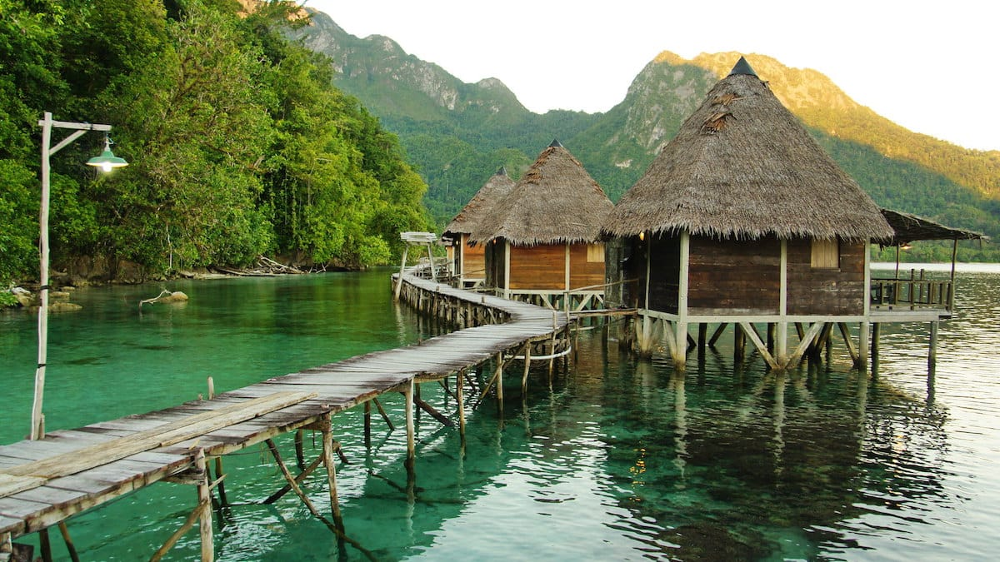

Indonesia Timur memang surganya para pecinta keindahan alam, terutama keindahan wisata baharinya. Indonesia Timur tak ubahnya seperti sebuah peti harta karun yang menyimpan sejuta pesona. Siapapun pasti ingin menjamah keindahannya. Pasir pantai yang putih halus. Lautan yang biru jernih. Terumbu karang yang berwarna-warni. Ikan-ikan yang menari. Rasanya kata-kata tak akan pernah cukup untuk menggambarkan keindahannya.

Mungkin kalian sudah pernah mendengar tentang Kepulauan Raja Ampat, Taman Nasional Bunaken, ataupun Taman Nasional Wakatobi. Tapi bagaimana dengan "Negeri Saleman"? Pernah mendengar sebelumnya?

Aku pun baru mengetahui keberadaan Negeri Saleman ini kala *iseng* membaca sejumlah blog *traveling*. Secara geografis, Negeri Saleman berada di Kecamatan Seram Utara, Kabupaten Maluku Tengah. Negeri Saleman ini menghadap langsung ke Teluk Saleman, Pulau Seram. Dan rupanya Pulau Ora yang luar biasa indahnya, terletak tidak jauh dari Negeri Saleman. Sekira 15 menit dengan menggunakan *speedboat*.

Negeri Saleman dikelilingi bukit karst yang menjulang pipih seperti di Kepulauan Raja Ampat. Tebing-tebing tersebut tingginya mencapai 400 meter dan dirimbuni oleh berbagai vegetasi tropis. Perairan di Negeri Saleman sangatlah jernih. Terumbu karang yang masih terawat dapat terlihat jelas dari atas permukaan air.

Konstruksi rumah-rumah di Negeri Saleman pun sangat unik. Rumah-rumah kayu tersebut didirikan warga di atas permukaan air. Konstruksi rumah inilah yang kemudian diadopsi oleh Ora Beach Resort—sebuah penginapan eksotis di Pulau Ora. Pasti sangat menyenangkan memiliki rumah dengan lautan biru sebagai halamannya.

Selain keindahan lautnya, Negeri Saleman juga memiliki potensi wisata lain yang tak kalah uniknya. Seperti Air Belanda—sebutan penduduk lokal kepada sebuah aliran sungai kecil yang bermuara ke Teluk Saleman. Pada zaman kolonial, Air Belanda ini sempat dijadikan basis pertahanan Belanda. Di lokasi Air Belanda ini juga pengunjung dapat menyaksikan ribuan Lusiala—sejenis burung—yang berterbangan keluar dari tebing-tebing karst kala petang tiba.

Suatu hari aku harus pergi ke Negeri Saleman! Amin.

 oleh [Maurice Weststrate](https://www.flickr.com/photos/127824790@N02/))](01-negeri-saleman.jpg)

 oleh [Maurice Weststrate](https://www.flickr.com/photos/127824790@N02/))](02-negeri-saleman.jpg)

 oleh [Kai Bey](https://www.flickr.com/photos/kaib/))](03-seram-by-kaib.jpg)

 oleh [Kai Bey](https://www.flickr.com/photos/kaib/))](04-seram-by-kaib.jpg)

 oleh [Kai Bey](https://www.flickr.com/photos/kaib/))](05-seram-by-kaib.jpg)

Foto cover dari [Flickr](https://www.flickr.com/photos/10380360@N07/21894681974/in/photostream/) oleh [sheing tjioe](https://www.flickr.com/photos/10380360@N07/).
