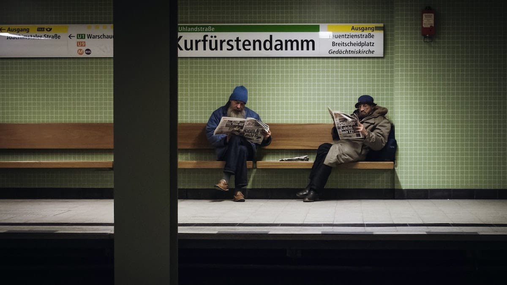
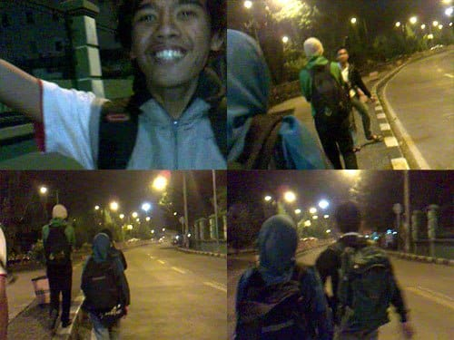
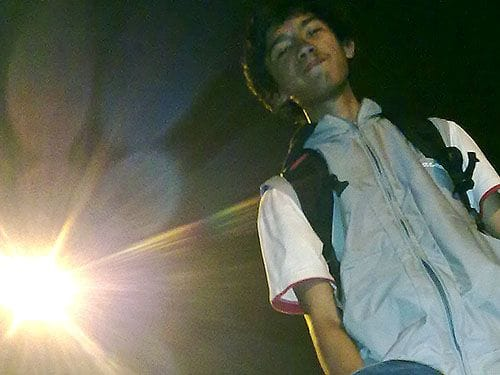

Waktu hampir genap pukul 12 malam, kami berlima sudah menjejakan kaki di Jakarta. Omprengan yang kami tumpangi dari Bandung mengantarkan kami sampai Terminal Kampung Rambutan. Masih terlihat beberapa calo yang menjaring penumpang untuk bis terakhir. Dari logat mereka aku bisa menebak mereka sama-sama orang Sunda. Sama sepertiku.

Kami berjalan masuk ke dalam terminal. Berjalan beriringan di bawah temaram lampu-lampu merkuri. Sangat sepi. Sesekali terdengar eretan roda-roda dari tas ajaib milik Gita. Ya, tasnya bisa berfungsi baik sebagai tas punggung ataupun koper beroda. Mengingatkanku pada tas-tas serupa milik anak-anak TK.

Suasana terminal sangat lengang. Tidak ada lagi keramaian yang tersisa. Puluhan bis-bis kopaja berwarna oranye menyala, berderet terparkir rapi. Sepasang pria paruh baya masih tampak terjaga memainkan bidak-bidak caturnya. Seorang ibu dan anak balitanya tertidur di atas kardus-kardus tipis yang ia gelar di lantai terminal. Beberapa orang tampak pulas tertidur di bangku-bangku kayu terminal.

Kami terus menyusuri terminal, menuju lokasi bis-bis dalam kota. Kami memastikan bis Patas jurusan Grogol mampir ke terminal ini. Bis jurusan Grogol ini akan mengantarkan kami ke daerah Citraland, lalu disambung metromini menuju Muara Angke. Bis yang kami cari pun masih beroperasi malam itu, namun kami memutuskan untuk menginap di terminal hingga esok pagi. Pertimbangan kami adalah akan lebih nyaman bermalam di terminal dibandingkan dengan di Muara Angke yang notabene merupakan pusat pelelangan ikan.

Kami berjalan memutari terminal, mencari lapak yang pas untuk melewatkan malam. Cukup lama kami memutari terminal, kami pun menemukan sebuah mesjid. Mesjid Nurul Istiqomah, namanya mirip dengan seorang rekan kuliah kami. Namun kami terpaksa menelan kekecewaan, mesjid tersebut dikunci dan tidak bisa dimasuki.

Tidak jauh dari Mesjid tersebut kami menemukan sebuah taman kecil yang berada tepat di samping terminal. Di pinggir taman tersebut tumbuh pepohonan dan rumput yang tampak terawat. Tanpa berpikir panjang, kami menggelar lapak di situ. Kami tidur-tiduran di atas sepetak beton yang tersisa di tengah rerumputan itu.

Jakarta dini hari. Beberapa pemuda tampak asyik melenggak-lenggok dengan papan seluncurnya di taman. Semakin larut, taman tersebut semakin ramai. Tidak hanya pemuda dengan papan luncur, berdatangan juga pemuda dengan motor dan sepeda bmx-nya. Tidak jauh dari taman, persiapan untuk resepsi sebuah pernikahan pun tengah digelar. Lagu-lagu dangdut diputar, malam semakin hidup.

Sesekali aku terlelap dalam tidur. Cukup nyaman dan tidak dingin sama sekali. Dedaunan diam membisu, tidak goyah sedikitpun. Di Jakarta, angin enggan berhembus. Kami berpikir apa jadinya kalau tengah malam di Bandung, kami tidur di tempat terbuka seperti ini. Menggigil pasti.

Foto cover dari [Unsplash](https://unsplash.com/photos/qhP0dR8WPRs) oleh [Vidar Nordli-Mathisen](https://unsplash.com/@vidarnm).
