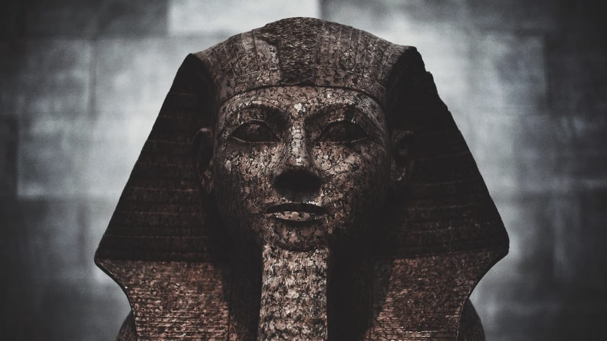

Film bergenre komedi ini sangat unik sekali karena menggunakan seting di sebuah museum. Film ini dibintangi oleh Ben Stiller, Carla Gugino, Dick van Dyke, Mickey Rooney, Bill Cob, Jack Cherry, Ricky Gervais, Robin Williams dan masih banyak lagi bintang Hollywood lainnya.

Film ini mengisahkan seorang ayah bernama Larry Dalley yang diperankan oleh Ben Stiller. Ia baru saja cerai dengan istrinya Erica (**red:** Kin Raver) karena tidak juga mempunyai pekerjaan. Anaknya pun Dick Dalley (**red:** Jake Cherry) tidak seperti anak lainnya yang bangga dengan ayahnya.

Larry pun mencari pekerjaan, tapi tidak ada yang menerimanya. Akhirnya dia diberikan alamat oleh seorang temannya bahwa ada sebuah lowongan pekerjaan di Museum Natural History. Ia pun akhirnya datang untuk melamar. Tapi ternyata pekerjaan yang menantinya itu adalah menjadi penjaga malam di sebuah museum yang sepi pengunjung. Tapi bagaimanapun juga ia butuh pekerjaan dan dia menerimanya.

Di malam pertamanya, sesuatu yang tidak pernah ia harapkan terjadi. Seluruh isi di dalam museum itu hidup. Mulai dari tulang dari t-rex, miniatur pasukan Romawi, patung lilin manusia purba, hingga presiden Amerika ke 22: Teddy Rosevelt (**red:** Robin Williams).

Tentu saja hal ini membuatnya terkejut. Benda yang tadinya diam pada malam hari hidup. Pada malam itu ia dikejar-kejar oleh tulang T-rex. Ia juga diburu oleh sekelompok bangsa barbar. Ia diburu oleh hewan-hewan buas sampai ditangkap oleh para miniatur.

Untung saja ada Teddy Rosevelt yang membantunya. Ternyata museum itu hidup karena tabulet Ahkmenrah yang didapat dari ekpedisi Nile. Jadi setiap malam semua benda di museum itu hidup. Dan bila matahari terbit ada yang diluar, maka ia akan menjadi debu.

Karena susahnya mencari pekerjaan ia pun harus tetap bekerja di museum itu. Oleh karena itu ia mempersiapkan segalanya. Ia mencari buku-buku referensi tentang sejarah benda-benda yang ada di museum itu. Ia menyusun taktik agar malam yang dilewatinya berjalan dengan lancar.

Malam berikutnya pun ia sudah siap dengan taktiknya tapi tetap saja terjadi kekacauan. Mantan penjaga sebelumnya menduplikasi kunci museum. Binatang-binatang liarpun melarikan diri. Terjadi peperangan antara tentara romawi dan Wild West. Sampai matahari terbit masih tertinggal salah satu manusia purba di luar, dan akhirnya ia menjadi debu. Larry pun hampir dipecat.

Pada suatu malam benda-benda di museum itu tidak hidup lagi. Larry pun curiga. Ternyata tabulet Ahkmenrah telah dicuri oleh para mantan penjaga museum. Nick pun mengambil tabulet itu dan mengaktifkannya, benda di museum itupun kembali hidup. Tapi tabulet itu berhasil direbut oleh para mantan penjaga museum lagi.

Kekacauan pun terjadi lagi. Terjadi peperangan di dalam museum dan banyak hewan yang keluar dari museum. Tapi akhirnya semua kekacauan berakhir ketika semua tahu bahwa tabulet Ahkmenrah yang membuat mereka hidup telah dicuri. Para benda di museum itupun bekerjasama dengan Larry dan Ahkmenrah untuk merebut kembali tabulet itu.

Tabulet pun sudah didapatkan kembali. Dengan kekuatan dari Ahkmenrah semua benda dari museum itu kembali ke dalam museum. Saat matahari terbit museum pun berantakan dan manager museum memecat Larry. Akan tetapi karena berita di televisi yang menayangkan benda di museum itu hidup, museum yang tadinya sepi kini banyak pengunjungnya. Oleh karena itu Larry pun dipercayai kembali untuk menjadi penjaga malam di museum.

Pokoknya film ini bagus banget untuk semua umur lah. Apalagi perpaduan 3D dengan scene aslinya nyatu banget. Soundnya juga ngedukung banget. Suasana keluarganya pun menonjol sekali, sampe-sampe agak sedih kaya waktu Larry gak dipercaya lagi sama anaknya. Pesen sejarahnya juga banyak banget, ane masih inget waktu Rebecca nge-guide pengunjung dia bilang

*More you know about the past, the better you prepare for the future!*

caemm dah.

Foto dari [Unsplash](https://unsplash.com/photos/xBeid9r1paU) oleh [Daniel H. Tong](https://unsplash.com/@danieltong).
