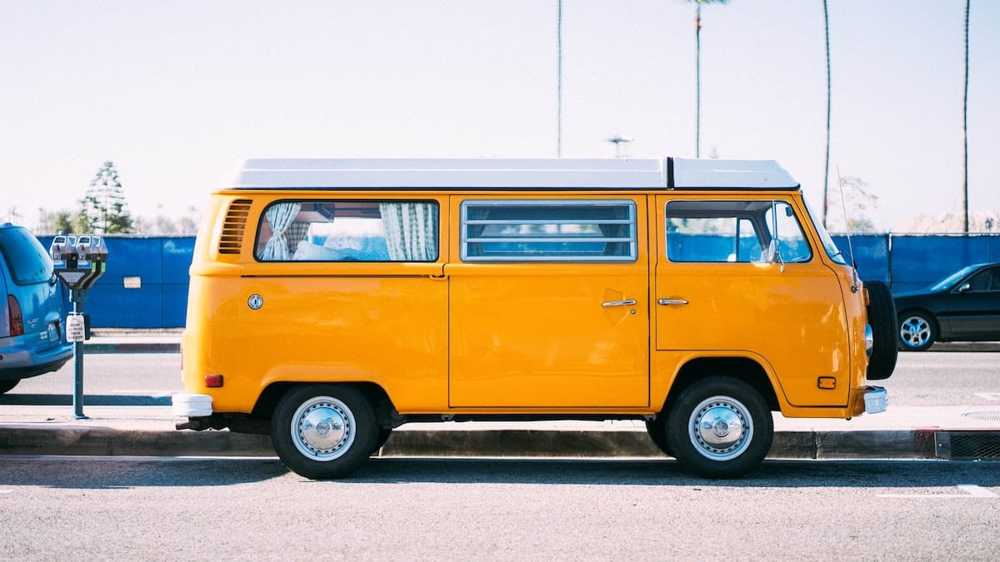
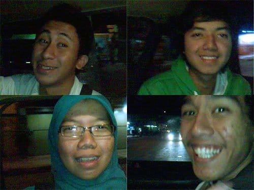

Aku bisa merasakan darahku berdesir kencang dalam buluh-buluh nadiku. Senja berlalu tergantikan petang. Aku bersama keempat kawan kuliah berkumpul penuh semangat di sebuah kamar kos di bilangan Sarijadi, Bandung. Doa dipanjatkan, kami pun bergegas keluar menuju jalanan. Menuju Pulau Tidung!

Beberapa hari sebelumnya kami memang sudah merencanakan perjalanan ini. Pun begitu kami tidak menyiapkan apa-apa. Modal kami hanya rute moda transportasi untuk mencapai pulau yang termasuk kedalam gugusan Kepulauan Seribu itu. Awalnya aku terprovokasi oleh tayangan Pulau Tidung di salah satu stasiun televisi. Pantai yang bersih dan sepi, dikelilingi lautan jernih berwarna hijau toska. Sebuah pelarian yang sempurna selepas ujian gumamku. Ditambah lagi, Tidung yang kala itu mulai *booming* di milis-milis *backpacker* disebut-sebut sebagai Maladewa-nya Indonesia. Kontan saja aku terayu.

Dari Sarijadi kami menggunakan angkot menuju Stasiun Hall. Saat menunggu di Stasiun Hall kami mendapatkan tawaran tumpangan dari sopir angkot untuk menuju Terminal Leuwipanjang dengan harga 25 ribu. Kamipun menyetujuinya. Di tengah perjalanan, setelah mengoborol dengan sang Sopir, rencana kami berubah. Kami memilih untuk naik bis ke Jakarta dari gerbang Tol Padalarang, tidak dari Terminal Leuwipanjang. Bis-bis dengan tujuan Bandung–Jakarta dari Terminal Leuwipanjang tarifnya jauh lebih mahal daripada bis-bis dari Ciamis, Garut, atau Tasik yang sama-sama menuju Jakarta. Dengan tambahan 25 ribu lagi, kami diantarkan ke gerbang Tol Padalarang.

Angkot yang kami tumpangi melesat membelah jalan-jalan kota yang mulai sepi. Satu jam perjalanan, akhirnya kami sampai juga di muka gerbang Tol Padalarang. Kami duduk berjejer di tepi trotoar bersama para calon penumpang lainnya. Di bawah sinar lampu merkuri, menunggu bis yang akan mengantar kami ke Jakarta.

Tidak dinyana, kami yang tengah duduk-duduk ditawari naik omprengan oleh seorang pria tegap. Tawar menawar terjadi. Bersama beberapa penumpang yang lain akhirnya kami sepakat 20 ribu sampai Terminal Kampung Rambutan. Awalnya kami berpikir omprengan milik pria tegap ini semacam minibus L300 yang usang dimakan usia. Namun dugaan kami meleset! Jauh meleset!

Kami berjalan beriringan mengikuti pria tegap ini. Mobilnya diparkir agak jauh di depan. Ah, kami tercekat! Rupanya pria ini mengompreng dengan Kijang Innova keluaran anyar. Kontan mata kami berbinar melihatnya. Kursi penumpang yang empuk, pendingin udara, *sound system* yang apik, deru mesin yang halus, cukup dibayar 20 ribu rupiah saja. Nyaman.

Rupanya pria ini sehabis mengantarkan tamunya dari Cipanas. Kala itu ia hendak pulang lagi ke Jakarta. Daripada pulang sendirian, lebih baik *ngompreng* tuturnya. Lumayan juga untuk bayar tol dan bensin tambahnya lagi.

Mobil terus melesat kencang, melahap kilometer demi kilometer. Roda-rodanya menggilas aspal dengan mantap. Ia melesat membawa kami lebih dekat ke Pulau Tidung.

Foto cover dari [Unsplash](https://unsplash.com/photos/w8CcH9Md4vE) oleh [Herson Rodriguez](https://unsplash.com/@hero).
