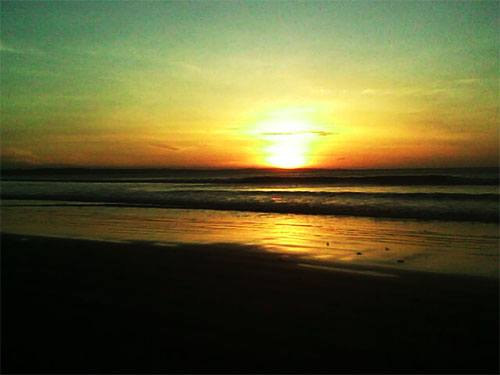
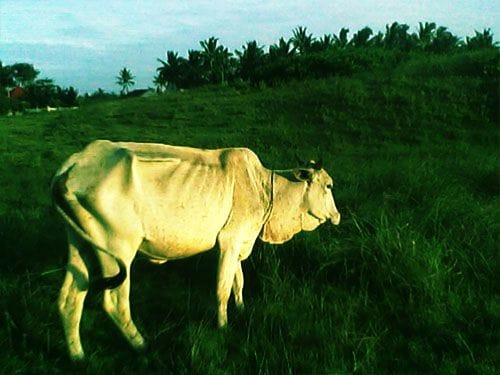
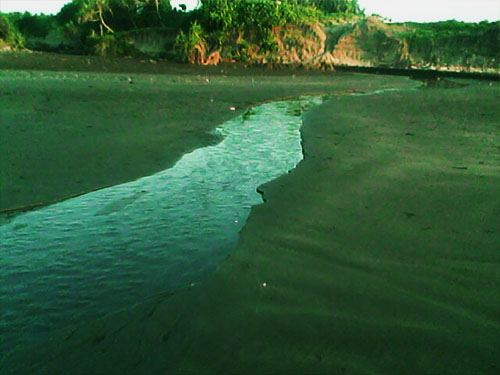
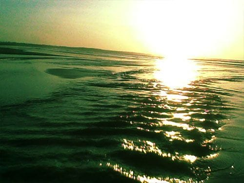

Kala beravonturir, rasanya sangat mudah untuk bangun pagi. Tak ada lagi acara tarik-meringkuk di dalam selimut saat telinga terusik teriakan alarm. Begitupun halnya saat aku melanglang buana ke pesisir Selatan Sukabumi. Menyapa mentari pagi rasanya jauh lebih menyenangkan daripada sembunyi di balik selimut.

Suara alarm bersahutan menggema dalam kamar yang kami tempati. Badanku yang terasa masih remuk, kuseret dengan terhuyung-huyung ke kamar mandi. Lunas menyegarkan badan, aku pun memasukan satu pak biskuit dan sebotol air mineral ke dalam tas kecil, untuk sarapan nanti. Ternyata di luar masih sangat gelap. Angin dingin berhembus kencang menusuk-nusuk tubuhku yang hanya berbalut sepotong kaos tipis.

Jalanan masih sangat sepi dan gelap. Aku berjalan menapaki bukit kecil di belakang penginapan—awal tempat kami tersesat kemarin. Lamat-lamat terdengar suara sapi melenguh. Lenguhannya bersahutan dari bukit tersebut. Tidak mengherankan, bukit yang ditumbuhi rumput dan belukar tersebut memang menjadi tempat penggembalaan hewan ternak milik warga. Sapi-sapi tersebut dilepaskan warga begitu saja. Sebuah lonceng kayu kecil terkalung di leher mereka; suaranya merdu kala berdenting mengikuti gerak leher mereka saat merumput. Jumlah robekan pada telinga sapi-sapi tersebut sepertinya menjadi identitas kepemilikan.

Sementara di balik bukit, samudera terhampar luas. Warna merah memulas di Timur langit, menandakan pagi yang tengah merekah. Mentari pun menyembul perlahan dari balik cakrawala. Sinarnya yang kemerahan memantul-mantul riang dalam riak samudera, seolah gembira menyambut Sang Pagi. Burung-burung pun terbang keluar dari sarangnya, menghiasi langit yang merah menyala. Jauh di lepas pantai, sekelompok burung tampak asyik bertengger di atas gugusan karang. Burung-burung tersebut tampak seperti melayang di atas permukaan air.

Kala itu suasana pantai sangat sepi. Hanya ada aku yang duduk menikmati mentari yang perlahan terbit. Sesekali warga melintas dengan sepeda motornya, meninggalkan jejak roda yang memanjang di pasir pantai. Sambil mengunyah biskuit, aku duduk di pasir pantai yang masih basah karena disapu pasang semalam. Kubiarkan ujung-ujung kakiku dijilati buih-buih ombak. Damai sekali rasanya.

Tuntas menghabiskan sarapan, aku pun beranjak menyusuri pantai. Aku berjalan ke Utara, berlawanan dengan arah yang kami ambil kemarin. Pantai yang berada di belakang penginapan kami, bentuknya melengkung bak bulan sabit. Bukit kecil yang hijau dan dirimbuni semak belukar mengelilingi pantai yang landai ini. Di Selatan pantai, bukit mulai melandai dan di sana terdapat sebuah perkampungan nelayan yang tak jauh dari hutan tropis. Sementara di Utara, bukit semakin tinggi menjulang. Sesekali sungai-sungai kecil tampak meliuk dari balik bukit, airnya yang jernih bermuara ke pelukan samudera luas. Puas mengitari pantai, aku pun memutuskan untuk kembali ke penginapan.

Foto cover dari [Unsplash](https://unsplash.com/photos/zWtxLpSHfxw) oleh [Jordan McQueen](https://unsplash.com/@jordanfmcqueen).
