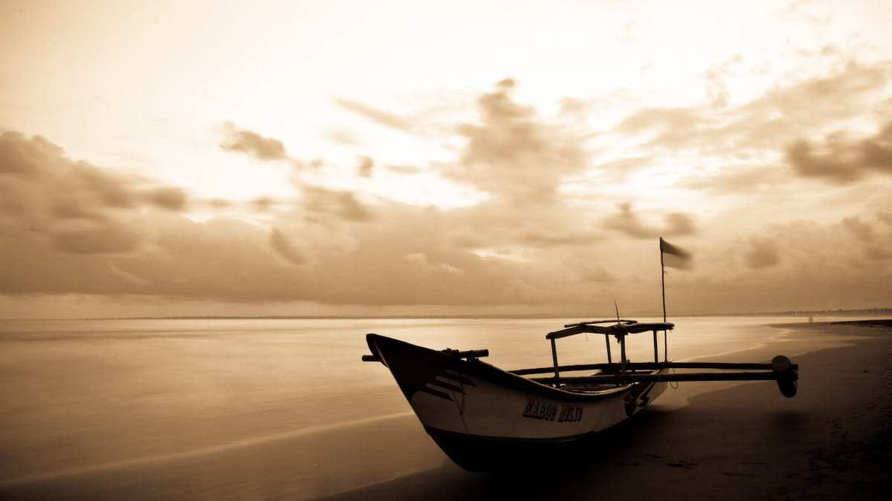
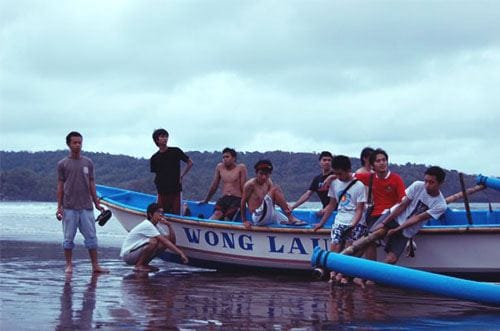
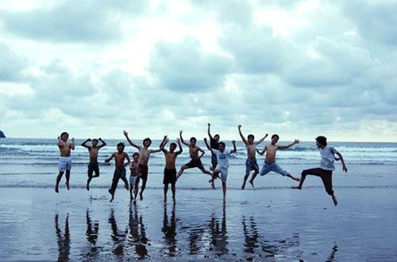

Ini adalah hari terakhir UTS, UTS pertamaku sebagai mahasiswa. Beres menghabisi setiap soal ujian, aku bergegas melesat ke SMA-ku di jalan Belitung—tidak jauh dari Taman Lalu Lintas. Di sana sudah berkumpul beberapa teman-teman dari Belitung Merantau. Kami akan berpelesir ke Pangandaran!

Ini adalah kali kedua aku dan teman-teman dari Belitung Merantau berlibur ke Pangandaran. Pantai Pangandaran yang masuk ke dalam wilayah administrasif Kabupaten Ciamis ini merupakan salah satu wisata pesisir favorit warga Jawa Barat. Pantainya yang landai dan luas, ombaknya yang cukup bersahabat, serta fasilitasnya yang terbilang lengkap menjadi magnet tersendiri bagi pantai ini. Terbukti dari ramainya pengunjung yang kerap memadati kawasan pantai ini kala akhir pekan atau hari libur tiba.

Pantai Pangandaran memiliki keunikan tersendiri. Bentuk pantainya yang memiliki dua sisi, membuat pengunjung pantai ini dapat menikmati keindahan *sunset* dan *sunrise* dalam satu kawasan. Di Pantai Barat, pengunjung dapat bermain air dan menikmati saat-saat matahari tenggelam. Sedangkan di Pantai Timur pengunjung dimanjakan dengan keindahan terbitnya mentari.

Pangandaran yang sempat dihantam gelombang Tsunami pada tahun 2006 silam ini, benar-benar mengandalkan sektor pariwisata. Terlihat dari menjamurnya berbagai jenis penginapan di sisi Barat dan Timur pantai ini. Mulai dari pondokan sederhana, hotel melati, hingga hotel sekelas bintang tiga. Di sekitar Pangandaran sendiri banyak terdapat penyewaan sepeda, ATV (*All Terrain Vehicle*), hingga *body board* untuk para pengunjung.

Tidak jauh dari Pantai Pangandaran, terdapat objek-objek wisata lain yang tidak kalah menariknya. Ada Pantai Batu Karas, Pantai Batu Hiu, hingga Cukang Taneuh atau yang lebih dikenal dengan nama *Green Canyon*. Sebuah pilihan destinasi yang tepat bagi para pencinta wisata bahari.

Foto cover dari [Flickr](https://www.flickr.com/photos/lilie_suisse/15811661085/in/photostream/) oleh [Aurélie Rattaz](https://www.flickr.com/photos/lilie_suisse/).
