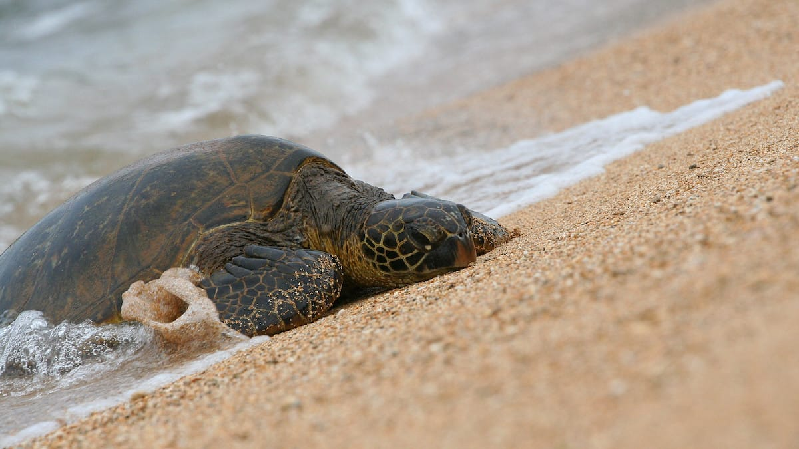
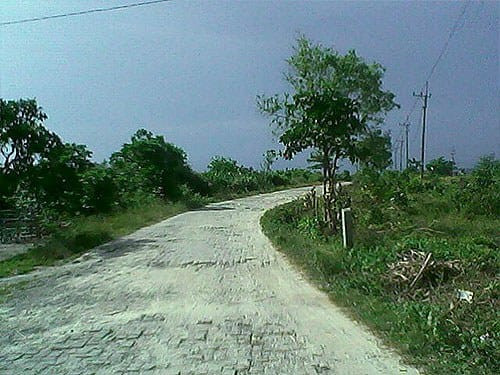
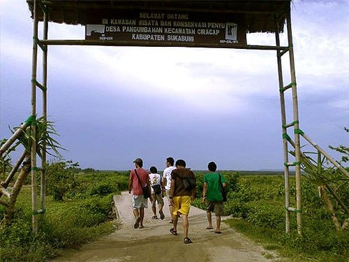
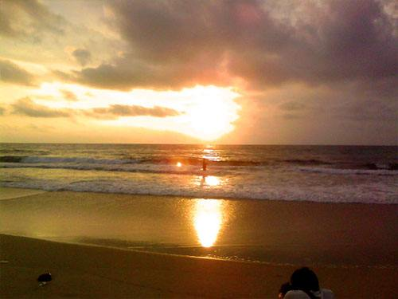

"Kalau mau ke Pangumbahan kemana ya Mas?" tanyaku pada seorang lelaki yang tengah asyik mengaso di sebuah warung kecil, tak jauh dari bibir pantai.

"Lurus aja, tinggal lima kilo lagi," ujarnya sambil menunjuk ke sebuah jalan setapak yang mengarah ke Utara.

Lelaki itu bukan lelaki pertama yang kami tanyai. Mungkin sudah ada tiga atau empat lelaki lain yang kami tanyai sebelumnya. Dan semuanya menjawab sama: Pangumbahan tinggal lima atau enam kilometer lagi. Oh Tuhan, lima kilometer tidak pernah terasa sejauh ini. Rasanya lutut ini akan copot karena tak sanggup berjalan lagi.

Mentari masih tegak gagah di angkasa. Sinarnya menyilaukan, panasnya menyengat kulit. Peluh pun menetes deras dari dahi, dada, punggung, hingga ketiak. Beruntung sajian alam di sepanjang pesisir pantai mampu membuatku terlena dan lupa akan keletihan yang tengah melanda. Di sebelah kiri, luasnya Samudera Hindia terhampar. Deru ombak yang menyapu pantai terdengar syahdu bak sebuah melodi yang manis. Di kanan jalan, pepohonan rindang, ladang-ladang jagung dan bukit-bukit yang hijau terhampar silih berganti. Indah sekali.

Dua jam lebih kami berjalan, akhirnya kami menemui sebuah plang kayu dan sebuah gapura bambu yang menandakan bahwa kami telah sampai di Desa Pangumbahan. Melihat plang tersebut, kami merasa sangat senang. Ini berarti tidak lama lagi kami akan sampai di pusat konservasi penyu Pantai Pangumbahan. Namun lagi-lagi kami salah. Dari gapura bambu Desa Pangumbahan, letak pusat konservasi masih lumayan jauh. Kami baru sampai di Pantai Pangumbahan saat menjelang ashar.

Pantai Pangumbahan memiliki pantai yang benar-benar luas dan cukup landai. Butiran pasirnya halus dan terasa hangat karena diterpa sinar matahari seharian. Hutan dataran rendah tampak lebat dan mendominasi sepanjang bibir pantai. Benar-benar tempat yang sempurna bagi penyu untuk bertelur.

Pusat konservasinya sendiri terdapat agak menjorok ke dalam hutan. Di halaman pusat konservasi ini terdapat sebidang tanah berpagar yang dijadikan tempat pengeraman telur-telur penyu. Lubang-lubang pengeraman tersebut diberi sebuah penanda yang bertuliskan tanggal bertelur dan jumlah telurnya. Telur-telur ini dikumpulkan dari penyu-penyu yang bertelur di pantai ini.

Penyu yang bertelur di sepanjang Pantai Pangumbahan ini merupakan spesies Penyu Hijau (*Chelonia mydas*) yang terancam punah. Setiap malamnya belasan hingga puluhan penyu datang untuk bertelur di pantai ini. Sekali bertelur rata-rata penyu hijau mampu menghasilkan 100 hingga 200 telur, tergantung dari usianya. Meski begitu, dari seratus telur hanya satu atau dua telur saja yang mampu bertahan hidup hingga usia dewasa. Hal ini tak lain karena ulah para manusia yang tak bertanggung jawab. Habitat mereka dirusak. Telur mereka dijual. Daging mereka diperjualbelikan, bahkan cangkang mereka sering dijadikan hiasan dinding.

Saat di Pangumbahan, bersama seorang petugas konservasi kami turut serta melepaskan tukik-tukik yang baru menetas ke lautan lepas. Jumlahnya ratusan. Tukik-tukik tersebut sangat menggemaskan. Mereka mengepak-ngepakkan tungkai depannya. Tertatih-tatih bergerak ke arah ombak bergulung, menuju samudera lepas. Mereka akan berenang ribuan kilometer, menjelajahi lautan. Apabila mereka telah dewasa, penyu-penyu itu akan kembali untuk bertelur di pantai ini. Kata si petugas, penyu-penyu itu memiliki kompas alami dalam tubuhnya, sehingga mereka bisa mengetahui arah mana yang mereka tuju. Hewan yang menakjubkan.

Mentari semakin condong di ufuk Barat. Sinarnya meredup kemerahan. Semburat lembayung perlahan menghiasi langit yang kejinggaan. Ombak di Pangumbahan berdebur keras. Suaranya bergemuruh ditengah kesunyian. Kini tukik-tukik kecil itu tengah berenang-renang menantang gelombang dahsyat samudera. Mereka baru saja menetas pagi ini, namun mereka sudah harus mengecap kerasnya hidup.

Sejenak kami pun menikmati mentari yang perlahan tertelan lautan. Detik demi detik senja kunikmati. Mencoba membaca dan meresapi bait demi bait lukisan sempurna Sang Kuasa.

Foto cover dari [Flickr](https://www.flickr.com/photos/kishlc/3480918292/) oleh [Carla Kishinami](https://www.flickr.com/photos/kishlc/).
