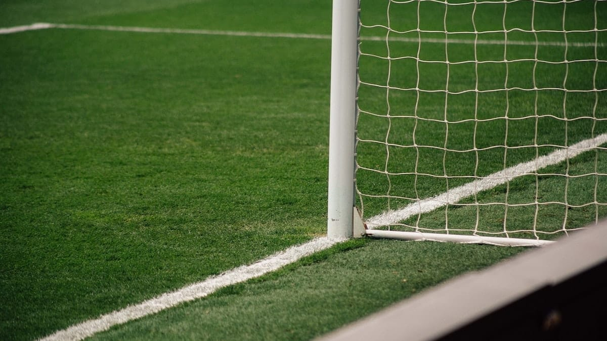

Jreng! Hari itu dengan baju biruku ane pergi ke rumah si Opik. Ceritanya ane mau nonton PERSIB vs PERSIK sama anak-anak. Sesampainya deket turunan maut (**red:** turunan yang wah gila bener lebih dari 45 derajat lah). Si Opik udah nunggu juga pakai baju biru.

Tanpa berpikir panjang (emang punya pikiran?) kami pun bergegas ke sekolah kita di bilangan Jl. Belitung. Ane sama Opik nunggu orang-orang laen yang mau nonton di kios. Satu persatu orang bermunculan. Si Cumi (**red:** si Rhesa), si Arif, si Hiu (**red:** Sejenis ikan air asin) dan si Rhendy, terus dateng juga si Key sama si Kolot(**red:** Adzan).

Nah ceritanya udah jam satu siang, kami pun cau ke stadion Siliwangi. Sebelum masuk ke stadion, tentunya kami menunaikan dulu sholat Dzuhur. Jreng, kami pun masuk ke dalam stadion lewat tribun Timur (**red:** tribun para Viking). Yah, nyampe juga. Walaupun jam tangan masih menunjukan pukul setengah dua siang tapi tribun hampir penuh. Ni dia nih yang paling ngebosenin, nunggu lama banget.

Jreng, sekitar jam 3 baru muncul tim kesayangan kita PERSIB. Yel-Yel pun berkumandang (kaya adzan) seantero stadion.

*Persib Bandung yang kutunggu kutunggu...*\
*kunanti nanti...*\
*Telah lama kuberdiri berdiri...*\
*kunanti nanti...*

Yah kurang lebih seperti itu keadaanya. Kami pun terbawa suasana dan ikut teriak-teriak.

Ceritanya udah mau maen nih. "PRIT..."" wasit niup pluit. Baru juga lima menit maen, kiper Persik Wahyudi udah kebobolan lagi lewat sundulan si Bang Bekamenga Bekamengo. Abang asal Kamerun ini bisa memanfaatkan pemain belakang Persik Cheikh Ba yang lagi bengong. Hoho tentu hal ini membuat kami girang soalnya Persik kan salah satu tim yang jago banget. Tapi ada yang bikin kesel juga, soalnya wasitna gob\*\*ks pisan, udah jelas-jelas pelanggaran, eh didiemin aje.

Nah tak lama dari gol pertamanya, Bang Beka berhasil menggetarkan lagi jala gawang Wahyudi. Bang Beka memanfaatkan bola yang mantul dari bang Wahyudi. Dari gol kedua itu kiper Persik Wahyudi diganti, hahaha.

Semenjak pergatian kiper itu Persib tidak lagi menciptakan gol. Gara-gara itu salah satu penonton di belakang kami teriak

"Eh licik ganti kiper, da teu meunang (**red:** gak boleh) ganti kiper mah!""

Hahaha sampai pluit panjang dibunyikan Persib berhasil unggul 2 – 0 atas Persik. Hore...

Foto dari [Unsplash](https://unsplash.com/photos/I9HyW30buuQ) oleh [Nathan Rogers](https://unsplash.com/@nathanjayrog).
