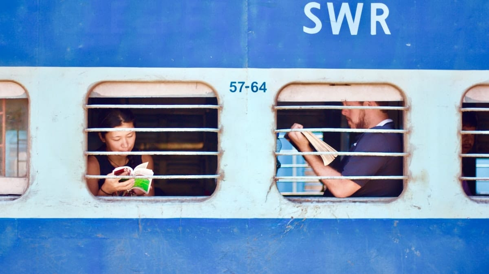

Liburan sekolah tiba! Seperti biasa anak-anak Belitung Merantau merencanakan perjalanan bersama. Kali ini yang menjadi tujuan adalah: Yogyakarta! Para personil sepakat, bahwa tema liburan kali ini adalah *menggembel* dengan membawa uang seadanya.

Hari keberangkatan pun tiba. Karena rencananya sehemat mungkin, maka moda transportasi yang dipilih pun jatuh pada: kereta api Kahuripan, kelas ekonomi! Kami semua berangkat dari stasiun Kiaracondong, Bandung.

## Namanya juga Kereta Ekonomi

Ini adalah pengalaman pertamaku menggunakan kereta api kelas ekonomi. Mulanya sangat menyiksa jiwa dan raga. Bagaimana tidak, hampir 10 jam lebih kuhabisakan waktu dengan duduk di atas jok kursi yang sangat tipis. Belum lagi bentuk sandarannya yang nyaris tegak 90 derajat. Pegal. Linu. Encok.

Keadaan kereta ekonomi ini diperparah dengan lingkungannya yang jorok. Kecoa-kecoa berseliweran, terkadang mereka menggerayangi tubuh kami. Aroma pesing menguap mengusik kekhusyukan kami dalam bernapas. Tidak ketinggalan juga asap rokok yang ikut terjebak dalam gerbong yang pengap. Sempurna!

Para pedagang asongan pun tiada henti-hentinya berorasi, membuat mataku sulit terpejam. Namun ada sebuah kejadian dimana seorang pedagang sukses membuat kami tertawa terbahak-bahak.

Pedagang: "Tong gandeng aya nu sare!" (Jangan ribut ada yang tidur!)

Kami pun hening sejenak. Sang Pedagang mem-*pause* kalimatnya, berusaha mendramatisir. Lalu kemudian.

Pedagang: "SARE–BUAN! SAREBUAN! SAREBUAN!" (Seribu! Seribu! Seribu!)\
Kami: "*FAAAAAKKK!!*" Tertawa terpingkal-pingkal.

Pertama kalinya memang aku tersiksa dan membenci kereta ekonomi. Namun itu dahulu. Sekarang justru aku jatuh cinta pada kereta ekonomi. Ada romansa tersendiri dengannya. Selalu ada pelajaran kehidupan di dalamnya. Gerbong-gerbong lusuh kereta ekonomi ini merupakan miniatur Indonesia. Sebuah potret kehidupan rakyatnya.

Foto dari [Unsplash](https://unsplash.com/photos/3Mb47nu2dws) oleh [Rathish Gandhi](https://unsplash.com/@ratz03).
