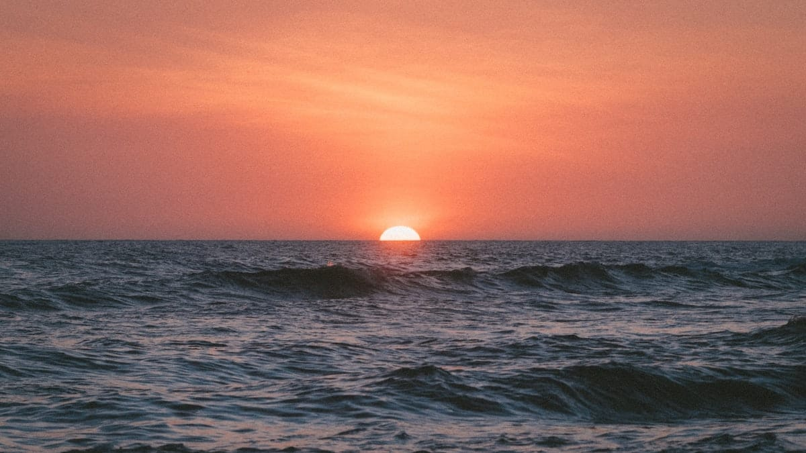
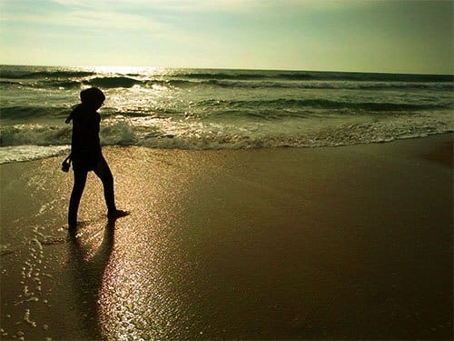
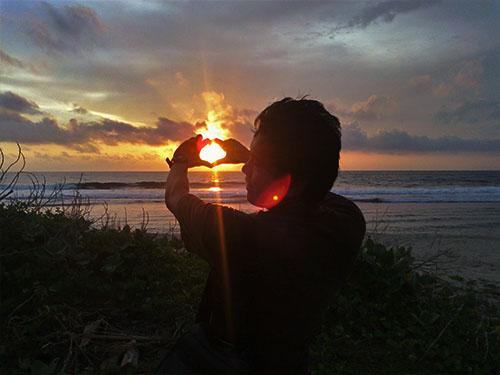
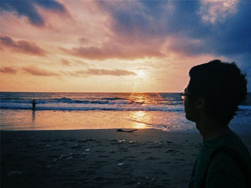
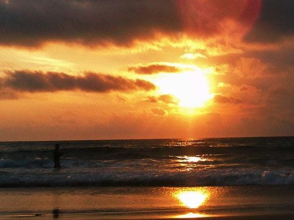
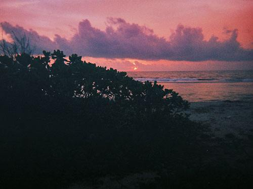
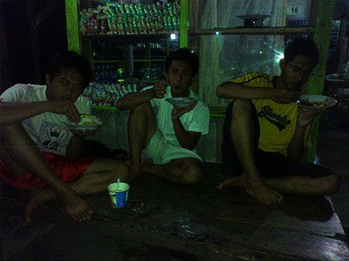

Senja perlahan terkikis oleh Sang Malam. Gurat lembayung yang kejinggaan kini telah hilang tersapu gulitanya. Awan-gemawan berduyun ringkih, mereka menggelayuti angkasa yang sepi tak berbintang. Bulan pun malu-malu bersolek di balik tirai kelabunya gemawan. Sinarnya yang redup tak mampu menembus kegelapan malam.

Kami berjalan berbaris bak serdadu yang tengah menyergap kamp musuh. Sorot lampu senter yang kami bawa menari, menemani kami menyusuri jalanan setapak tanpa penerangan. Sesekali cahaya lampu senter memantul di mata anjing liar yang melintas di hadapan kami. Warna mata mereka hijau mengkilat, seolah ingin menerkam kami. Gelombang Samudera Hindia yang ganas pun pecah beruih-buih dipukul gugusan karang di lepas lautan dan hanya menyisakan gema yang terdengar kian sendu.

Lelah menggenapi hari pertama kami di pesisir Selatan Sukabumi. Tungkai kakiku pun terasa goyah, seolah akan terlepas dari sendi-sendinya. Belasan kilometer kami tempuh untuk menyusuri jalanan setapak di sepanjang bibir pantai Ujung Genteng. Kalau saja bukan karena keindahan alamnya, mungkin aku sudah mati kelelahan karena terpanggang bara matahari siang tadi.

Kaki kami terus mengayun, sesekali kami melempar canda untuk mengusir rasa lelah yang mendera. Lamat-lamat suara adzan Isya pun mengalun di langit malam yang kian dingin. Kami semakin dekat.

Akhirnya kami sampai kembali di jalanan ber-*paving–block*. Penginapan-penginapan pun kini tampak berderet di sepanjang bibir pantai. Berhalamankan pantai yang menghadap langsung ke samudera, penginapan-penginapan tersebut tampak asri karena dirimbuni pohon-pohon kelapa. Namun penginapan-penginapan tersebut tampak sepi. Hanya ada satu atau dua kendaraan yang terparkir di halamannya. Maklum, kala itu memang bukan musim liburan. Kami terus berjalan, penginapan kami tidak di sini. Terlalu mahal untuk ukuran kami. Penginapan yang kami sewa berada jauh dari pantai utama, mungkin sekitar satu atau dua kilometer.

Di ujung jalan ber-*paving–block* berdiri warung-warung sederhana di tepi pantai. Dinding warung-warung tersebut terbuat dari bilik-bilik bambu yang tampak reyot dimakan usia. Bersama dengan belasan botol bir, bangku-bangku kayu yang panjang pun tergelar di muka warung. Meski tampak sepi, sesekali dentuman musik dangdut koplo yang enerjik mengalun dari dalam warung. Menggodaku untuk turut bergoyang. Lampu pijar yang redup dan terkadang berwarna merah, semakin meyakinkanku kalau inilah yang kerap disebut orang sebagai warung remang-remang.

Tak jauh dari deretan warung-warung tersebut, berdiri beberapa warung makan *seafood*. Kami yang luar biasa kelaparan mengunjungi salah satu warung di pertigaan jalan. Sayang seribu sayang, ternyata kala itu bukan musimnya melaut, tidak ada ikan yang tersedia. Sudah berbulan-bulan para nelayan enggan pergi melaut karena cuaca di lautan yang tengah bergejolak. Kami pun terpaksa membatalkan pesta makanan laut malam itu. Selain itu acara kami untuk menyambangi Pantai Ombak Tujuh dengan perahu nelayan pun terpaksa harus kami urungkan. Membayar 700 ribu untuk mengarungi Samudera Hindia yang tengah mengamuk rasanya bukan sebuah pilihan yang bijak.

Akhirnya kami sampai kembali di penginapan. Beres bersih-bersih kami segera menyerbu warung yang ada di halaman penginapan. Betul saja, di warung inipun tidak tersedia panganan laut. Agak aneh rasanya berkunjung ke pesisir tanpa mencicipi aneka panganan laut yang seharusnya melimpah. Kami pun memesan makanan seadanya untuk mengisi perut: telur dadar atau mie instan.

Malam kian larut. Ranjang kayu penginapan yang tak terlalu besar berderit mengkhawatirkan karena dipaksa menahan berat empat laki-laki. Meski berdesak-desakan, rasa lelah yang menghantui akhirnya membawa kami semua terlelap di peraduan.

Foto cover dari [Unsplash](https://unsplash.com/photos/11Sw1SVPPKo) oleh [Jakob Owens](https://unsplash.com/@jakobowens1).
