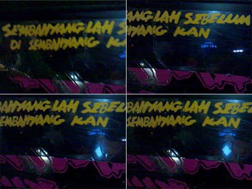

*Tek tek tek tek*. Si kenek mengadu-ngadukan koin recehnya dengan tiang besi yang terpancang di tengah bis. Sopir beringas yang memacu bis ini habis-habisan akhirnya menginjak pedal rem juga. Rem angin mendesis diiringi suara decitan roda-roda bis.

"Yuk yang ke Muara Angke turun sini!" si Kenek mengingatkan kami.

Kami pun turun dari bis Apollo ini. *Alhamdulillah*.

Hari masih pagi. Jalanan ibu kota masih lengang, jauh dari hiruk pikuk kendaraan. Tidak jauh dari lampu merah dua buah mikrolet berwarna merah tengah menunggu penumpang. Mikrolet 01 Jurusan Muara Angke, begitu tulisan di kaca belakang mikrolet ini. Ah, ini dia mikrolet yang kami cari!

Di dalam mikrolet yang *mengetem* paling depan, baru ada satu orang penumpang. Ia duduk tepat di belakang jok si sopir, kami pun turut masuk ke dalam mikrolet dan duduk di bagian paling belakang. Ada tulisan cukup besar menempel pada kaca belakang mikrolet ini, kami terkagum-kagum saat selesai membacanya.

> Sembahyang Lah Sebelum Di Sembahyang Kan

Jarang sekali bukan kita menemukan tulisan religius seperti itu di dalam mikrolet? atau angkot? atau bis? Biasanya yang kita temukan hanya frasa-frasa penuh kegetiran, seperti "The My Is Three" (demi istri maksudnya) atau "Cari Jodo Di Pulau Jawa" lengkap dengan kaca film bergambar wajah wanita menor.

Tulisan itu menampar-nampar batinku. Sekelebat bayangan kematian melintas di benakku. Apa amalan yang akan ku bawa jika aku mati? Tidak banyak pikirku. Aku sering kali terbuai dengan masa mudaku. Aku masih muda dan hidupku masih panjang, begitu pikirku. Padahal siapa yang tahu soal usia?

Dengan singkat bangku-bangku mikrolet terisi penuh. Berdesakan. Mikrolet melaju menggilas jalanan. Kantuk merayapi pelupuk mataku, akupun terlelap dengan petuah dari mikrolet yang masih terngiang.

Foto cover dari [Unsplash](https://unsplash.com/photos/BYu8ITUWMfc) oleh [Israel Sundseth](https://unsplash.com/@kappuru).
