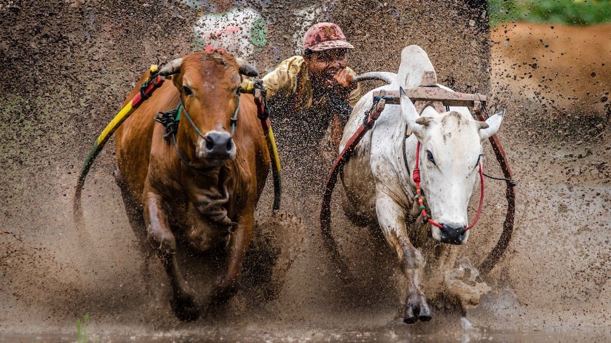

Kedua telapak tanganku menggenggam erat ekor dari sepasang sapi yang akan kupacu. Halilintar dan Guntur. Kaki kiriku terendam lumpur halus setinggi mata kaki. Sementara kaki kananku memijak kokoh batang bambu yang melintang di antara kedua bajak. Halilintar melenguh, mendengus keras kala dicekoki ramuan pendongkrak stamina—hasil campuran madu lebah dan telur ayam kampung. Jantungku pun berdetak kian kencang. Peluh menetes deras dari dahi, ke pipi, hingga akhirnya bermuara ke ujung daguku. Ini memang saat-saat paling mendebarkan dalam hidupku. "Risan Bagja Pradana!", namaku menggema dari pengeras suara milik panitia. Ini giliranku untuk turun ke arena Pacu Jawi!

Pacu Jawi atau balapan sapi ini memang menjadi hiburan atraktif yang selalu dinanti-nanti. Atraksi khas Kabupaten Tanah Datar ini umumnya digelar untuk menyambut masa tanam padi, sekira Bulan Juni atau Juli. Berbeda dengan Karapan Sapi di Madura, Pacu Jawi di Tanah Minang ini digelar di areal pesawahan yang berlumpur. Disamping itu, selain harus cepat, peserta Pacu Jawi pun dituntut untuk mengarahkan sapi-sapinya agar berlari lurus.

Satu, dua, tiga! Dengan sigap rahangku menggigit keras ekor Halilintar dan Guntur. Mereka melesat bak angin. Lumpur menciprat deras, menghambur ke udara. Suasana semakin riuh rendah. Penonton yang berjejer di sepanjang pematang sawah bersorak penuh keriangan. Di ujung sana, sebilah bambu tertancap ke dalam lumpur sebagai penanda garis *finish*. Bilah bambu itu terlihat dekat dan semakin dekat. Sampai akhirnya Guntur tiba-tiba merubah arah larinya. Tungkai-tungkai kakinya bergerak dengan liar. Aku pun tak mampu lagi mengendalikan arahnya. Bajak bergerak liar, aku terpelanting ke udara. Seketika sekelilingku seolah berubah menjadi sebuah adegan *slow motion* dalam sebuah film laga. Hening. Hingga akhirnya aku terperosok ke dalam kolam lumpur dan semuanya tiba-tiba menjadi gelap.

Gelap enggan pergi dari penglihatanku. Gulita, tanpa ada cahaya setitikpun. Namun ada hal lain yang berbeda. Aroma keringat bercampur lumpur kini terganti dengan bau asap yang menusuk hidung. Suara gemuruh tepuk-tangan penonton kini terganti dengan suara bising dari logam-logam yang beradu. Apa aku ada dalam kereta?

Seketika sinar keemasan mentari menyelusup ke sekelilingku. Kini semuanya terang benderang. Aku mendapati diriku tengah terduduk di kursi kayu yang memanjang. Aku meloncat, menghambur, menengok lewat jendela kaca di hadapanku. Bukit-bukit nan hijau terhampar luas di luar jendela. Mereka tampak bekejar-kejaran. Sementara di belakang, terowongan hitam menganga lebar di tebing cadas yang kokoh. Semakin lama, terowongan itu semakin menjauh, hingga akhirnya hilang dari pandangan. Aku mulai menyadari keberadaanku: aku benar-benar tengah berada di dalam kereta yang bergerak!

Mak Itam namanya, dari Jerman ia berasal. Lokomotif uap bernomor seri E-1060 ini dahulu digunakan untuk mengangkut batu bara dari Tambang Ombilin di Sawahlunto ke Pelabuhan Emma Haven (sekarang dikenal sebagai Teluk Bayur). Namun kala produksi batu baru merosot tajam di medio 80-an, Mak Itam terpaksa dipensiunkan dan diboyong ke Ambarawa, Jawa Tengah. Namun kini Mak Itam telah pulang kembali dan bertransformasi menjadi kereta wisata.

 oleh [Christopher Yapp](https://www.flickr.com/photos/128839707@N03/) © All rights reserved)](01-e1060-esslingen-between-ambarawa-and-jambu-by-christophery.jpg)

Pluit Mak Itam menyalak keras. Dari cerobongnya asap putih pekat membumbung tinggi ke udara. Mak Itam yang berbobot 55 ton ini, setiap hari Minggunya akan membawa wisatawan bernostalgia, mengenang kejayaan batu bara Sawahlunto di masa silam. Mak Itam yang mengkonsumsi satu ton batu bara untuk perjalanan pulang–pergi antara Padangpanjang dan Sawahlunto ini, menawarkan keindahan lanskap dan pengalaman yang tiada duanya. Salah satu yang menarik adalah saat kereta memasuki "Lubang Kalam"—terowongan gelap sepanjang satu kilometer yang menembus bukit-bukit cadas.

"Danau Singkarak!", aku berteriak dengan penuh semangat kala Mak Itam melintasi bibir danau terbesar ke-dua di Sumatera ini. Aku berlari ke pintu gerbong. Mendongakkan kepalaku ke luar dan sebisa mungkin merekam setiap detail keindahan yang dipancarkan olehnya. Airnya tenang, jernih kehijauan. Di kejauhan seorang nelayan menebar jala di atas sampannya yang kecil. Siapapun pasti akan berdecak kagum kala melihat danau cantik berlatarkan gunung-gemunung ini.

 oleh [Erwin Jonathan](https://www.flickr.com/photos/erwinjonathan/) © All rights reserved)](02-danau-singkarak-by-erwinjonathan.jpg)

Aku bergelayut di pintu gerbong. Kupejamkan mata. Kubiarkan segarnya udara Singkarak menampar-nampar kulit wajahku. Kubayangkan diriku bersampan. Mengail ikan di tengah Danau, berharap mendapatkan Ikan Bilih—ikan endemik yang hanya ada di Danau Singkarak. Mak Itam terus berdesis, mataku masih terpejam. Sejuk terasa kala angin tak henti-hentinya membelai wajahku, menerbangkan helai-helai rambutku yang mulai gondrong.

Mataku enggan jua terbuka. Bak seorang kekasih yang tengah merindu, kunikmati belaian demi belaian angin yang memulas mesra wajahku. Seolah menghipnotisku, lamat-lamat desis Mak Itam perlahan hilang. Tak ada lagi suara nyaring pluit. Tak ada lagi suara roda-roda besi yang beradu dengan bantalan rel. Tak ada lagi suara sekop yang tengah meraup-raup batu bara. Kini semuanya senyap, tergantikan debur halus ombak. Kubuka mata. Aku di pantai!

Kudapati diriku tengah terbaring malas di atas hamparan pasir putih. Bayangan pohon-pohon kelapa yang berderet, meneduhi diriku dari terik Sang Mentari. Angin berdesir menyapaku, membawa aroma laut yang menyenangkan. Ku bangun dari tidurku, duduk bersender di batang pohon kelapa. Sejauh mata memandang, lautan nan biru terhampar luas. Sinar keemasan mentari menari, memantul-mantul di atas riak air. Ombak bergulung tenang, menyapu hamparan pasir putih yang lembut seperti tepung. Di sepanjang bibir pantai deretan pohon kelapa tumbuh sumbur.

Pulau Sikuai, itulah tempat dimana diriku berada. Pulau seluas 45 hektar ini masih termasuk ke dalam wilayah administratif Kota Padang. Hamparan pasir putihnya yang lembut, perairannya yang tenang, jernih, dan kaya akan biota laut, menjadikan Pulau Sikuai sebagai salah satu wisata bahari andalan provinsi Sumatera Barat. Tak hanya itu, kontur pulaunya yang berbukit berpadu dengan rimbunya hutan hujan, semakin melengkapi ekostisme Sikuai. Berenang atau *snorkeling*, tentu menjadi agenda wajib kala bertandang ke pulau ini. Selain itu bersepeda keliling pulau ataupun *hiking* menyusuri hutan bisa menjadi pilihan yang menyenangkan.

 oleh [Pudji Utami](https://www.flickr.com/photos/44783778@N02/) © All rights reserved)](03-sikuai-island-by-pudjiu.jpg)

Tak terasa waktu berlalu dan senja akhirnya tiba. Lembayung memulas indah di angkasa. Awan-awan tipis berarak riang di batas cakrawala. Aku berdiri di atas bukit, memandangi lautan yang seolah tak berbatas. Mentari bulat sempurna, jingga merona di ufuk Barat. Senyum perlahan terangkat dari ujung bibirku, mengagumi indahnya ciptaan Sang Kuasa. Burung-burung pun terbang beriringan kembali ke sarangnya. Di atas bukit, kubaringkan tubuhku di tanah yang lapang. Cahaya pucat bulan sudah nampak di angkasa yang perlahan kelabu. Indah tak tergambarkan kata-kata. Sekali lagi kupejamkan mata, untuk kembali ke dunia nyata.

*Post scriptum*: Tulisan ini diikutsertakan dalam lomba artikel wisata yang di adakan Explore Minangkabau. *Alhamdullilah* direstui juri untuk jadi artikel terbaik. Sebagai hadiahnya saya pun dapat berpelesir secara cuma-cuma ke Sumatera Barat! 🙂

Foto cover dari [Flicker](https://www.flickr.com/photos/11642572@N06/23689611915/in/album-72157662312317745/) oleh [Rodney Ee](https://www.flickr.com/photos/11642572@N06/).
