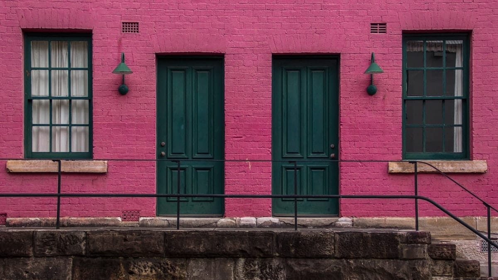

Ini hari kelima saya dan teman-teman saya diharuskan hadir di kampus pukul 7 pagi. Sebenarnya tidak ada yang salah dengan masuk pukul 7 pagi, hanya saja tubuh saya sudah terdidik dengan baik agar pingsan jam 6 pagi dan baru siuman pada jam 12 siang (kadang jam 2, hahaha).

Dengan dalih "Tidurnya orang puasa adalah ibadah", saya membenarkan perilaku malas saya yang satu ini. Belum lagi tontonan sepak bola sepanjang malam yang menambah deretan "berkah di bulan ramadan".

Yang membuat hari ke-5 *ngampus* berbeda adalah dosen mata kuliahnya yang terkenal menganut disiplin tingkat dewa. Perlu dicatat bahwa kalimat sebelumnya bukan merupakan keluhan, akan tetapi ungkapan *respect* saya pada beliau. Saya menaruh hormat yang besar pada dosen yang satu ini. Caranya mendisiplinkan para mahasiswa merupkan cerminan tanggung jawabnya yang besar terhadap profesinya.

Singkat kata hampir seluruh mahasiswa sudah berada di ruang kuliah A308. Hanya ada beberapa mahasiswa yang belum datang. Ketika perkuliahan sedang berlangsung, barulah segelintir mahasiswa yang terlambat itu bermunculan dan meminta izin untuk mengikuti perkuliahan. Tanpa rasa marah dan tanpa nada sindiran beliau mempersilakan masuk mahasiswa-mahasiswa tersebut.

Dosen: "Masuk, masuk! Selama ramadan ini boleh terlambat. Di bulan ramadan ini pintu surga dibuka lebar-lebar bukan? Begitupun pintu itu, saya buka lebar-lebar."

Saya: "Waaaahhhh," sambil tertawa.

Yang membuat saya kagum adalah karena kalimat tersebut diucapkan oleh orang yang bukan beragama Islam. Satu lagi nilai yang saya pelajari dari beliau: toleransi.

Rasanya indah kalau semua orang mau menghargai satu sama lain. Tidak perlu terjadi lagi pengrusakan-pengrusakan sarana ibadah atau tindakan-tindakan anarkis lainnya seperti yang akhir-akhir ini terjadi.

Foto dari [Unsplash](https://unsplash.com/photos/aZM_FgQdGiA) oleh [Dylan Collette](https://unsplash.com/@dylanjohn).
