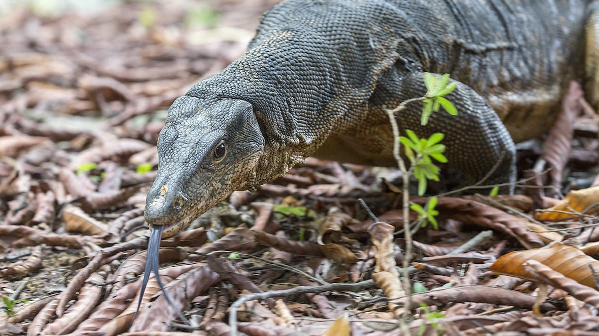
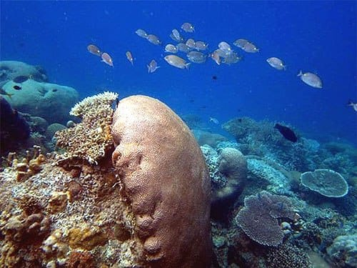
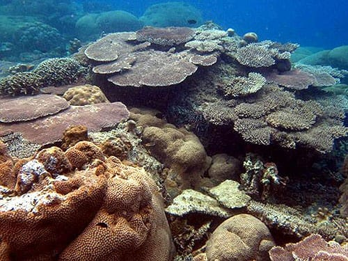
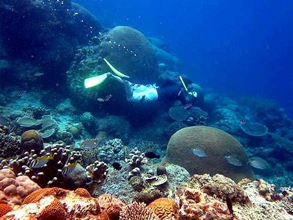
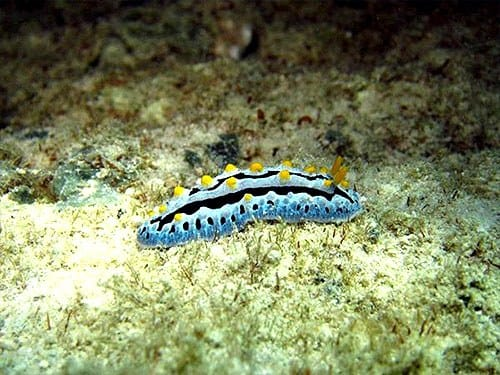
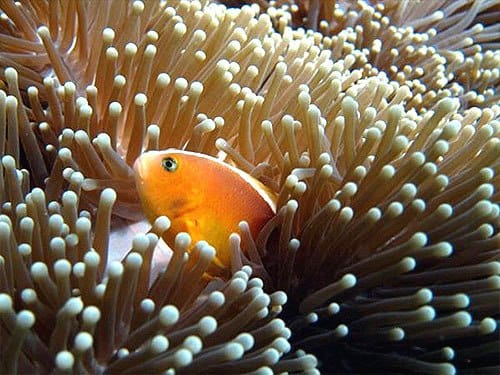
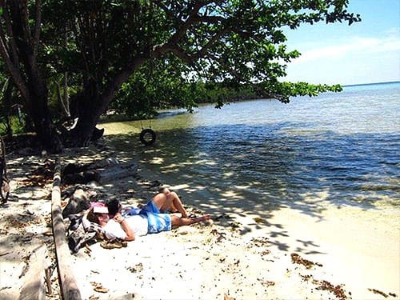

Aku tidak pernah tahu ada lokasi *snorkeling* yang begitu indah di Indramayu. Yang aku tahu tentang kabupaten di pesisir Laut Jawa ini hanya mangganya, hidangan lautnya, serta kilang minyaknya. Tidak lebih.

Sudah beberapa kali aku menyambangi Indramayu. Itu pun sekadar lewat mengisi perut yang keroncongan dengan hidangan lautnya yang segar. Sempat aku mendengar tentang Pulau Biawak, namun yang terbayang dalam benakku saat itu adalah: pulau kecil dengan perairan yang kotor, pasir pantainya yang hitam bak lumpur dan dihuni ratusan biawak yang kelaparan. Sebuah gambaran yang mengerikan.

Gambaran Pulau Biawak dalam benakku itu tentu beralasan. Tiap kali aku menepi untuk menyantap makanan laut di pesisir Indramayu, yang kutemukan adalah perairan yang kotor dan keruh kecoklatan. Kata dosenku, hal itu disebabkan banyaknya aliran sungai yang bermuara ke Laut Jawa. Aliran sungai itu membawa material lumpur yang menyebabkan perairan Laut Jawa tampak keruh.

Namun lusa kemarin saat [Achmad Alkatiri](https://twitter.com/madalkatiri) menuturkan keindahan Pulau Biawak lewat akun Twitter HolidayIQ Indonesia, aku terkejut bukan main. Bagaimana tidak, gambaran mengerikan tentang Pulau Biawak dalam benakku sirna seketika. Keindahan bawah laut Pulau Biawak benar-benar menghipnotis diriku. Terumbu karang yang tersebar di sekitar perairan Pulau Biawak tampak sehat dan tidak mengalami kerusakan. Pasir pantainya pun putih dengan laut tenang berwarna kehijauan. Belum lagi sebuah menara mercusuar peninggalan kolonial Belanda berdiri kokoh di tengah pulau.

Keindahan bawah laut memang menjadi daya tarik utama di Pulau Biawak. Kita *nyemplung* di ujung dermaganya saja, eksotisme bawah laut Pulau Biawak sudah bisa kita nikmati, ujar Alkatiri di lini masa Twitter-nya. Terbukti dari gambar-gambar yang ia sajikan, perairan yang jernih dengan tebaran terumbu karang serta ikan-ikan yang berwarna-warni. Surga!

Berikut adalah gambar-gambar keindahan Pulau Biawak yang disajikan HolidayIQ Indonesia dalam akun Twitter-nya pada tanggal 24 November 2011 kemarin:

Alkatiri juga menuturkan rincian logistik perjalanannya ke Pulau Biawak dari Jakarta bersama 18 orang lainnya selama 3 hari 2 malam:

* Idealnya pergi bersama 19 orang, agar biaya perjalanan lebih murah
* Transportasi PP Jakarta–Indramayu: **Rp 2.410.000**. Dengan rincian: sewa mobil kapasitas 19 orang Rp 1.700.000, bensin Rp 400.000, tol Rp 40.000, tips sopir Rp 150.000, serta makan sopir selama menunggu 2 hari Rp 120.000.
* Sewa kapal motor Biawak untuk PP Indramayu–P. Biawak dan untuk *snorkeling* selama 2 hari: **Rp 5.500.000**.
* Di Pulau Biawak belum ada yang menyewakan peralatan selam ataupun *snorkeling*, sehingga harus disiapkan dari rumah.
* Tips selama menginap di rumah penjaga mercusuar: **Rp 500.000**.
* Makan 4x untuk 19 orang: **Rp 1.750.000**.

Total perorang sekira **Rp 550.000**.

Sumber: [Achmad Alkatiri](https://twitter.com/madalkatiri) dalam HolidayIQ Indonesia.\
Foto cover dari [Flickr](https://www.flickr.com/photos/budak/36857783461/) oleh [budak](https://www.flickr.com/photos/budak/).
