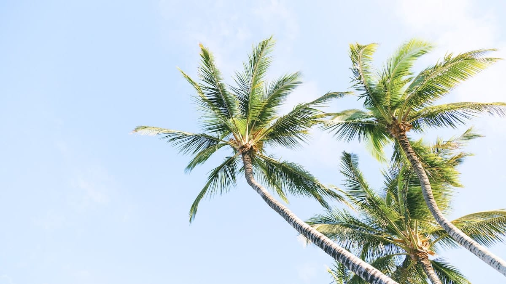
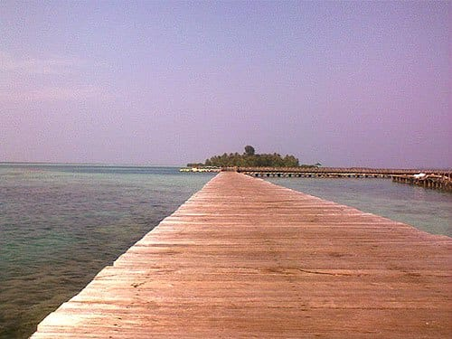
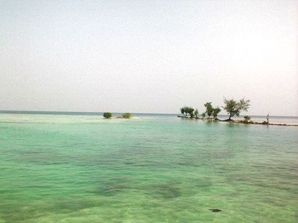

Pulau Tidung adalah pulau terluas yang berada di dalam wilayah Taman Nasional Kepulauan Seribu, Jakarta. Pulau ini terdiri dari dua bagian: Pulau Tidung Besar dan Pulau Tidung Kecil. Pulau Tidung Besar yang memanjang hampir 5 KM ini dihuni oleh beragam suku, mulai dari Banten, Bugis, hingga Jawa. Sedangkan Pulau Tidung Kecil yang berada di sebelah Timur Pulau Tidung Besar, tidak berpenghuni dan di sana terdapat makam Panglima Hitam yang dikeramatkan warga. Di Pulau Tidung Kecil juga terdapat pusat pembibitan pohon bakau.

Pulau Tidung Besar dan Pulau Tidung Kecil ini dihubungkan oleh sebuah jembatan kayu yang sangat indah. Jembatan kayu ini berdiri di atas karang, membelah perairan Tidung yang tenang. Perairan Tidung yang hijau jernih, membuat para pengunjung dapat menikmati keindahan bawah laut cukup dari jembatan ini. Ikan-ikan kecil dengan mudah dapat kita temui meliuk-liuk di antara terumbu karang.

Jembatan kayu yang menjadi penghubung antara Pulau Tidung Besar dan Pulau Tidung Kecil ini kerap dinamai "Jembatan Cinta". Konon pasangan yang berjalan sambil berpegangan tangan sepanjang jembatan ini, hubungannya akan langgeng dan berakhir di pelaminan. Di bagian awal dekat Pulau Tidung Besar, jembatan kayu ini melengkung tinggi di atas sebuah ceruk lautan. Perairannya yang cukup dalam di bagian ini, memungkinkan perahu-perahu nelayan lewat di atasnya. Bagian jembatan yang melengkung tinggi ini juga sering dijadikan tempat adu nyali para pengunjung. Berdiri di puncak jembatan, lalu terjun melompat kelaut.

Perairan di Tidung sangat tenang. Tidak ada ombak, hanya riak-riak air yang menyapu pantainya. Ombak Laut Jawa pecah oleh formasi karang yang mengitari pulau indah ini. Airnya benar-benar jernih berwana hijau bergradasi biru. Berenang atau sekadar bermain air di perairan Tidung tentu menjadi agenda wajib para pengunjung.

Di sepanjang pesisir Tidung Kecil pengunjung juga dapat menikmati pantai yang bersih dengan pasirnya yang putih lembut. Pohon-pohon kayu dan bakau tumbuh lebat di pulau ini, membuat suasana terasa teduh. Tidur-tiduran di bawah rindangnya pepohonan atau berjemur di atas pasir pantainya yang lembut, menjadi sebuah pengalaman yang menyenangkan. Tidak heran para *backpacker* menyebut pulau ini *The New Paradise*.

Foto cover dari [Unsplash](https://unsplash.com/photos/rMqbe4WLqXk) oleh [Sebastien Gabriel](https://unsplash.com/@sgabriel).
