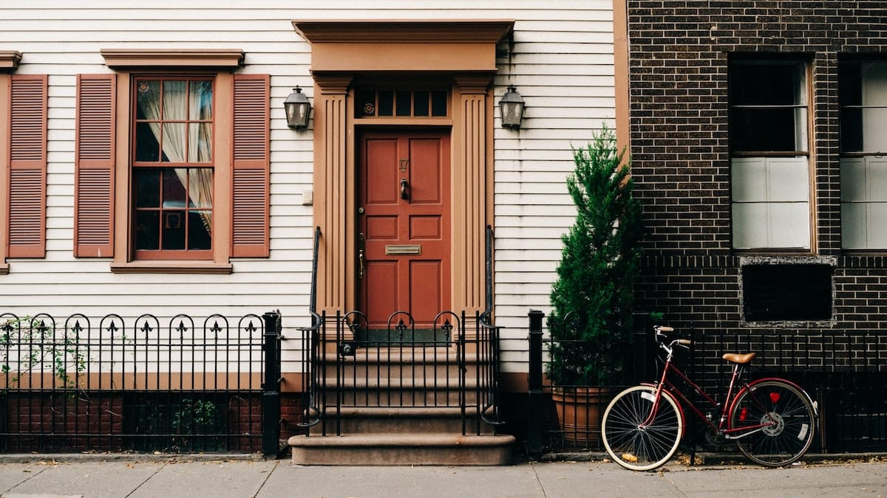

Entah sudah berapa malam aku merindukan rumah. Merindukan hangatnya tempatku dibesarkan. Terakhir aku pulang tepat satu bulan yang lalu, itupun hanya untuk satu malam. Dan sekarang ini aku terdampar di Kepulauan Riau, jauh dari kota kecil yang sudah menjadi kampung halaman bagiku.

Aku tinggal di Kota Cimahi, sebuah kota kecil yang berbatasan dengan Kabupaten Bandung. Kota dengan tiga kecamatannya yang berada di kaki Gunung Tangkuban Parahu. Kota yang sejuk dan kerap mendapatkan penghargaan Adipura—meski ironisnya tragedi maut longsoran sampah terjadi juga di kota ini.



Aku rindu masakan ibu. Rindu melahap habis semua sajian yang beliau hidangkan. Rindu pada dingin yang kerap menyapa dari malam hingga pagi merekah. Rindu pada selimut tebal yang setia menemani malam-malamku meringkuk nyaman di tempat tidur. Rindu menonton kartun-kartun pagi bersama adik lelakiku. Bersantai sembari menikmati pisang goreng buatan ibu dengan kopi hitam pekat cap Aroma.

Aku rindu berlari hingga ke batas kota, memandangi kota kecilku yang berbalut kabut di ketinggian. Rindu menyambangi kios buku untuk sekadar membeli koran atau pun majalah. Rindu pada Tukang Bubur yang setiap pagi rutin melewati gang di depan rumah.

Aku rindu bermalas-malasan. Membaca buku sembari tiduran di kursi. Rindu mengantarkan ibu ke pasar. Rindu menunggui adikku yang gemar bermain sepak bola di alun-alun kota sepulang sekolah. Rindu pada kabut yang kerap turun di musim hujan seperti ini. Rindu menggoda dan mengusili adik perempuanku. Rindu pada semua hal tentang rumah.

Aku mulai kembali merasa jenuh dengan pekerjaanku, padahal jauh dari kata sibuk. Kurasa aku harus segera pulang.

*Everyday there’s a boy in the mirror, asking me*\
*What are you doing here?*\
*Finding all my previous motives*\
*growing increasingly unclear*\
*Home sick*\
*Because I no longer know where home is*\
— Homesick oleh Kings of Convenience

Foto cover dari [Unplash](https://unsplash.com/photos/D_4R9CcYZOk) oleh [Christian Koch](https://unsplash.com/@xt1an).
