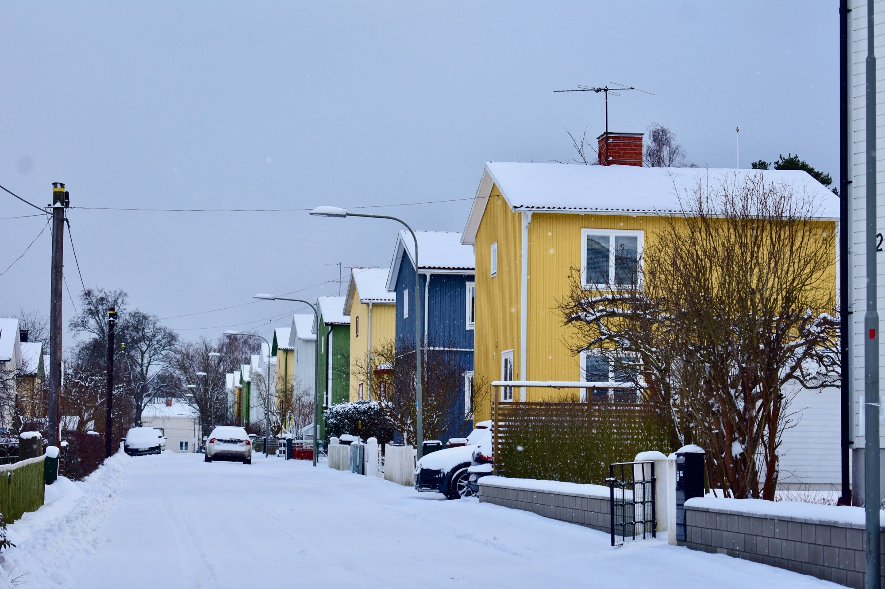
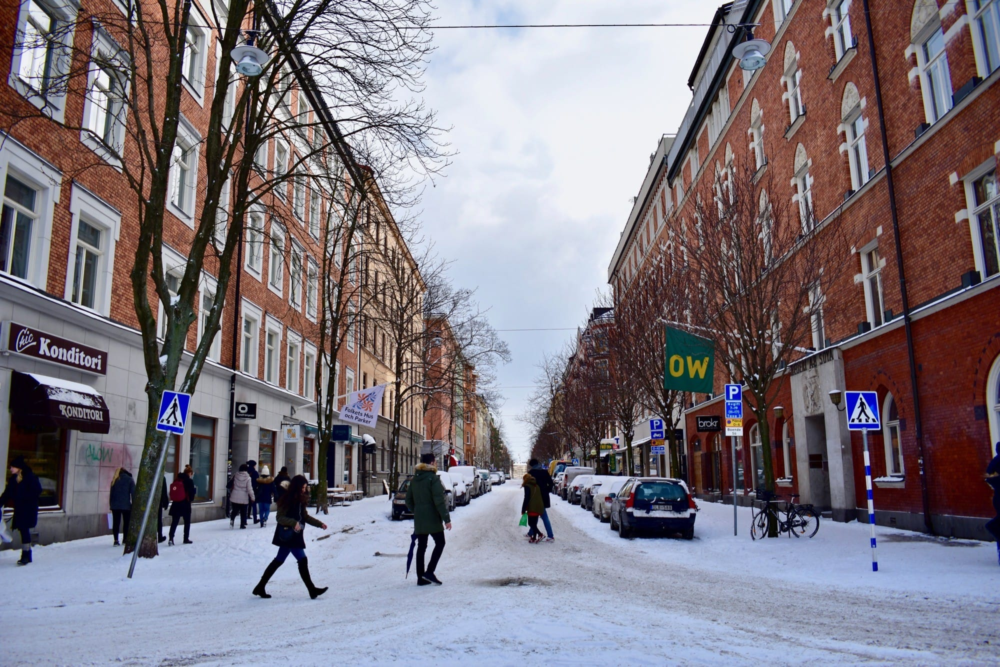
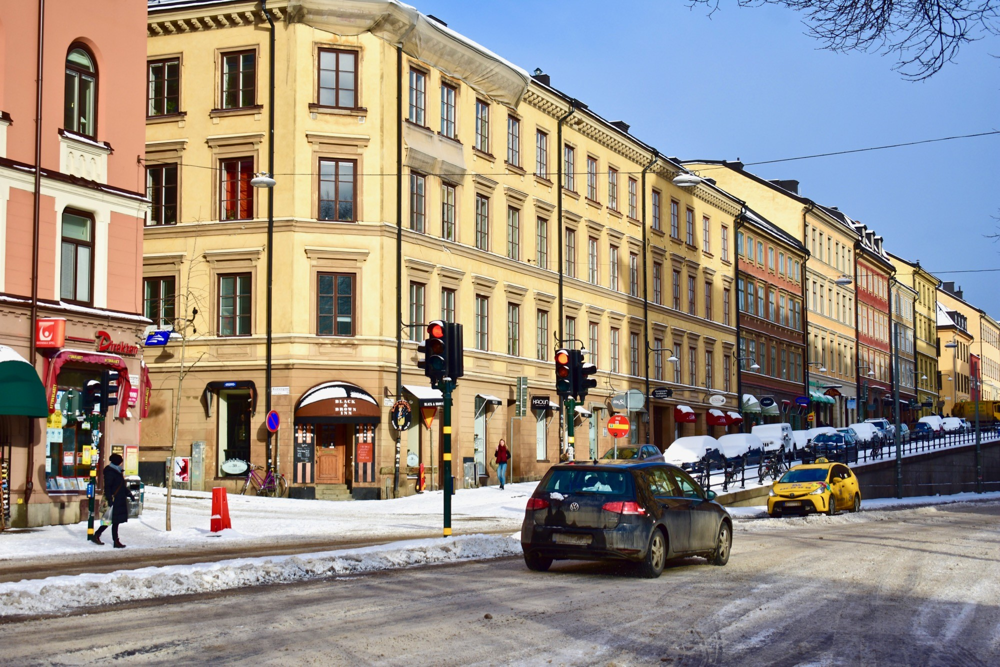
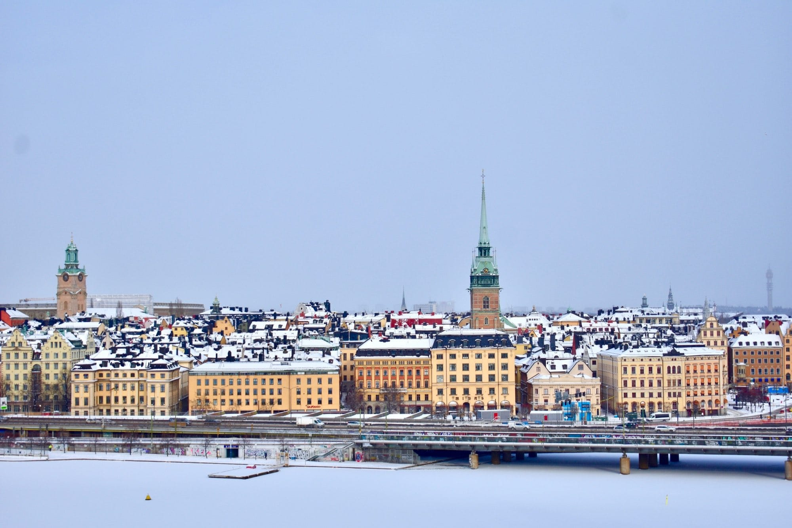
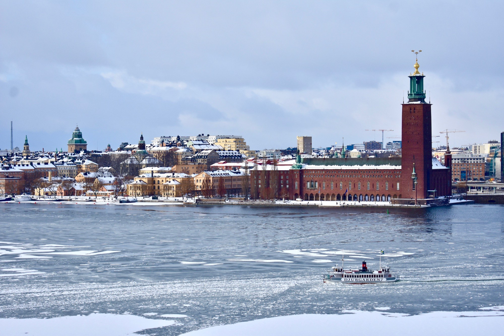
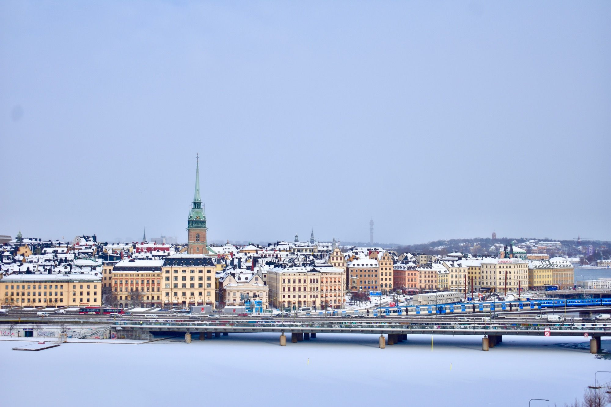
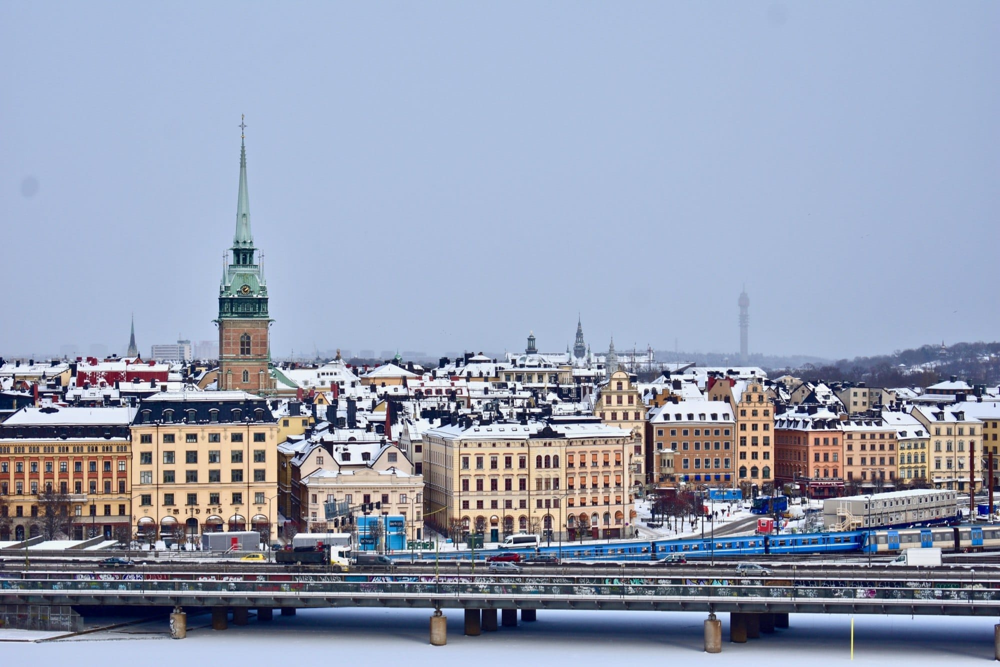
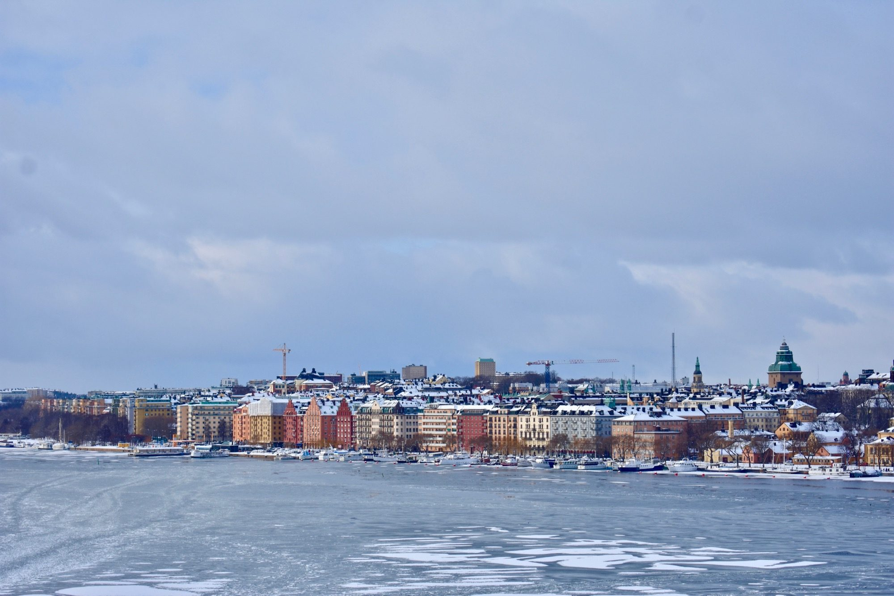
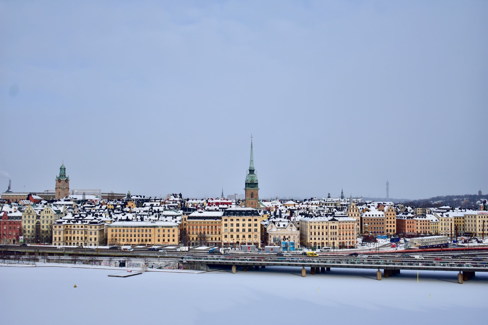

Hari Sabtu dan Minggu kemarin, Swedia mengalami "*isdygn*" yang kedua kalinya di musim dingin kali ini. *Isdygn* adalah istilah meteorologi yang digunakan di Swedia saat temperatur maksimum di siang hari berada di bawah 0°C di seantero negeri.

Jatuhnya temperatur kali ini disebabkan oleh angin dingin dari Siberia. Suhu terdingin di Swedia pagi ini tercatat di kota Gielas, di mana temperatur hampir mencapai -40°C.

Di Stockholm sendiri, pagi ini suhu mencapai -6°C—relatif tidak sedingin hari-hari sebelumnya, di mana suhu sempat menyentuh -12°C. Sedari pagi, saljupun turun tiada hentinya. Sekira 30 jadwal penerbangan dibatalkan dari Bandara Arlanda. Di beberapa kota sistem keretapun sempat mengalamai gangguan. Bahkan mobil yang ditumpangi perdana menteri Stefan Löfven mengalami kecelakaan akibat derasnya salju yang turun. Mobil sang perdana menteri menabrak pagar pembatas jalan, beruntung tidak ada korban yang terluka.

Pada siang hari, salju sempat sempat berhenti. Saya pun menyempatkan diri untuk jalan-jalan ke Monteliusvägen. Monteliusvägen ini merupakan salah satu titik populer untuk mengambil foto di Stockholm. Ia berupa jalan setapak di tepi tebing, di mana kita bisa memandang lepas ke arah Danau Mälaren dan daerah-daerah di sekitarnya: Kungsholmen, Riddarholmen dan Gamla Stan.


{{}}

{{}}

{{}}

{{}}

{{}}

{{}}

{{}}

{{}}

{{}}

{{}}

