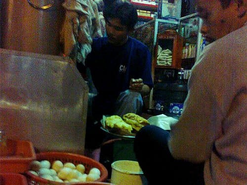
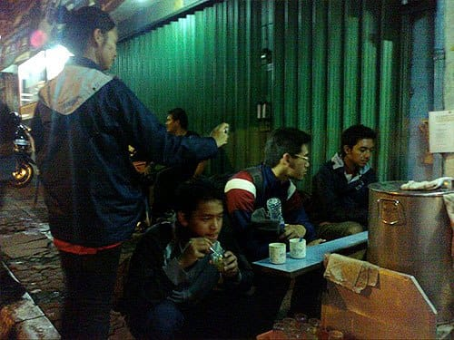
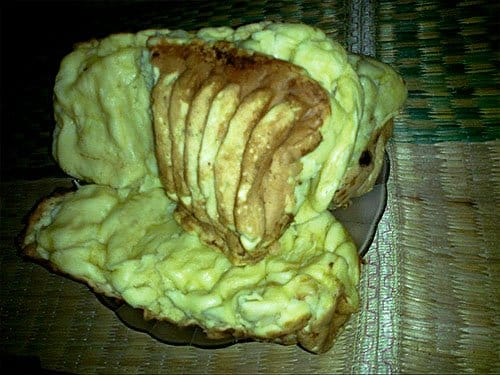
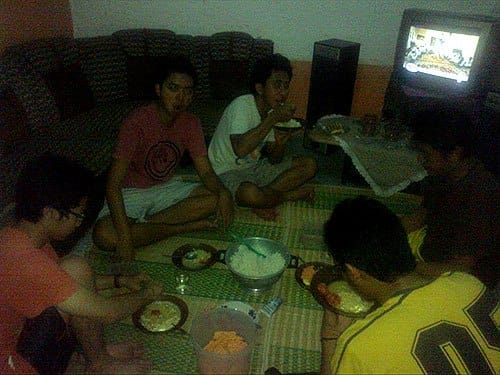
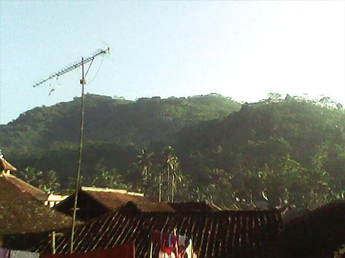

Malam sudah mendahului saat kami tiba di Kota Sukabumi. Perjalanan menuju pesisir Selatan Sukabumi masih panjang. Kami memutuskan untuk bermalam di kota ini dan melanjutkan perjalanan esok hari. Awalnya kami akan menginap di Mesjid Agung Sukabumi yang bersebelahan dengan Alun-Alun kota, bahkan kami sudah ditawari oleh pengurus DKM-nya. Namun akibat bujuk rayu Mas Febri, kami pun luluh menerima tawarannya untuk menginap di rumah kerabatnya.

Kami berjalan beriringan, membopong tas yang menggelayut mesra di punggung-punggung kami. Disirami cahaya lampu-lampu merkuri, kami susuri jalan-jalan di jantung kota. Kami bergerak mencari panganan yang populer di kota ini: Bandros Ata. Bandros si *waffle van java* ini adalah kudapan khas tanah Sunda yang berbahan dasar tepung beras dan kelapa. Dan si "Bandros Ata" ini merupakan salah satu penjaja bandros yang tersohor di Sukabumi.

Tidak terlalu sulit mencari Bandros Ata ini, semua warga kota pasti tahu dimana letaknya. Dari Alun-Alun Kota kami hanya perlu berjalan lurus ke arah Utara. Bandros Ata ini terletak tidak jauh dari perempatan, tepatnya di Jalan Gudang nomor 2. Suasana di Bandros Ata sangat ramai. Para pembeli berjejer menunggu gilirannya dilayani. Si penjual pun dengan cekatan menyiramkan adonan putih kental ke dalam cetakan.

Kami memesan Bandros *Original* sebanyak 4 porsi. 1 porsi bandros *original* berukuran besar cukup kami tebus seharga 6 ribu rupiah. Awalnya aku pikir bandros yang dijajakan di sini sama dengan bandros yang biasa kubeli di Bandung: rasanya asin, kulitnya garing, dan gurih adonannya. Meski sama-sama terbuat dari tepung beras dan kelapa, Bandros Ata ternyata rasanya manis dan lebih mirip pukis atau kue pancong. Pun begitu citarasanya memang tak perlu dipertanyakan, nikmat! Terlebih kelapa dalam adonannya tidak diparut, tapi dipotong-potong kecil sehingga menambah kaya teksturnya.

Beres membungkus Bandros Ata, kami menyewa sebuah angkot untuk mengantarkan kami ke rumah kerabat Mas Febri. Rumah kerabat Mas Febri ini tidak jauh dari pusat kota, tepatnya di Kampung Gandasoli, Dusun Cipurut, Kecamatan Cireunghas. Meski begitu angkot yang kami sewa seharga 40 ribu itu terpaksa melewati jalan-jalan tikus, keluar masuk jalan-jalan kecil. Kalau malam memang bagian para tukang ojek untuk menjaring penumpang, jelas si sopir. Kalau kepergok mengangkut penumpang, *wah* bisa panjang urusannya. Dimana-mana masalah perut memang sangat sensitif.

Sesampainya di Kampung Gandasoli, kami disambut ramah oleh kerabat mas Febri yang menenteng-nenteng lampu senter. Lampu senter tersebut rupanya berguna untuk menerangi jalanan setapak yang gelap dan licin di perkampungan.

Sesampainya di rumah kediaman kerabat Mas Febri, kami disuguhi cemilan nikmat khas Sukabumi lainnya: makaroni. Bentuknya mirip pasta macaroni dari Italia, hanya saja yang satu ini digoreng sehingga renyah seperti keripik. Rasanya sungguh tiada duanya! Makaroni di sini merupakan makaroni terlezat yang pernah kumakan. Rasanya asin dan gurih. *Bikin* ketagihan.

Suasana di Kampung Gandasoli sangat tenang. Sepanjang malam hanya terdengar suara aliran air dan derik jangkrik. Malam yang semakin larut dan perut yang sudah terisi perlahan membawa kami kepembaringan. Kami pun tertidur lelap.

Pagi menjelang membuka tabirnya. Udara dingin menyelinap dari celah-celah pintu, menusuk-nusuk kulitku yang hanya berbalut sarung tipis. Ayam berkokok bersahutan, beradu keras dengan alarm ponsel yang sengaja kupasang. Kami pun terbangun.

Beres mandi dan sarapan, tubuh kami terasa bertenaga kembali. Kami sangat bersemangat untuk melanjutkan perjalanan kami ke pesisir Sukabumi. Kami pun pamit kepada pemilik rumah yang sudah berbaik hati menampung kami. Ketika berjalan keluar kampung, akhirnya kami sadar kalau kampung ini ternyata berada tepat di kaki bukit. Pantas saja hawanya dingin menusuk.

Foto cover dari [Unsplash](https://unsplash.com/photos/uFomxGheuGk) oleh [Todd Diemer](https://unsplash.com/@todd_diemer).
