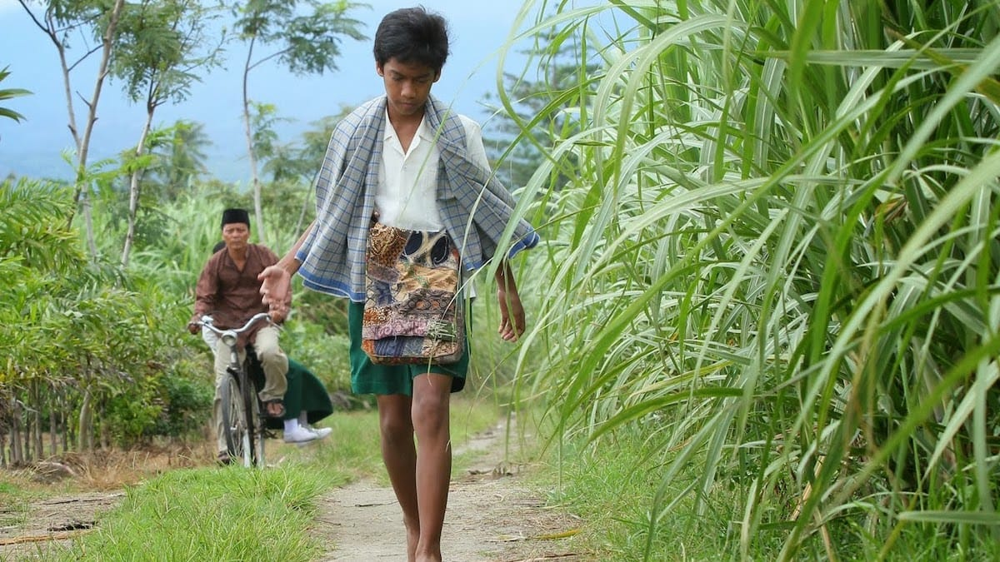

Siapa yang tak kenal Dahlan Iskan? Menteri BUMN sekaligus CEO Jawa Pos ini kerap menyedot perhatian publik dengan aksi-aksinya yang terbilang *nyentrik*. Tentu masih hangat di ingatan kala Dahlan Iskan geram dan membuka sendiri pintu tol dalam kota yang masih ditutup. Atau saat beliau diam-diam ikut berdesak-desakan dalam KRL. Atau juga saat beliau memilih untuk menginap di rumah seorang petani dengan hanya beralaskan tikar. Penampilannya yang bersahaja—kemeja putih, celana bahan serta sepatu kets yang menjadi ciri khasnya—nampak kontras dengan pejabat-pejabat tinggi di negeri ini.

Siapa yang tak kenal Dahlan Iskan? Menteri BUMN sekaligus CEO Jawa Pos ini kerap menyedot perhatian publik dengan aksi-aksinya yang terbilang *nyentrik*. Tentu masih hangat di ingatan kala Dahlan Iskan geram dan membuka sendiri pintu tol dalam kota yang masih ditutup. Atau saat beliau diam-diam ikut berdesak-desakan dalam KRL. Atau juga saat beliau memilih untuk menginap di rumah seorang petani dengan hanya beralaskan tikar. Penampilannya yang bersahaja—kemeja putih, celana bahan serta sepatu kets yang menjadi ciri khasnya—nampak kontras dengan pejabat-pejabat tinggi di negeri ini.

Sepatu Dahlan merupakan buku pertama dari rangkaian trilogi Novel Inspirasi Dahlan Iskan karya Khrisna Pabichara. Novel ini menceritakan kisah hidup Dahlan kecil yang penuh semangat dalam mengejar impian-impiannya meski berteman akrab dengan kemiskinan. Impiannya sangat sederhana: sepatu dan sepeda. Mungkin bagi sebagian orang impian tersebut tampak remeh. Namun bagi Dahlan kecil yang kerap melingkarkan sarung untuk menahan rasa lapar, kedua impian tersebut sangatlah mewah. Ia sering membayangkan betapa nikmatnya bila ia memiliki sepatu dan sepeda. Tak perlu ia pergi terlalu pagi untuk mencapai sekolah yang jaraknya berkilo-kilo. Tak perlu ia merasakan panasnya sengatan aspal di siang hari. Tak perlu juga ia merasakan perihnya luka-luka lecet di telapak kakinya.

Rupanya bukan hanya kemiskinan dan kelaparan yang mesti dihadapi Dahlan kecil. Ada yang lebih memilukan lagi dari itu semua: kehilangan. Di usianya yang masih belia, Dahlan harus kehilangan ibunya—sosok yang selama ini selalu memberikan kehangatan di rumahnya yang sederhana. Setelah ditinggal ibunya, Dahlan harus mengurusi adiknya yang masih kecil: Zein. Hal ini ia emban karena ayahnya bekerja serabutan dan kerap keluar kampung, sementara kedua kakak perempuannya tinggal di luar kota.

Buku ini juga hadir bukan untuk mengelu-elukan sosok Dahlan. Dahlan kecil juga digambarkan bukan tanpa cela. Diceritakan bagaimana Dahlan kecil terpaksa mencuri tebu untuk menebus rasa lapar. Bagaimana Dahlan kecil juga sempat berniat mencuri uang simpanan ayahnya untuk membeli sepatu. Atau Dahlan yang terampil di kelas, organisasi dan lapangan voli justru ciut dan kikuk di hadapan Aisha—gadis pujaan hatinya.

Penulis juga dengan apik menggambarkan persahabatan Dahlan dengan sahabat-sahabatnya: Kodir, Imran, Komariyah, Maryanti dan Arif. Jalinan persahabatan yang penuh kasih tanpa memandang latar sosial masing-masing. Persahabatan yang memberi gairah serta semangat tersendiri bagi Dahlan.

Kisah Dahlan kecil seperti sebuah tamparan bagi kita, bahwa keterbatasan bukanlah penghalang bagi kita untuk meraih impian. Bahwa kemiskinan tak layak dijadikan alasan untuk mengeluh dan meminta-minta. Bahwa kebahagiaan itu sangatlah sederhana.

)](01-sepatu-dahlan.jpg)

Judul: Sepatu Dahlan\
Penulis: Khrisna Prabichara\
Penerbit: Noura Books (PT Mizan Publika)\
Cetakan: VI, Juli 2012\
Tebal: 369 Halaman

Foto cover dari [Film Sepatu Dahlan](http://filmsepatudahlan.blogspot.com/2014/01/tidak-bersepatu.html).
