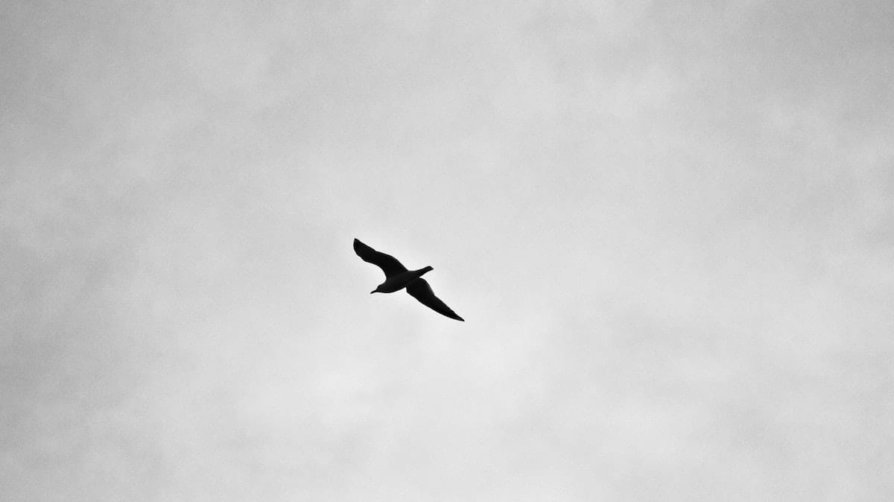

Aku mendengar nafasmu yang mulai tersengal. Degup jantungmu yang berderap seperti hentakan kuda-kuda perang.

Sementara aku masih terbujur kaku di bawah lumpur hitam yang mulai mengering. Mengerang tanpa suara. Mengernyit ketakutan, bersembunyi dari hantu-hantu yang berjaga di pintu gerbang. Perlahan kutandaskan pula niatku untuk hidup kembali. Keluh-kesah para cacing-cacing busuk ini lebih menarik perhatianku.

Tubuhmu kini mengejang. Terseok, terperosok ke jurang kelam yang dasarnya tak pernah terjamah oleh cahaya. Namun matamu nyalang menantang kematian yang menggantung di ujung hidungmu.

Awan kelabu bergulung. Menggagahi angkasa yang pongah. Desah hujan pun perlahan terdengar menciumi bumi. Sementara kau kian terengah dan semakin lemah.

Foto cover dari [Unsplash](https://unsplash.com/photos/MZYLtqrAWBw) oleh [Axel Antas-Bergkvist](https://unsplash.com/@abl).

