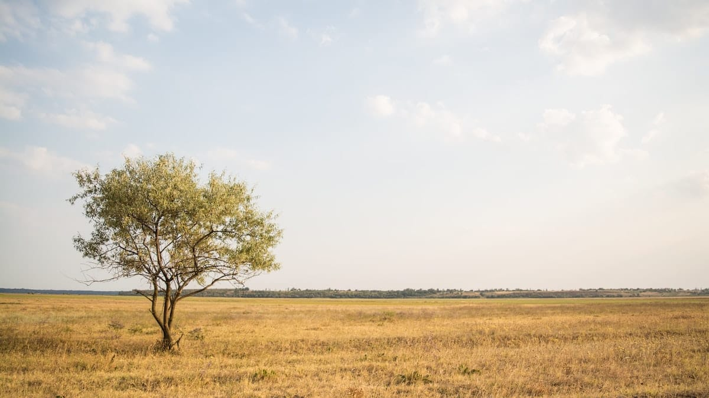

Seperti pohon...

Di pokok kita masih satu, lantas kita berpisah di cabang. Ada yang ke kiri, ada yang ke kanan, ada yang terus ke atas, ada yang ke depan, ada yang ke belakang. Atau bilapun masih satu di cabang, kita nanti akan berpisah juga di ranting. Ke atas, ke kiri, ke kanan, ke depan, ke belakang...

Saat kita kecil dulu, kita masih satu, masih anak kecil. Lantas sedikit demi sedikit waktu kita bikin kita beda. Waktunya makin banyak, beda kita tambah banyak.

Itulah kita.

— Dikutip dari Jejak-Jejak karya Bubin Lantang.

Foto cover dari [Unsplash](https://unsplash.com/photos/a7IVuJwYjp8) oleh [Rodion Kutsaev](https://unsplash.com/@frostroomhead).
