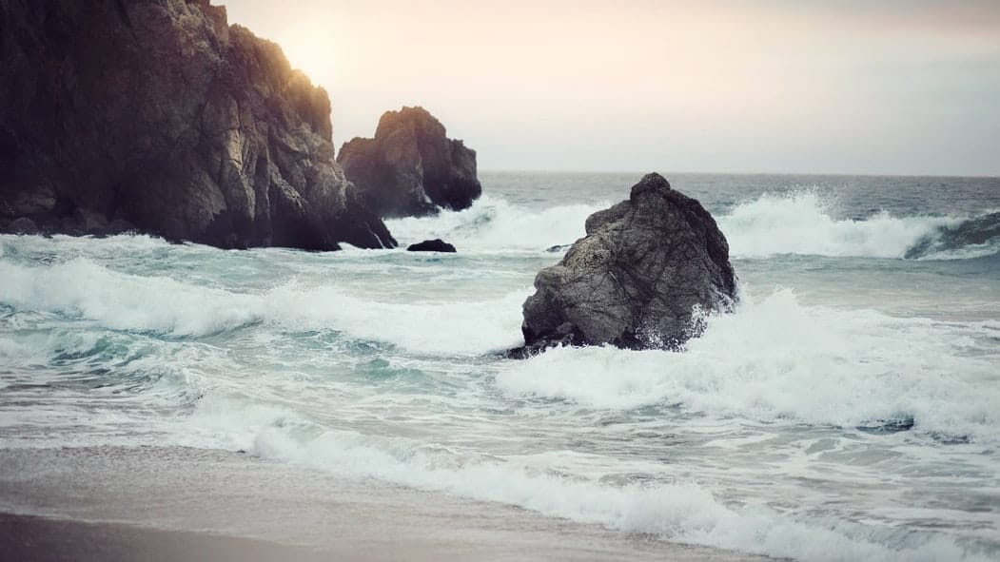

Karang besar berdiri kokoh di tepian pantai. Bentuknya sangat unik, karang yang kokoh itu memiliki lubang besar yang menganga—menyajikan pemandangan indah ke laut lepas. Bak gapura alami, karang tersebut melengkung tinggi dengan satu sisi kaki tertanam di pasir pantai yang halus dan kaki yang lain jatuh di lepas lautan. Berhiaskan lumut-lumut hijau dan dikelilingi rindangnya beringin, karang tersebut seolah menyambut ramah setiap pengunjungnya. Karang Bolong namanya.

Pantai Karang Bolong termasuk ke dalam wilayah administrasif Provinsi Banten. Letaknya persis berada di pinggir jalan raya Anyer–Carita, tidak jauh dari Pantai Carita.

Sekira tahun 2007, aku bersama teman-teman semasa SMA berkesempatan untuk berkunjung ke Pantai Karang Bolong ini. Pantainya bersih dan pemandangannya sangat indah, terlebih bila kita melihatnya dari atas karang. Bahkan bila cuaca sedang cerah, kita bisa melihat anak Gunung Krakatau jauh di lepas lautan.

Meski pantainya tidak terlalu luas, Pantai Karang bolong menawarkan panaroma alam lain yang tidak kalah indahnya. Banyak terdapat karang-karang besar yang menjorok ke lautan lepas. Beberapa karang bahkan sudah dilengkapi dengan tangga sehingga para pengunjung dapat memanjat ke atasnya. Selain itu ombak pantainya yang bersahabat dan rindangnya pepohonan di pinggiran pantai membuat pengunjungnya betah berlama-lama di pantai ini.

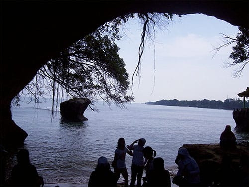

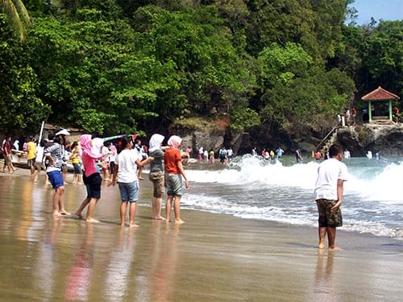

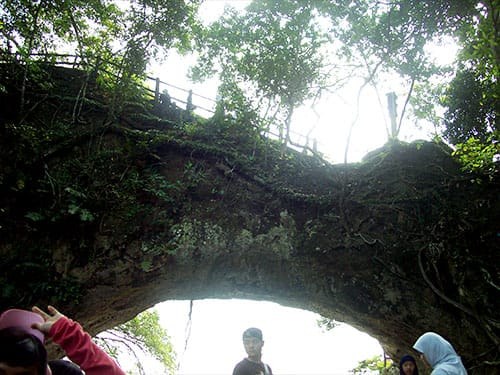

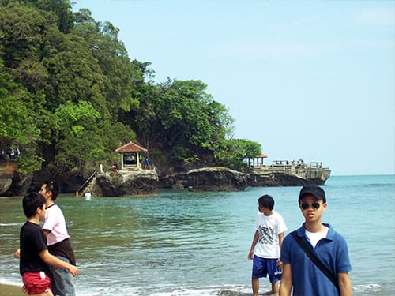

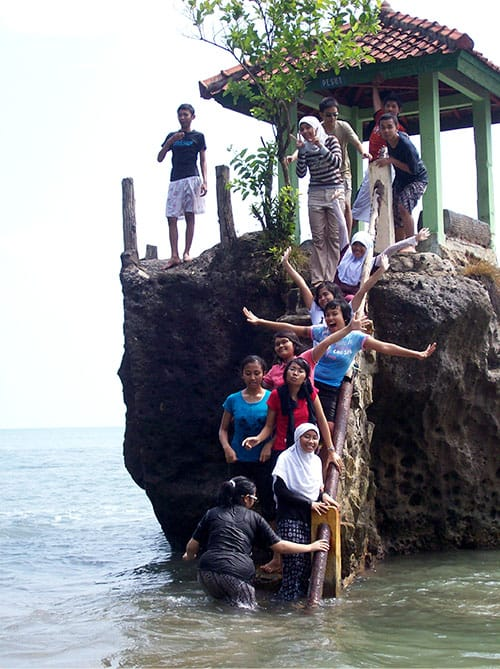

Sebagai salah satu destinasi wisata favorit di Provinsi Banten, Pantai Karang Bolong pun sudah dilengkapi beberapa sarana pendukung. Kamar mandi untuk tempat bilas pengunjung nampak masih baru dan terawat. Pondok penginapan dan kolam renang berdiri tidak jauh dari bibir pantai. Area parkir yang luas mampu menampung beberapa bus besar. Taman yang rindang akan pepohonan ditambah patung-patung hewan juga tersedia di sini.

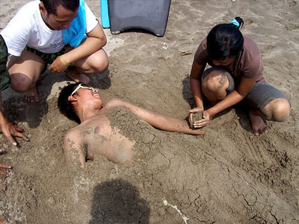

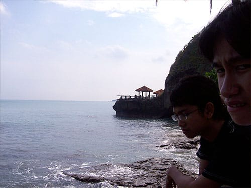

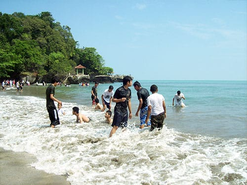

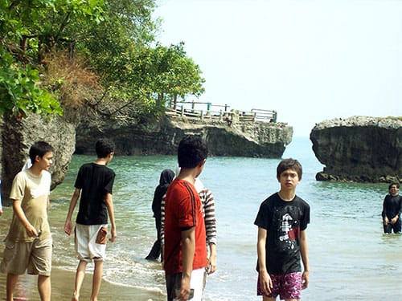

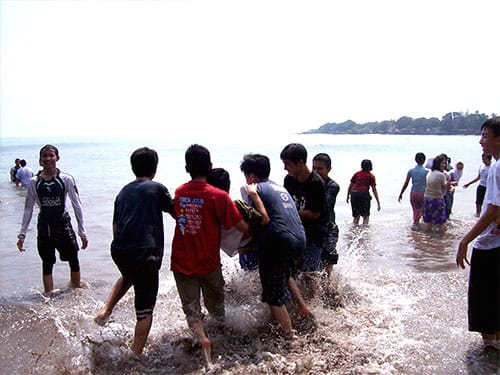

Foto cover dari [Unsplash](https://unsplash.com/photos/lp0IFw6YqZg) oleh [Angelina Odemchuk](https://unsplash.com/@angelinaodemchuk) .
