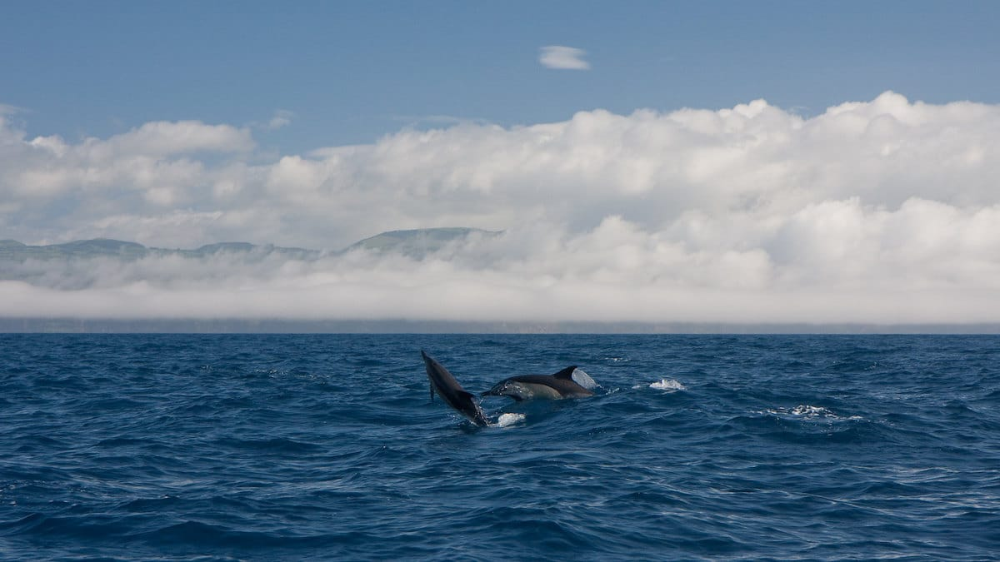
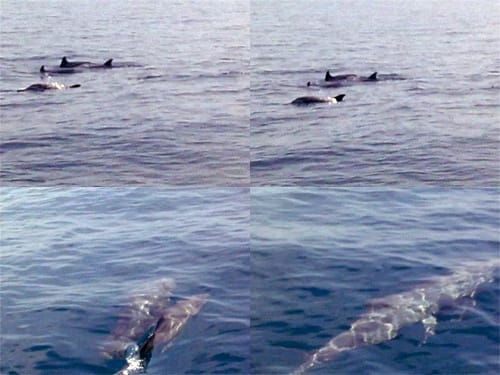
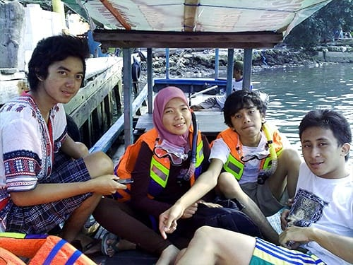
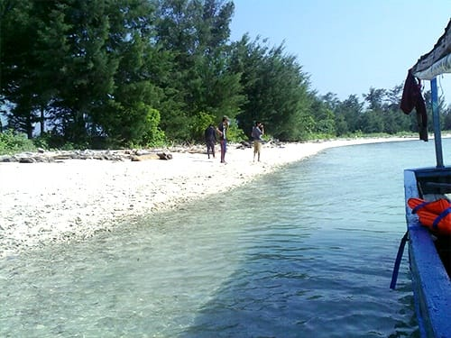
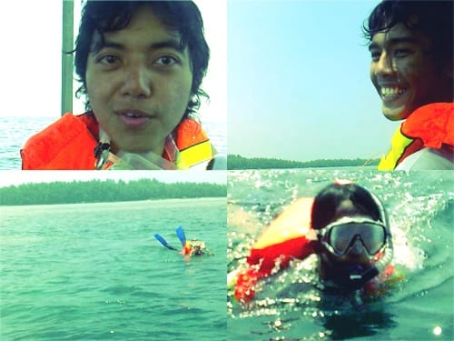
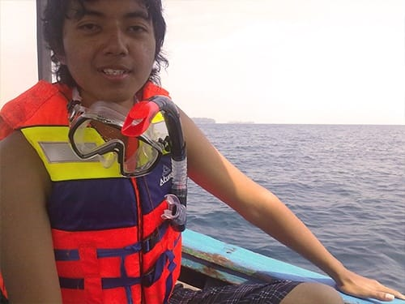

"Itu Lumba-Lumba!", teriak kami yang tengah terombang-ambing di atas kapal. Sekelompok ikan lumba-lumba melesat cepat di dekat permukaan air. Sesekali mereka melompat ke udara. Mereka berenang mengiringi kapal kami, seolah ingin memamerkan kemahirannya beratraksi di dalam air. Semasa kecil aku hanya bisa melihat mereka beratraksi di kolam mini dalam sebuah pertunjukan, kini kami bisa menyaksikannya langsung di lautan. Kami berdecak kagum, seolah tidak percaya di lepas Teluk Jakarta kami masih bisa menemui mamalia yang pintar ini.

Malam menjelang. Angin berhembus seiring ombak yang pecah di kejauhan. Aku, keempat kawanku dan dua pasang mahasiswa lain dari Jakarta tengah duduk-duduk santai di ruang tengah pondokan Pak Taufik. Ditemani Pak Taufik, kami berbincang tentang persiapan *snorkeling* esok hari. Pak Taufik membantu kami mencarikan perahu dan peralatan *snorkeling* yang kami butuhkan.

Pak Taufik sengaja mengundang pemilik perahu ke pondokannya, sehingga kami bisa berembuk langsung mengenai acara *snorkeling* besok pagi. Akhirnya kami sepakat untuk menyewa perahu seharian, dengan rute Pulau Air—Pulau Karang Beras—Pulau Payung. Harga sewanya sendiri sebesar 350 ribu, dengan kapasitas kapal mencapai 10 orang. Itu artinya, kami yang bersembilan cukup membayar 40 ribu rupiah per-orangnya.

Tuntas persoalan perahu, Pak Taufik membawa kami ke rumah Bang Syahbani. Bang Syahbani ini menyewakan peralatan untuk *snorkeling*. Untuk menyewa peralatan *snorkeling* lengkap, mulai dari pelampung, sepatu katak, *goggle*, serta snorkel kami cukup membayar 35 ribu rupiah untuk seharian penuh. Bang Syahbani juga menyewakan sepeda. Sepeda yang disewakan Bang Syahbani kondisinya masih sangat bagus, berbeda jauh dengan sepeda yang kami sewa.

Semua persiapan sudah lengkap. Kami sudah siap untuk ber-*snorkeling* ria esok pagi.

Pagi merekah. Hari itu langit tampak cerah. Hanya ada awan-awan tipis yang bergerak beriringan di batas cakrawala. Angin segar memulas-mulas wajah kami yang sedari tadi sudah duduk-duduk di atas perahu nelayan. Kami sudah tidak sabar mengarungi birunya lautan luas.

Kapal akhirnya bergerak, mesinnya menderu kencang melawan arus gelombang. Perahu kayu nelayan yang kecil ini berayun sangat keras. Air laut berhamburan ke atas kapal, membuat sekujur tubuh kami kebasahan. Namun semakin jauh meninggalkan daratan, gelombang laut semakin tenang. Perahu pun melaju dengan mantap.

Lokasi *snorkeling* pertama kami adalah di perairan Pulau Air. Warna-warni terumbu karang bertebaran di dasar lautnya yang dangkal. *Arcopora* yang memiliki bentuk seperti meja, hidup berkoloni menjadi tempat persembunyian bagi ikan-ikan kecil. *Coral Brain* yang menyerupai otak manusia pun tumbuh sehat dengan ukuran yang sangat besar.

Dari Pulau Air, kami menuju Pulau Karang Beras. Tidak seperti terumbu karang di perairan Pulau Air, terumbu karang di perairan ini tidak begitu variatif. Namun begitu, di Pulau Karang Beras ikannya jauh lebih banyak ditemui. Ikan kakak tua berwana hijau kemerahan pun tampak asyik menggerogoti terumbu karang dengan geliginya. Ikan-ikan di sini nampaknya tidak terganggu dengan kehadiran kami.

Hari menjelang sore, di tengah perjalanan dari Pulau Karang Beras menuju Pulau Payung, kami berpapasan dengan segerombolan ikan lumba-lumba. Mereka melesat sangat cepat di dalam air, mengiringi laju perahu kami. Sesekali mereka melompat di permukaan air. Menyuguhkan atraksi yang mengundang decak kagum. Tidak disangka di Kepulauan Seribu yang tidak jauh dari hiruk pikuk ibukota, masih bisa kami temui mamalia laut yang pintar ini.

Kapal akhirnya bersandar di Pulau Payung. Setelah membersihkan tubuh, kami menyusuri pulau ini. Menerobos belukar yang terhampar di belakang perkampungan. Di balik belukar itu tersembunyi sebuah pantai yang diteduhi pohon-pohon besar. Sebuah ayunan dan sebuah sampan yang tertambat menjadi objek permainan kami. Puas bermain, kami pun istirahat sejenak sambil melahap seperosi mie rebus dan sebuah kelapa muda di dekat dermaga. Hari yang sempurna!

Foto cover dari [Flickr](https://www.flickr.com/photos/stefanhaubold/3976699785/in/photostream/) oleh [Stefan Haubold](https://www.flickr.com/photos/stefanhaubold/).
