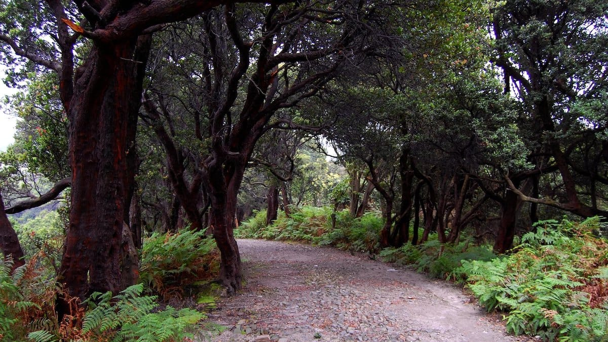
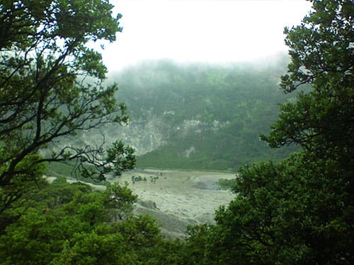
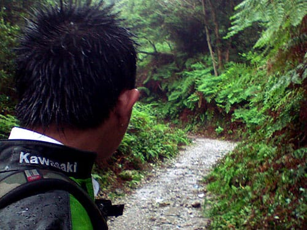
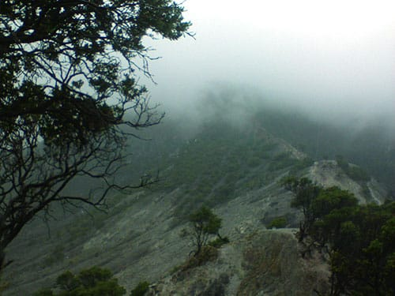
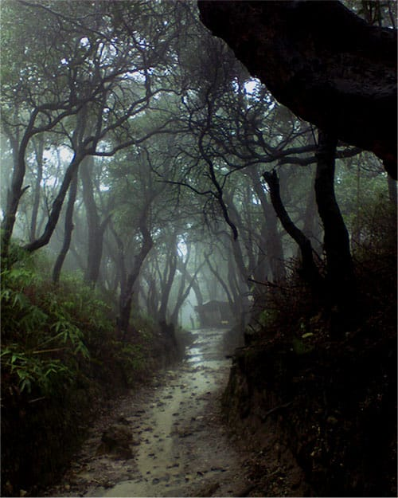
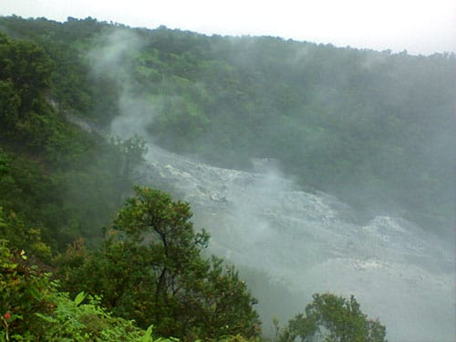
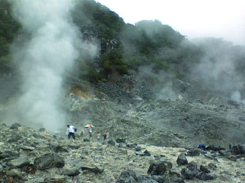
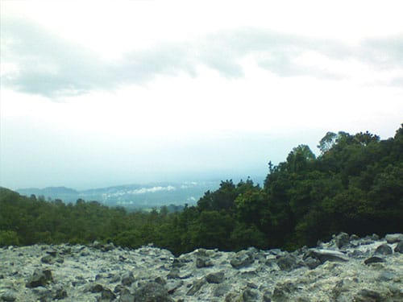

Kawasan wisata alam Gunung Tangkuban Parahu menyajikan keindahan alam yang memukau. Kawah vulkanik yang bergejolak dibalut keasrian hutan pegunungan, menjadi magnet pariwisata Jawa Barat.

## Kawah Upas

Kawah Ratu, menjadi spot utama para wisatawan berkunjung ke Tangkuban Parahu. Di sisi lain, Tangkuban Parahu masih menyimpan keindahan alam yang tidak kalah uniknya. Kawah Upas misalnya, kawah yang berdampingan dengan Kawah Ratu ini di kelilingi hutan dataran tinggi yang rindang. Di dasar Kawah Upas bahkan tumbuh subur pepohonan.

Untuk mencapai Kawah Upas, kita perlu memutari Kawah Ratu hingga nanti dijumpai sebuah gapura kayu yang menunjukan arah ke Kawah Upas. Selama perjalanan menuju Kawah Upas, pengunjung akan dimanjakan dengan lebatnya hutan yang meneduhi jalanan berbatu. Selain itu—selepas gapura—pengunjung juga akan melewati sebuah jembatan kayu yang sangat unik. Tidak jauh dari bibir Kawah Upas, pengunjung akan melewati lorong sempit yang diapit bebatuan besar di kanan dan kirinya.

## Kawah Domas

Lain halnya dengan Kawah Domas, kawah ini dapat dikunjungi wisatawan hingga ke dasarnya. Di dasar kawah Domas terdapat sumber mata air panas. Rekahan-rekahan di dasar kawah memancarkan air panas alami, sehingga terbentuk beberapa kolam air panas. Pengunjung dapat santai berendam dalam kolam-kolam air panas alami ini. Suhu airnya yang benar-benar panas dan kaya akan belerang dipercaya mampu mengusir pegal dan berbagai macam penyakit kulit. Di beberapa kolam dekat sumber pancaran air panas, pengunjung bahkan dapat merebus telur. Sebuah pengalaman yang sangat unik.

Untuk mencapai Kawah Domas, terdapat dua jalur utama. Pertama dalam perjalanan menuju Kawah Ratu, pengunjung dapat memarkir kendaraannya di gerbang masuk Kawah Domas yang terletak di sebelah kanan jalan. Dari gerbang ini pengunjung melanjutkan perjalanan dengan berjalan kaki menyusuri jalan setapak. Atau kedua, dari area parkir di puncak Kawah Ratu. Di sini terdapat tangga berbatu yang menurun menuju Kawah Domas. Alas kaki yang digunakan perlu diperhatikan karena jalur menuju Kawah Domas ini masih berupa tanah berbatu, sehingga sangat licin apabila hujan turun.

Foto cover dari  [Flickr](https://www.flickr.com/photos/ikhlasulamal/4406247454/in/photostream/)  oleh  [Ikhlasul Amal](https://www.flickr.com/photos/ikhlasulamal/) .
