Jum'at dua pekan yang lalu saya berkunjung ke Djurgården. Djurgården ini merupakan pulau yang berada tidak jauh dari pusat Kota Stockholm. Di sini terdapat banyak tempat-tempat menarik, mulai dari taman-taman yang rindang, museum-museum, galeri-galeri lukisan, hingga taman bermain. Tak ayal pulau ini menjadi salah satu tempat rekreasi favorit bagi warga Stockholm dan para wisatawan.

Untuk mencapai Djurgården, saya menggunakan kapal feri dari Dermaga Slussen. Tak lebih dari 10 menit, feri yang saya tumpangi pun akhirnya berlabuh di Allmänna gränd, Djurgården. Sesampainya di Djurgården, saya disambut dengan antrian pengunjung Gröna Lund yang mengular. Gröna Lund ini merupakan taman bermain tertua di Swedia dan letaknya persis di samping dermaga kapal feri.

Siang itu saya menyusuri jalan setapak di sisi Selatan Djurgården. Dari Waldemarsudde, terus ke arah Timur melewati Taman Frisens dan Djurgårdens bokskog. Menyusuri bibir pantai, melewati Frihetens Port, Täcka Udden, hingga berakhir di Blockhusudden. Berikut foto-foto yang saya ambil di sepanjang jalan.

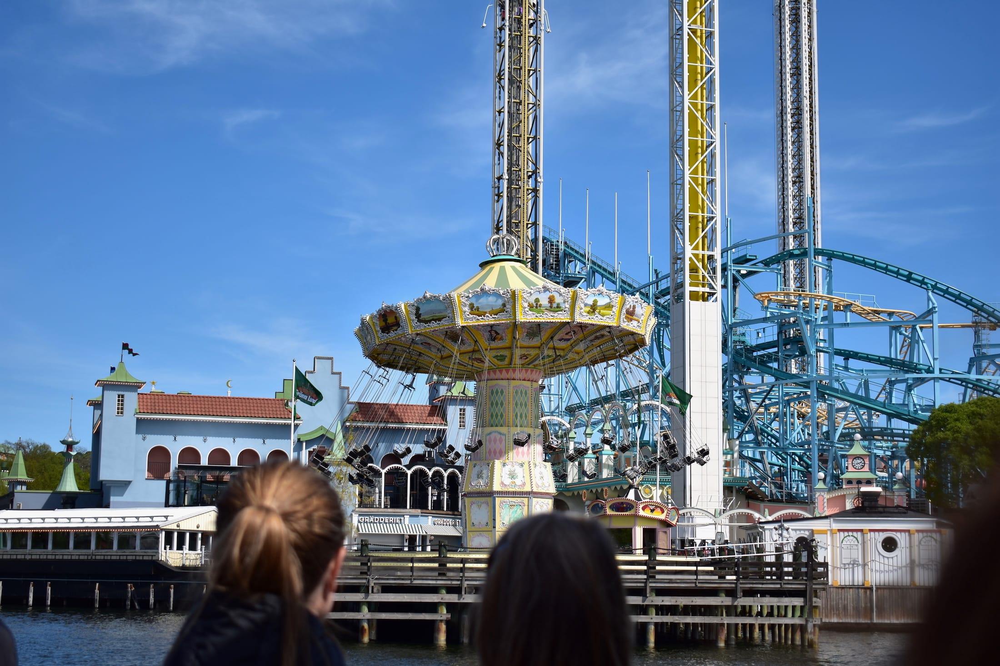

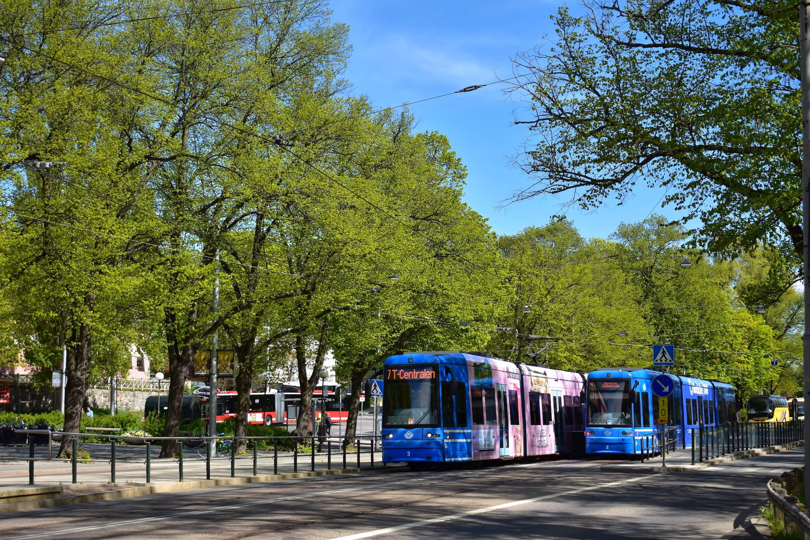

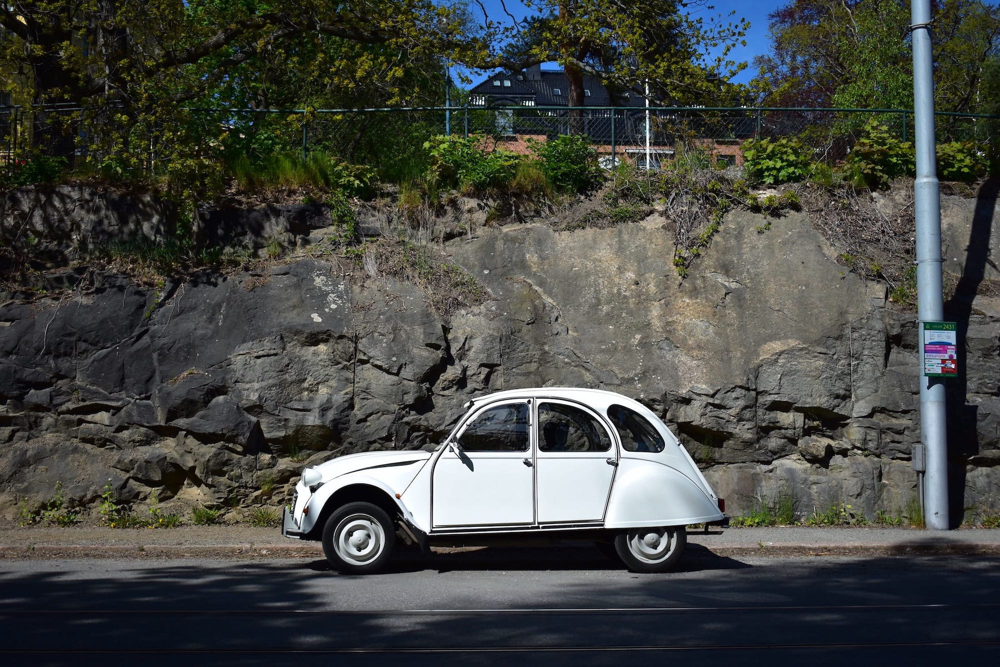

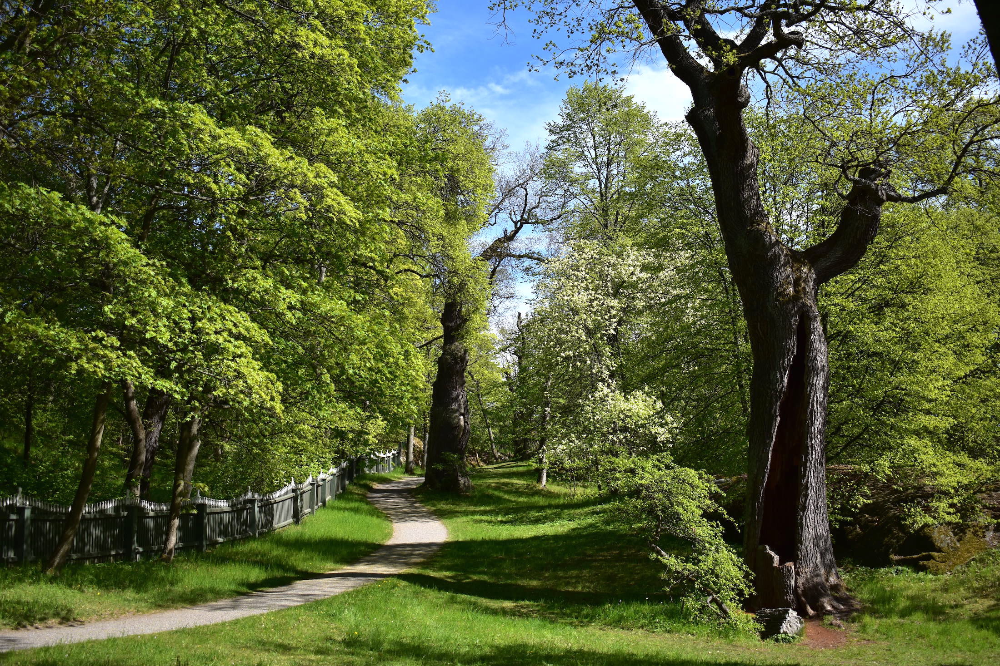

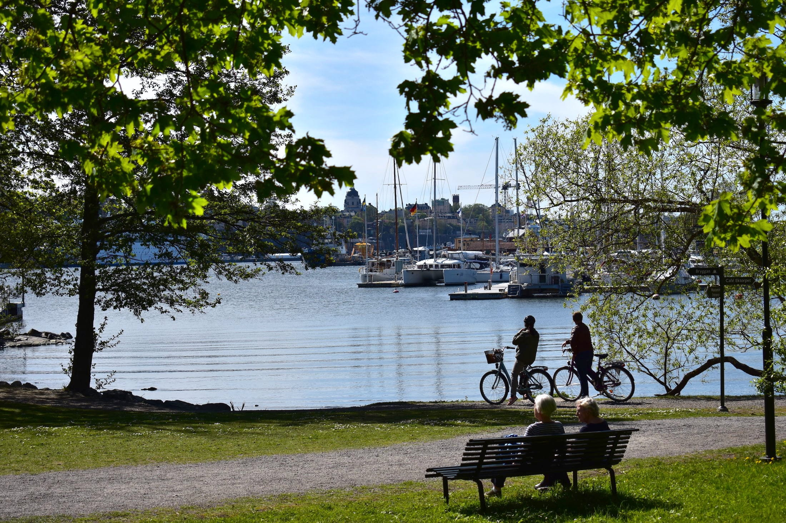

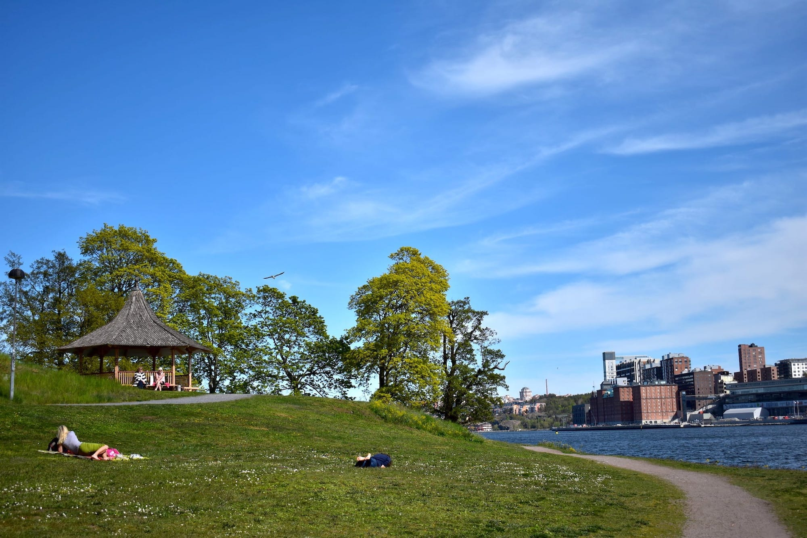

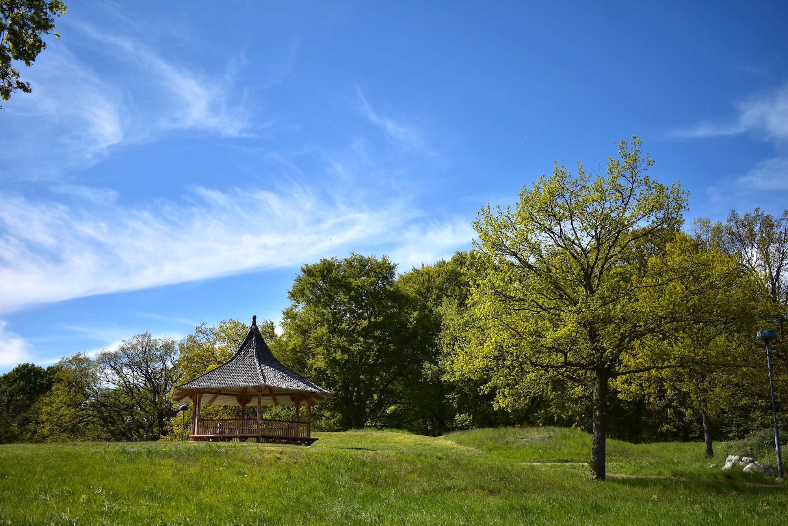

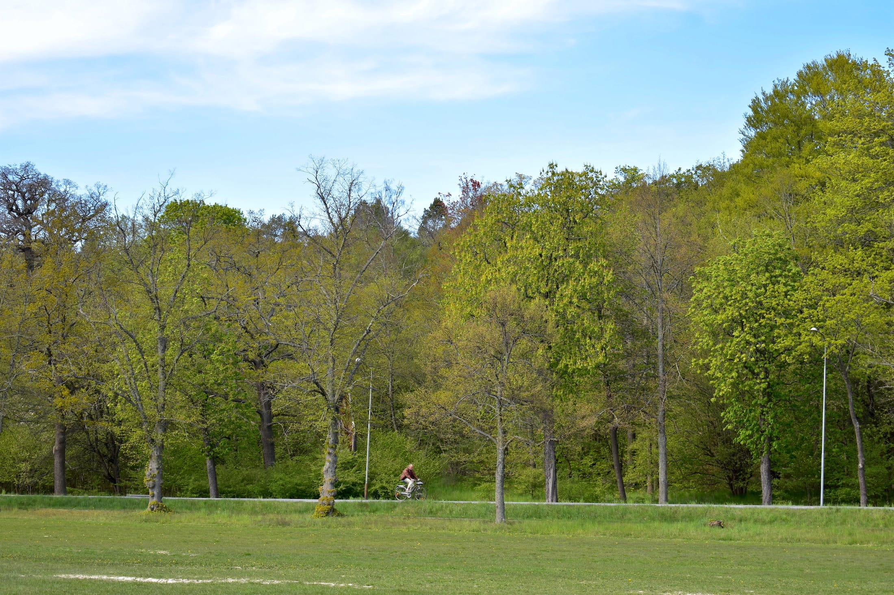

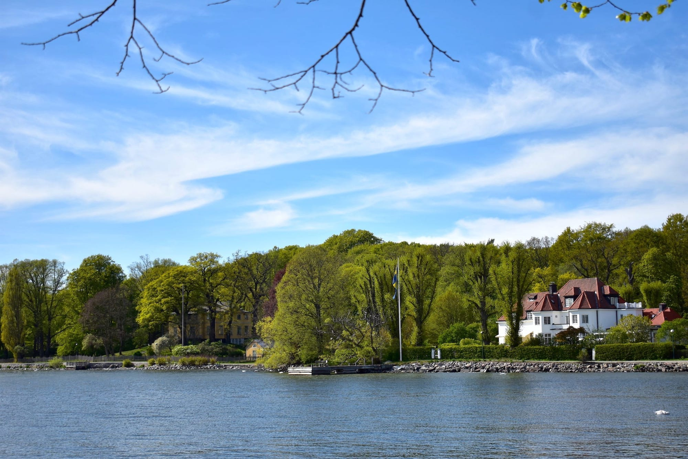

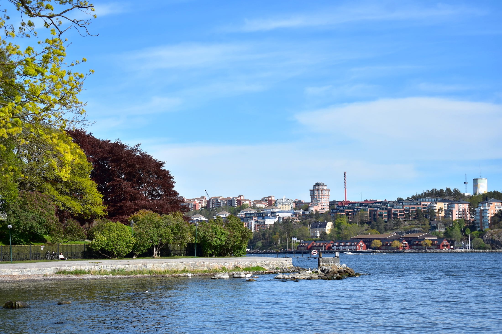

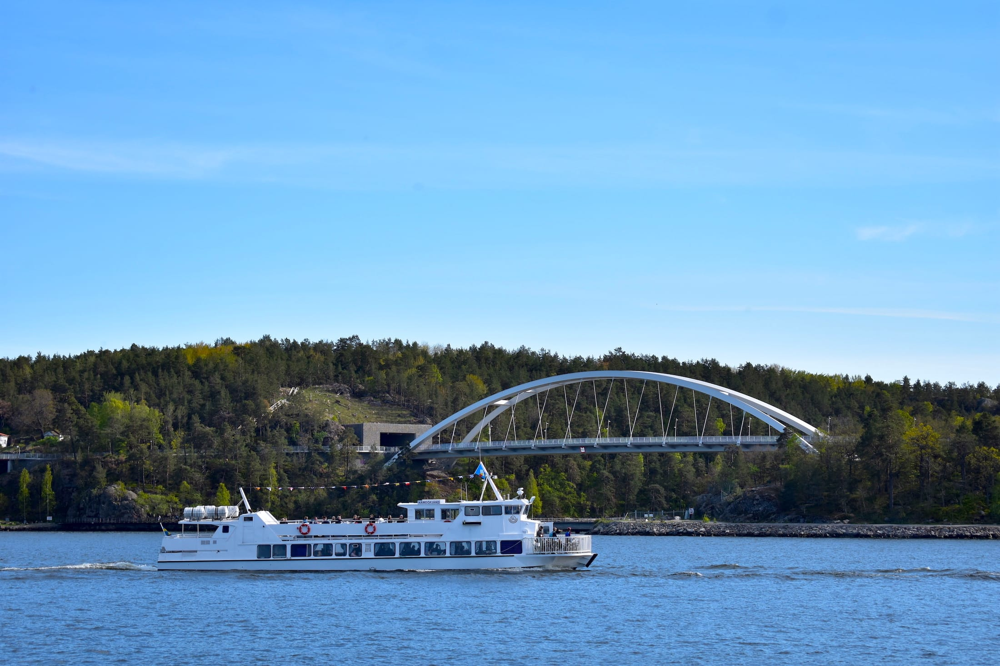

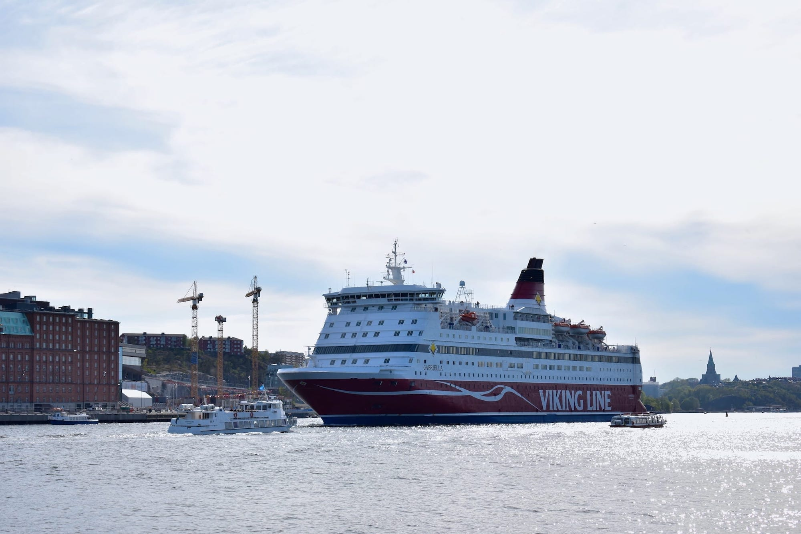

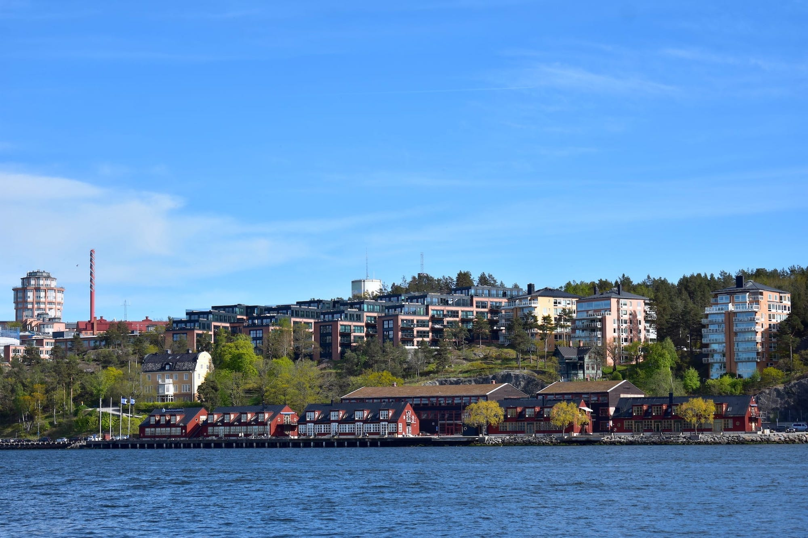

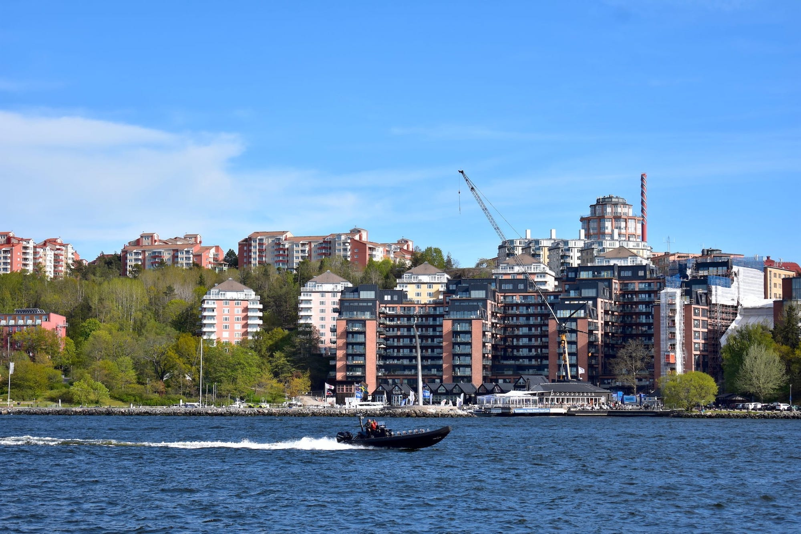