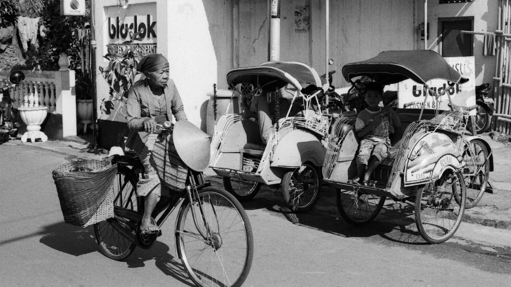
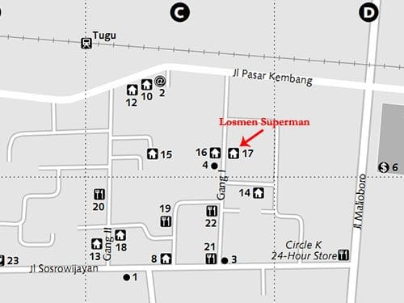
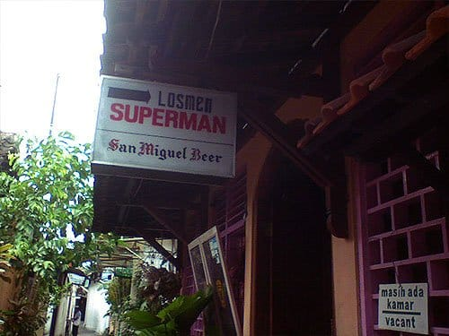

Mentari malu-malu mengintip dari balik awan. Sinar keemasannya menerobos menyiangi jalanan Malioboro. Entah untuk keberapa kalinya aku menginjakan kaki di pusat wisata belanja yang tersohor ini.

Hari masih pagi, Malioboro masih tertidur. Emperan-emperan sepanjang jalan ini masih lengang. Beberapa pedagang tampak terlihat sedang menyusun dagangan-dagangannya. Di pinggir jalan beberapa becak terparkir rapih berjejer. Berbalut sarung lusuh, sang pengayuhnya pun tampak masih terlelap tidur di atas becaknya.

Dari arah Stasiun Tugu, aku menuju Jalan Sosrowijayan. Sebuah jalan yang terletak di awal Jalan Malioboro, tidak jauh dari Stasiun Tugu. Di sepanjang Jalan Sosrowijayan ini berjejer penginapan-penginapan, mulai dari yang berjuluk *homestay*, losmen, hostel, hingga hotel berbintang. Cukup mudah untuk menemukan penginapan murah di sekitar sini.

Beberapa warga atau pengayuh becak di sekitar Jalan Sosrowijayan pun kerap menawarkan bantuan bagi pengunjung untuk mendapatkan tempat penginapan. Tidak perlu sungkan untuk menolak tawaran mereka, atau kalau perlu anda sampaikan kepada mereka harga penginapan yang anda cari. Gang-gang yang menghubungkan antara Jalan Sosrowijayan dan Jalan Pasar Kembang pun menawarkan penginapan dengan harga yang miring, mulai dari 30 ribu hingga 150 ribu rupiah permalam. Harga penginapannya yang murah dan tidak jauh dari Malioboro, menjadikan Sosrowijayan *spot* favorit wisatawan asing di samping Prawirotaman.

Saat melangkah di Jalan Sosrowijayan, kita seakan dibawa ke sebuah peleburan budaya. Bagaimana tidak, Jalan Sosrowijayan ini disinggahi wisatawan-wisatawan asing dari berbagai belahan dunia. Unik rasanya mengamati tukang becak dengan percaya dirinya menyapa dan berbincang dengan para turis asing dengan bahasa Inggris, Belanda, Jepang, atau bahkan Jerman. Di sudut-sudut gang juga beberapa wisatawan asing tampak asyik bernyanyi dan bermain musik bersama para warga.

Losmen Superman. Losmen yang aku pilih untuk menginap kala itu berada di salah satu gang Sosrowijayan. Dengan harga 50 ribu rupiah permalam, aku mendapatkan sebuah kamar dengan ranjang kapuk yang cukup lega. Tempatnya bersih, kain sprei, bantal, dan gulingnya pun tampak masih baru dicuci.

Kelak, saat aku kembali ke Jogja, aku tahu kalau harga penginapan di Sosrowijayan bisa ditawar. Saat kembali ke Jogja aku bersama temanku, mendapatkan kamar dengan harga 50 ribu rupiah permalam—dari harga awalnya 100 ribu rupiah. Losmen Betty namanya. Dengan fasilitas yang lebih wah, Losmen Betty menawarkan kasur yang lebih empuk, kamar mandi dalam, serta sebuah kipas angin.

Foto cover dari [Flickr](https://www.flickr.com/photos/ccdoh1/4438594723/in/photostream/) oleh [ccdoh1](https://www.flickr.com/photos/ccdoh1/).
