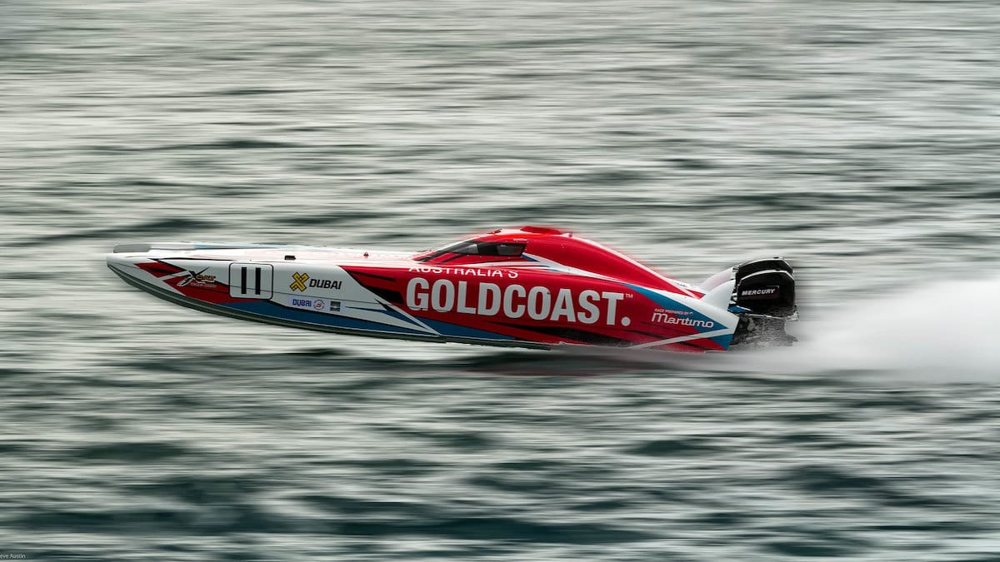
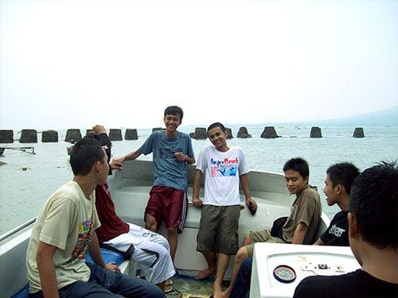
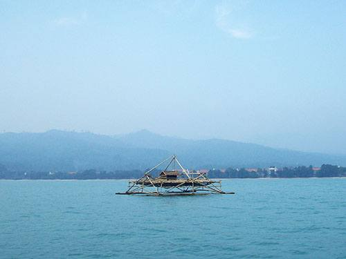
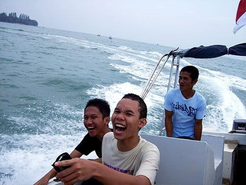
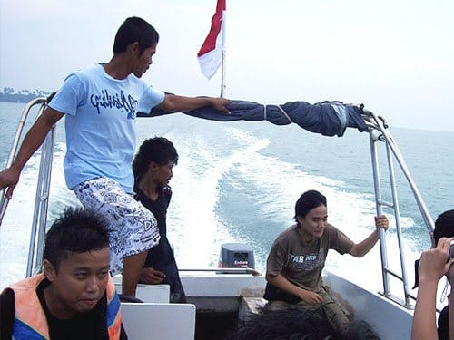
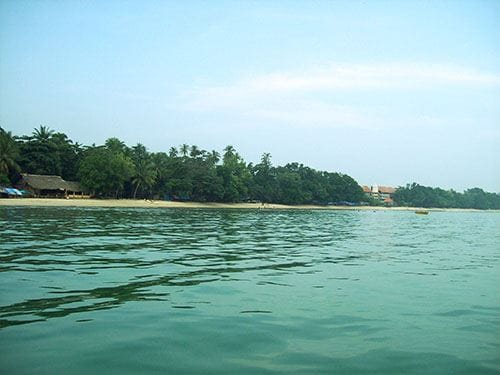
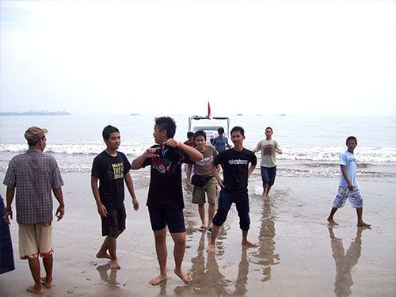
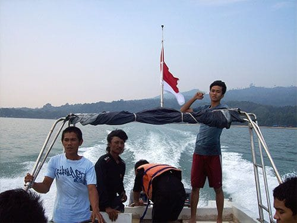

Tahun 2007 lalu, aku bersama teman-teman seangkatan tengah berlibur di Pantai Carita—pantai di Kabupaten Pandeglang, Banten. Kala itu aku dan teman-teman tengah duduk santai di pinggir pantai. Bercanda renyah sembari menikmati senja yang perlahan turun. Tiba-tiba kami didatangi oleh abang "pawang" *banana boat*. Abang tersebut menawarkan kami untuk mengunjungi bagian pantai yang lain dengan *speed boat*. Mungkin karena hari yang sudah sore, harga yang ditawarkan pun sangat miring. Kontan kami menyetujui rayuan abang itu.

Tanpa basa-basi kami semua berhamburan naik ke atas *speed boat*. Seingatku itu pengalaman pertama naik *speed boat*. Awalnya si abang mengendarai *speed boat*-nya dengan santai. *Alon-alon asal kelakon*. Perlahan *speed boat* mulai menjauh dari bibir pantai. Terus menjauh ke lautan lepas, melewati bagan-bagan penangkap ikan milik nelayan.

Setelah berada cukup jauh dari bibir pantai, senyum jahat abang *speed boat* pun tersungging. Ini sabotase! Si abang memacu *speed boat* nya. Mesin kapal menderu kencang, kapal bergoyang keras melawan gelombang. Layaknya sopir Kopaja, si abang pun melakukan manuver-manuver mematikan di atas laut.

Kapal meliuk-liuk lincah di atas air. Belum puas dengan aksi ugal-ugalannya, si abang berdiri di atas joknya. Kini bukan lagi tangan yang memegang kendali kapal, tetapi kaki! Bayangkan! Kami pun turut bersorak, entah kegirangan, ketakutan, atau takjub melihat aksi ajaib abang *speed boat*.

Tidak lama, *speed boat* cita rasa Kopaja yang kami sewa ini pun merapat ke pantai. Kondisi pantainya hampir sama dengan yang ada di depan pondok Mutiara Carita, hanya saja lebih landai dan lebih rimbun oleh pepohonan. Setelah puas bermain air di pantai ini, kami kembali ke penginapan. Namun dalam perjalanan pulang, si abang lebih santun dalam menjalankan *speed boat*-nya. Syukurlah.

Foto cover dari [Flickr](https://www.flickr.com/photos/bruvva/20789184191/) oleh [Steve Austin](https://www.flickr.com/photos/bruvva/).

