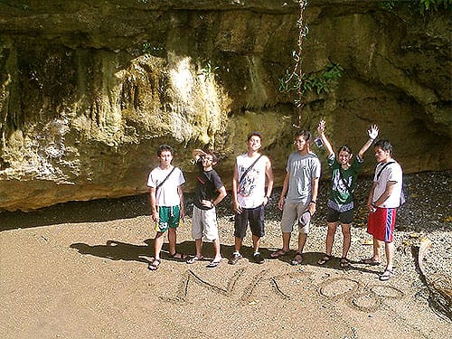
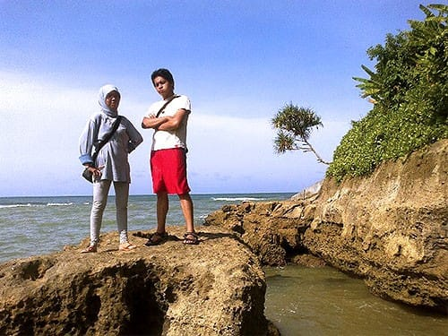
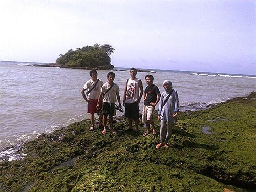
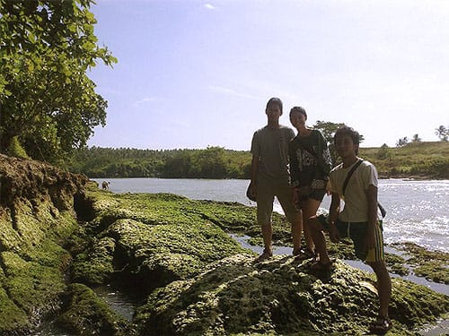
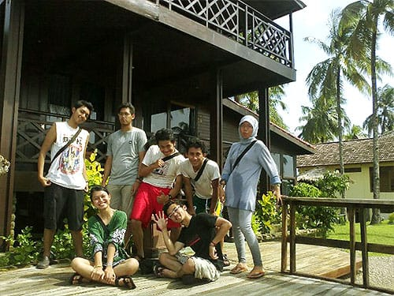

Kurebahkan tubuhku di atas hamparan hijaunya rerumputan. Pucuk-pucuknya basah menampung bulir-bulir embun yang enggan menguap. Kulihat ke arah langit lepas. Awan-awan tipis bergerak melayang di birunya angkasa. Daun-daun kelapa bergerak ke kiri dan ke kanan mengikuti arus angin yang bertiup. Damai.

Kupejamkan kedua mataku. Kubiarkan mentari memelukku dalam hangat sinarnya yang keemasan. Ombak berdebur keras menghantam karang-karang di tepi daratan. Suaranya terdengar bak melodi manis di telingaku. Sesekali angin berhembus membelai kulitku seakaan menyapaku dengan ramahnya. Aku pun bangkit dari hamparan rerumputan. Pagi yang menyenangkan.

Di hadapanku terbentang samudera luas yang membiru hingga batas cakrawala. Tak jauh dari tempatku berdiri, sebuah pulau karang berdiri kokoh di lepas lautan. Tebing-tebingnya berwarna merah kecoklatan. Tebing-tebing karang yang berongga itu mencuat membentuk pulau karang yang indah. Pepohonan hijau tumbuh subur menutupi pulau karang itu. Ingatanku pun terlempar jauh ke belasan tahun lalu, saat aku dan ibuku berlibur ke Tanah Lot di Bali. Pulau karangnya memang mirip dengan yang ada di Tanah Lot. Tak heran tempat ini kerap dinamai "Tanah Lot Amanda Ratu".

Tidak seperti di Tanah Lot, pulau karang di Amanda Ratu cukup berbahaya untuk dikunjungi. Gugusan karang yang menjadi jembatan alami ke pulau karang tidak nampak dari permukaan, salah-salah kita bisa tergulung gelombang samudera. Dan tentu saja di Amanda Ratu minus para wanita yang memanggul buah-buahan dan berbagai persembahan di kepalanya.

Amanda Ratu sebenarnya sebuah *resort* yang berada di Muara Sungai Cikarang. *Resort* yang dibangun di atas karang ini memiliki beberapa villa yang terbuat dari kayu. Suasananya sangat asri. Hijaunya rumput tertata apik dan terhampar luas hingga tepian tebing karang.

Jalan dari batu-batu kecil pun meliuk-liuk di atas hijaunya rerumputan. Beberapa saung kecil berdiri di tepian tebing karang, menjadi tempat yang pas untuk menikmati indahnya lautan lepas. Di *resort* itupun berderet rapi ratusan pohonan kelapa. Warga sekitar sering memanfaatkan sari bunganya untuk dijadikan gula merah.

Di sebelah Timur *resort*, aliran Sungai Cikarang menyatu dengan lautan. Di batasnya gelombang bergulung membentuk deretan ombak. Sementara itu seorang nelayan tampak menjaring di muara, sesekali ia berpindah tempat. Ia melompat-lompat di atas gugusan karang dengan lincahnya.

Mentari semakin terik bersinar. Sementara itu sekelompok anak kecil berhamburan melompat dari minibus. Dengan riang mereka berlari mendekati kolam renang yang ada di kompleks *resort* Amanda Ratu. Kami pun melanjutkan perjalanan kami.

Foto cover dari [Unsplash](https://unsplash.com/photos/2wd0CwmmloM) oleh [Blake Wisz](https://unsplash.com/@blakewisz).
