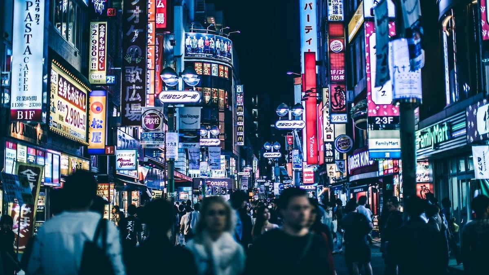

Kita semua adalah orang yang berjalan dalam barisan yang tak pernah berakhir,\
Kebetulan kau baris di muka dan aku di tengah\
Dan adik-adikku di belakang,\
Tapi satu tugas kita semua,\
Menanamkan benih-benih kejantanan yang telah kau rintis

Kita semua adalah alat dari arus sejarah yang besar\
Kita adalah alat dari derap kemajuan semua;\
Dan dalam berjuang kemerdekaan begitu mesra berdegup\
Seperti juga perjalanan di sisi penjara

Kemerdekaan bukanlah soal orang-orang yang iseng dan pembosan\
Kemerdekaan adalah keberanian untuk berjuang\
Dalam derapnya, dalam desasnya, dalam raungnya kita adalah\
manusia merdeka\
Dalam matinya kita semua adalah manusia terbebas

Oleh Soe Hok-gie.

Foto dari [Unsplash](https://unsplash.com/photos/Mn9Fa_wQH-M) oleh [Andre Benz](https://unsplash.com/@trapnation).
