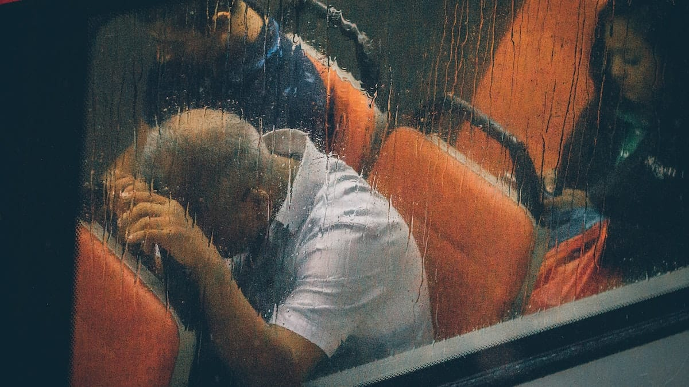

Ohhh...

Kemarin biarlah kemarin (naon deui). Bangun tidur sayah langsung dapet SMS dari si [Wasil](https://titikcerah.wordpress.com/) isinya kurang lebih begini:

"Cunk bwtn desain untuk spanduk!", dari situh saya baru ingat hari ini (**red:** 17 maret 2007) ada rapat buat bikin acara kumpul-kumpul *web administrator* se Bandung. Aduh males euy. Tapi akhirnya brangkat juga.

Ceritanya udah di sekolah, liat kelas 2 IPA 7 lawan kelas 1-7 maen bola. Lumayan seru, garokil maena.

Si Ofu (**red:** Rofianto si jangkung temen si KM) kena kartu kuning wasit (**red:** Eza), gara-gara terlihat sengaja melakukan handball. Trus si Wasil yang gokil hampir mencetak gol. Ada juga si Arip maksain maen padahal kakinya masih cedera.

Ada lagi si Ai, assist nya mantep-mantep, sampe-sampe dua diantara assist nya membuahkan gol. Dan yang paling mantap si Opik (**red:** ketua HI) mencetak gol dari jarak yang sangat jauh mengalahkan rekor si Opik (**red:** anak didikan saya).

Pokoknya mah gitulah, akhirnya 2 IPA 7 menang telak 5-0.

Terus saya pergi ke Ruang 67 lagi, katanya sih mau ada rapat gituh. Nunggu lagi di ruang 67 ini. Ehh, malah pada gak dateng orang-orangnya. Cuma saya, Wasil sama Kang Dani. Yahh, ya udah rencananya saya mau maen FS dulu bentar. Eh, hujan gede. Kejebak lagi di ruang 67! Yah jadi aja nunggu hujan reda ane nulis posting ini! SIALAN...

Foto dari [Unsplash](https://unsplash.com/photos/iNsKPCS-Z5g) oleh [Lily Lvnatikk](https://unsplash.com/@lvnatikk).
