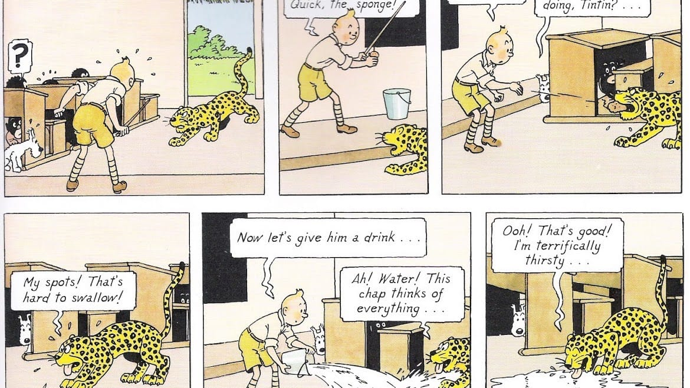

Tintin in the Congo (Tintin au Congo) pertama kali diterbitkan secara serial pada 5 juni 1930. Selama satu tahun seri Tintin in the Congo ini muncul pada suplemen bagi anak-anak di harian asal Brussels: Le Viengtième Siècle. Pada tahun 1931 serial kartun-strip ini kemudian diterbitkan dalam bentuk buku oleh Les Editions du Petit Viengtième. Beberapa bulan kemudian serial ini diterbitkan oleh Editions Casterman of Tournai. Terbitan Caterman inilah yang kemudian diterjemahkan ke dalam Bahasa Inggris.

Pada edisi kali ini, Tintin melakukan petualangan ke Kongo yang saat itu menjadi negara koloni dari Belgia. Mulanya tidak ada agenda khusus bagi Tintin untuk melakukan investigasi, ia hanya ingin melakukan perburuan binatang-binatang liar. Selain ditemani anjingnya yang setia: Snowy, kali ini Tintin juga ditemani seorang bocah asal Kongo bernama Coco.

Berbagai pengalaman seru dialami oleh Tintin, Snowy dan Coco selama menjelajahi Kongo. Mulai dari mobil trans-sahara mereka yang dicuri oleh penumpang gelap dari Kapal Thysville—kapal yang digunakan Tintin dan Snowy untuk berlayar ke Kongo. Atau Snowy yang diculik oleh monyet sehingga memaksa Tintin untuk turut menyamar menjadi monyet. Hingga undangan dari kepala suku Ba Baoro'm yang akhirnya membawa beragam konflik padanya.

Saat menerima undangan Ba Baoro'm dan tinggal di desanya, dukun desa pun iri pada Tintin dan rupanya ia berhasil dihasut oleh penumpang gelap Kapal Thysville. Dukun desa dan penumpang gelap itu pun akhirnya berkomplot untuk menyingkirkan Tintin. Mereka gunakan berbagai cara untuk menghabisi nyawa Tintin. Dengan muslihat mereka, Tintin dituduh telah mencuri dan merusak jimat desa sehingga akan dijatuhi hukuman mati oleh Ba Baoro'm. Beruntung Tintin dan Snowy yang disekap, berhasil diselamatkan oleh Coco dan sukses menguak kebohongan yang direncanakan oleh dukun desa dan penumpang gelap itu.

Tidak menyerah begitu saja, dukun desa dan si penumpang gelap juga menghasut suku 'M 'Hatavu sehingga memicu peperangan dengan suku yang dipimpin Ba Baoro'm. Suku 'M 'Hatuvu yang bersenjatakan tombak dan panah dihadapi Tintin sendirian. Dengan peralatan elektro-magnetik yang dibawanya, serangan suku 'M 'Hatuvu mudah saja dipatahkan. Serangan mata-mata panah dan tombak yang terbuat dari logam itu berubah arahnya. Termentahkan. Tertarik begitu saja oleh perangkat elektro-magnetik yang dibawa Tintin. Suku 'M 'Hatuvu pun takjub dan menyerah pada Tintin.

Tak kehilangan siasat. Mendengar kabar bahwa Tintin akan berburu macan tutul, dukun desa memutuskan untuk menyamar menjadi Aniota. Aniota adalah sebuah kelompok rahasia yang ditujukan untuk menghentikan kuasa kulit putih. Aniota menggunakan kostum yang unik yang menyerupai macan tutul. Jari-jemarinya dilengkapi cakar yang terbuat dari besi. Anggota Aniota juga dilengkapi sebuah tongkat yang di ujungnya terdapat cetakan jejak kaki macan tutul. Namun siasat dukun desa itu kembali kandas. Belum sempat ia menyerang Tintin, ia justru dililit oleh ular boa raksasa. Beruntung Tintin sigap dan berhasil melepaskan dukun desa itu dari jeratan si ular.

Dari dukun desa itu Tintin mengetahui tempat si penumpang gelap itu menunggu. Namun sayang, saat Tintin mendatangi tempat si penumpang gelap, Tintin justru tertangkap olehnya. Tintin pun diikat pada sebuah dahan pohon, di atas sungai yang diriuhi oleh buaya-buaya lapar. Beruntung ada seorang misonaris yang lewat, Tintin pun kembali terselamatkan dan diboyong ke perkampungan yang dikelola si misionaris tersebut.

Si penumpang gelap yang tak mudah menyerah itu pun menyusupi perkampungan si misionaris. Dengan menyamar sebagai seorang misonaris, ia berhasil melumpuhkan Tintin dan membuangnya ke sungai yang berhulu ke sebuah air terjun. Namun lagi-lagi keberuntungan masih memihak Tintin. Tubuh Tintin tersangkut pada dahan pohon yang berada di dinding air terjun. Misionaris dan Snowy pun akhirnya datang untuk menolongnya.

Setelah selamat dari ancaman air terjun, Tintin dan Snowy segera mengejar si penumpang gelap. Si penumpang gelap pun berhasil ditemukan, mereka kemudian bergulat dengan seru. Snowy secara tidak sengaja berhasil merebut kertas berisi pesan rahasia dari tangan si penumpang gelap. Sedangkan Tintin dan si penumpang gelap terjatuh ke jurang. Tintin selamat karena mendarat di atas tubuh kuda nil. Sementara si penumpang gelap malang nasibnya, ia tercebur ke sungai yang penuh dengan buaya.

Surat rahasia yang berhasil direbut Snowy itu rupanya berisi intruksi dari seseorang berinisial A.C. untuk menyingkirkan Tintin dengan segala macam cara. Pada surat itu juga diinstruksikan untuk menemui salah satu kaki tangannya di Kalabelou. Tintin pun memanfaatkan kesempatan itu. Ia menyamar menjadi si penumpang gelap dan bertemu dengan kaki tangan A.C. di Kalabelou. Saat bertemu, Tintin pun berhasil meringkus kaki tangan A.C. tersebut dan membawanya ke kantor polisi.

Dari Gibbons—kaki tangan A.C. yang tertangkap—diketahui bahwa A.C. adalah Al Calpone—seorang pimpinan Gangster di Chicago. Al Calpone ingin melebarkan bisnisnya dan ingin merebut produksi berlian di Kongo. Ia mengikuti kabar dari aksi Tintin di Rusia dulu dan merasa terancam saat mendengar Tintin berlabuh di Kongo. Al Capone pun mengirimkan salah satu anggota geng nya, Tom—si penumpang gelap—untuk mengenyahkan Tintin.

Malam harinya Tintin dan pasukan kepolisian meringkus ketiga kaki tangan Al Calpone lainnya yang tengah mengadakan pertemuan. Dengan diringkusnya gerombolan Al Calpone itu Tintin pun kembali menggegarkan dunia.

)](01-tintin-in-the-congo.jpg)

Judul: Tintin in the Congo\
Penulis: Hergè\
Diterbitkan: 1931

Foto cover dari [Steve's Comics Blog](http://graysonfan.blogspot.se/2013/05/back-by-popular-demand.html) oleh [Hergé](http://en.tintin.com/) © All rights reserved.
