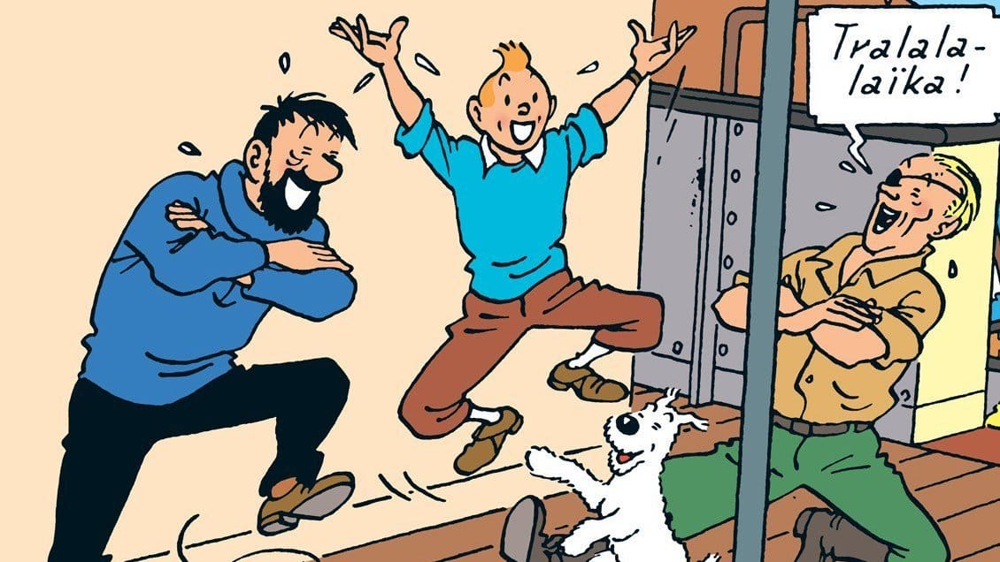

Serial "*The Adventures of Tintin*" ini mulanya dimuat dalam sebuah suplemen untuk anak-anak pada harian asal Belgia: Le Vingtiemè Siècle. Kartun-strip ini digarap oleh Hergè yang saat itu dipekerjakan sebagai seniman di harian tersebut. Meski tidak mendapatkan pendidikan seni yang formal, namun Hergè menunjukan originalitas dan keunikan tersendiri dalam dunia kartun-strip.

Pada seri ini, Tintin—reporter ternama dari harian Belgia Le Petit Vingtiemè—ditugaskan ke Soviet, Rusia untuk melakukan observasi dan membuat berita. Petualangannya tentu tidaklah mudah. Bahkan sebelum dia mencapai tanah Soviet, OGPU—pasukan rahasia Soviet—sudah berusaha untuk menyabotase dan menggagalkan usaha Tintin. Mulai dari kereta yang ditumpanginya di bom, rel keretanya dirusak, ditangkap dan dikejar-kejar polisi di Berlin hingga disekap di penjara bawah tanah.

Beruntung Tintin tidak sendiri, ada anjingnya Snowy yang setia menemani kemana pun ia pergi dan bertualang. Tak jarang pula Snowy yang justru muncul sebagai penyelamat bagi Tintin. Saat Tintin membeku dan diseret pemburu, Snowy lah yang berhasil melelehkan es yang menyelimuti Tintin dengan bantuan garam. Atau saat Tintin disekap di rumah berhantu yang menjadi tempat persembunyian bagi Lenin dan Trotsky untuk menumpuk harta rampasannya. Snowy lah yang kemudian menerobos dan melepaskan tali ikatan pada Tintin. Juga saat Snowy menyamar menjadi macan untuk menakut-nakuti OGPU yang menangkap Tintin.

Pada petualangannya ini, Tintin berhasil menguak berbagai kebobrokan Soviet. Bagaimana Soviet membangun pabrik-pabrik palsu untuk menipu orang-orang bahwa perkonomian mereka semakin membaik. Bagaimana rakyat dipaksa dan diintimidasi dengan senjata untuk memilih partai komunis. Juga bagaimana Soviet merampas paksa hasil panen rakyat untuk kepentingan propagandanya, menutup-nutupi krisis pangan di negerinya.

Di akhir petualangannya, Tintin berhasil melarikan diri dari sekapan OGPU dan pergi ke Berlin. Saat singgah di Berlin inilah Tintin berhasil meringkus anggota OGPU yang menyamar sebagai pelayan hotel. Dari Bolshevik—anggota OGPU yang ditangkap itu—terkuak bahwa ia tengah merencanakan aksi pengeboman di berbagai ibu kota negara Eropa.

Sepulangnya ke Brussels, Tintin dan Snowy pun dielu-elukan dan disambut meriah oleh seluruh warga kota.

)](01-tintin-in-the-land-of-soviets.jpg)

Judul: Tintin in the Land of the Soviets\
Penulis: Hergè\
Diterbitkan: 1930

Foto cover dari [The Jakarta Post](http://www.thejakartapost.com/life/2017/11/16/the-world-of-tintin-exhibition-to-run-in-hong-kong.html) oleh [Hergé](http://en.tintin.com/) © All rights reserved.
