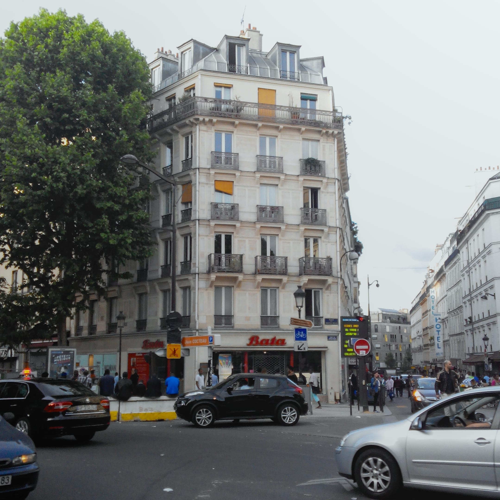

Sejak kecil saya mengira bahwa Bata merupakan merek asli Indonesia. Saya kira nama Bata diambil dari "bata"—material yang biasa dipakai untuk membangun rumah. Asumsi tersebut kian dikuatkan dengan logo Bata yang berwarna merah—persis seperti warna bata untuk mendirikan dinding.

Sampai akhirnya di musim panas tahun 2015—dalam perjalanan mencari gerai KFC—kami tidak sengaja menemukan toko sepatu Bata dekat stasiun Château Rouge di kota Paris. Sejak hari itu saya baru tahu kalau Bata merupakan perusahaan multinasional yang berbasis di Swiss dengan jaringan gerai di lebih dari 70 negara.

Perusahaan pembuat sepatu ini sudah berdiri sejak 1894—lebih dari 120 tahun yang lalu. Bermula dari kota Zlín yang kala itu masih berada dalam wilayah kerajaan Austria-Hongaria (sekarang bagian dari Republik Ceko). Merek Bata sendiri diambil dari nama pendirinya Tomáš Baťa. Bukan dari batu bata seperti yang saya duga sebelumnya.

