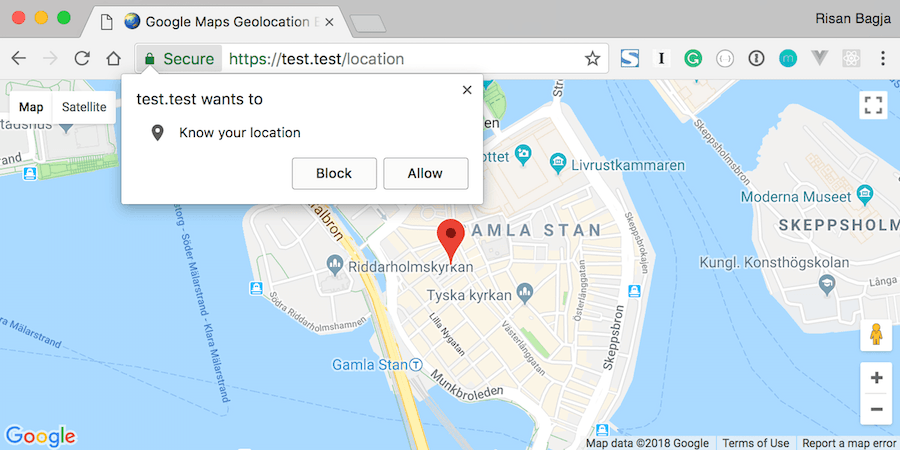
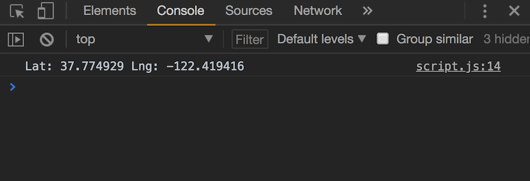
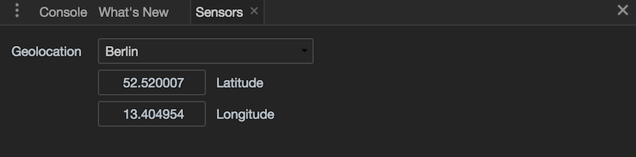
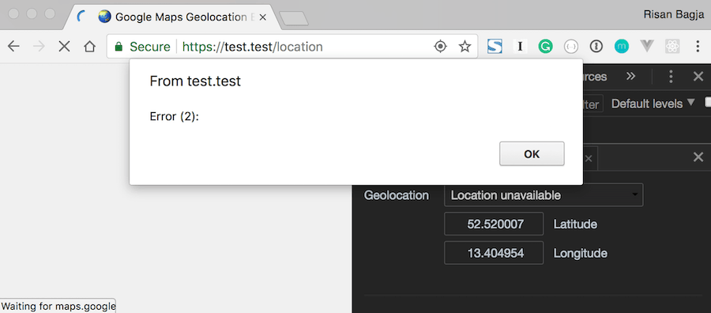

This is actually my answer to someone's question on [PHP Indonesia](https://www.facebook.com/groups/35688476100/) Facebook group. How can we track user's location continuously using the Geolocation API and display it on Google Maps?

Before getting started, we're going to need an [API Key](https://developers.google.com/maps/documentation/javascript/get-api-key) to use the Google Maps JavaScript API. As a safety measure, don't forget to set the HTTP referrers on your API key to your own domains.

## Table of Contents

## Displaying Google Map on Your Page

First, let's start with a simple example: display a map on our HTML page using Google Maps Javascript API.

### Our HTML Structure

Create a new file and put the following HTML structure:

```html
<!doctype html>
<html lang="en">
  <head>
    <meta charset="utf-8">
    <meta http-equiv="x-ua-compatible" content="ie=edge">
    <title>🌏 Google Maps Geolocation Example</title>
    <meta name="viewport" content="width=device-width, initial-scale=1, shrink-to-fit=no">
    <link rel="stylesheet" href="styles.css">
  </head>
  <body>
    <main class="container">
      <div id="map" class="map"></div>
    </main>

    <script src="script.js"></script>
    <script async defer src="https://maps.googleapis.com/maps/api/js?key=YOUR_API_KEY&callback=init"></script>
  </body>
</html>
```

Safe it as `index.html`. Don't worry about the `styles.css` and `script.js`, we'll create these files later.

The `div` with the id of `map` is where we'll load the map. Also, don't forget to replace the `YOUR_API_KEY` part with your own API key from Google.

```html
<script async defer src="https://maps.googleapis.com/maps/api/js?key=YOUR_API_KEY&callback=init"></script>
```

The optional `callback` property is where we can define which function to call once the Google Maps JavaScript API is loaded. In our case it's the `init` function, we'll define it later.

### Add Some Styles

Next, let's add some styles to our HTML page. Create a new CSS file and put the following CSS rules:

```css
html {
    font-family: sans-serif;
    line-height: 1.15;
    height: 100%;
}

body {
    margin: 0;
    font-family: -apple-system, BlinkMacSystemFont, "Segoe UI", Roboto, "Helvetica Neue", Arial, sans-serif, "Apple Color Emoji", "Segoe UI Emoji", "Segoe UI Symbol";
    font-size: 1rem;
    font-weight: 400;
    line-height: 1.5;
    color: #1a1a1a;
    text-align: left;
    height: 100%;
    background-color: #fff;
}

.container {
    display: flex;
    flex-direction: column;
    height: 100%;
}

.map {
    flex: 1;
    background: #f0f0f0;
}
```

Save this file as `styles.css`. This CSS file simply to make our map's `div` occupies the whole screen. We achieve this through [flexbox](https://developer.mozilla.org/en-US/docs/Web/CSS/flex):

```css
html {
    height: 100%;
}

body {
    height: 100%;
}

.container {
    display: flex;
    flex-direction: column;
    height: 100%;
}

.map {
    flex: 1;
}
```

### Initialize The Map

Now, all we have to do is create a new JavaScript file for displaying the map. Type the following codes and save it as `script.js`.

```js
function init() {
  new google.maps.Map(document.getElementById('map'), {
    center: { lat: 59.325, lng: 18.069 },
    zoom: 15
  });
}
```

This `init()` function will be automatically invoked once the Google Maps JavaScript API is loaded. Inside this function we create a new [Map](https://developers.google.com/maps/documentation/javascript/reference/3/#Map) instance:

```js
new google.maps.Map(element, options);
```

The first parameter is the DOM element where the map will be displayed. In our case, it's the `div` with the id of `map`. The second parameter is our map configuration object. The `center` property defines the initial coordinate of our map's center. The `zoom` property defines the initial zoom level. You can read more about other options in [Map Options Documentation](https://developers.google.com/maps/documentation/javascript/reference/3/#MapOptions).

Now if we open up our page in the browser, we should see our map is successfully loaded like this:


## Adding Marker to Your Map

Our next step is to learn how to add a marker to our map instance. Open the `script.js` file and modify it like so:

```js
function init() {
  const initialPosition = { lat: 59.325, lng: 18.069 };

  const map = new google.maps.Map(document.getElementById('map'), {
    center: initialPosition,
    zoom: 15
  });

  const marker = new google.maps.Marker({ map, position: initialPosition });
}
```

Within the `init` function, we add a new statement that will create an instance of [Marker](https://developers.google.com/maps/documentation/javascript/reference/3/#Marker) class.

```js
new google.maps.Marker(options);
```

It accepts a single argument: an object of marker's options. The `map` property is where the marker will be displayed, that's why we pass the created `Map` instance to this property. The `position` defines the marker's position. Check out all of the available options in [Marker Options Documentation](https://developers.google.com/maps/documentation/javascript/reference/3/#MarkerOptions).

We should now see the marker placed on the map.


## Get User's Location

Our next step would be retrieving user's location using the JavaScript [Geolocation API](https://developer.mozilla.org/en-US/docs/Web/API/Geolocation/Using_geolocation).

### Using the getCurrentPosition Method

Open up our `scripts.js` file again. Then add the new code section for retrieving user's location:

```js
function init() {
  const initialPosition = { lat: 59.325, lng: 18.069 };

  const map = new google.maps.Map(document.getElementById('map'), {
    center: initialPosition,
    zoom: 15
  });

  const marker = new google.maps.Marker({ map, position: initialPosition });

  // Get user's location
  if ('geolocation' in navigator) {
    navigator.geolocation.getCurrentPosition(
      position => console.log(`Lat: ${position.coords.latitude} Lng: ${position.coords.longitude}`),
      err => alert(`Error (${err.code}): ${err.message}`)
    );
  } else {
    alert('Geolocation is not supported by your browser.');
  }
}
```

The following code checks whether the GeoLocation API is supported by the browser. We simply check if the `geolocation` property exists within the `navigator` object.

```js
if ('geolocation' in navigator) {
    // Geolocation API is supported
} else {
    // Geolocation API is not supported
    alert('Geolocation is not supported by your browser.');
}
```

If the GeoLocation API is supported, we can then safely use the `getCurrentPosition()` method to retrieve user's location.

```js
navigator.geolocation.getCurrentPosition(success, error, [options])
```

This method accepts three parameters:

* `success`: A callback function that will be invoked once the user's location is retrieved successfully. The callback receives a [`Position`](https://developer.mozilla.org/en-US/docs/Web/API/Position) object that holds the user's location.
* `error`: A callback function that will be invoked if user's location is failed to retrieve. The callback accepts a [`PositionError`](https://developer.mozilla.org/en-US/docs/Web/API/PositionError) object.
* `options`: Is an optional [`PositionOptions`](https://developer.mozilla.org/en-US/docs/Web/API/PositionOptions) object that can be used to configure the retrieval process.

Upon successful retrieval, we simply print the user's coordinate. And if it's failed, we show the error message using `alert`.

```js
navigator.geolocation.getCurrentPosition(
  // On success
  position => console.log(`Lat: ${position.coords.latitude} Lng: ${position.coords.longitude}`),
  // On error
  err => alert(`Error (${err.code}): ${err.message}`)
);
```

Open our page in the browser. It will ask your permission to get your current location. Click **Allow** to give it permission and proceed.



> ⚠️ Geolocation API is only available in HTTPS
>
> Note that this Geolocation API is only available in secure contexts. So you'll need to access your page through HTTPS protocol.

If it's successful, you'll get your location printed on the console similar to this:



### Simulating User's Location on Chrome

On Chrome, we can simulate the user's location. Open up your developer tools. Click on the three-vertical-dots button on the top-right of your developer tools screen. Click on **More tools** >> **Sensors** menu. It will bring a new tab named **Sensors** where you can easily override the position.



There's also some presets for various city locations that we can choose from. Select some cities and reload the page, you should get the city's location printed on the console.

### Handling Errors

From the `Sensors` tab, you can also simulate the position unavailable error. From the drop-down select `Location unavailable` option and reload the page. You'll get an alert like this:



We only got the error `code`, but the `message` property is empty. Apparently, the specification already specifies that this `message` property is for debugging only and not to be shown directly to the user. That's why we should rely on the `code` and provide our own error message instead.

The [`PositionError.code`](https://developer.mozilla.org/en-US/docs/Web/API/PositionError/code) may have the following values:

* `1`: The permission is denied.
* `2`: The position is unavailable, the Geolocation failed to retrieve the user's location.
* `3`: Timeout—when the device does not return the user's location within the given `timeout` option.

Let's modify our `script.js` to print out the appropriate error message:

```js
// Get proper error message based on the code.
const getPositionErrorMessage = code => {
  switch (code) {
    case 1:
      return 'Permission denied.';
    case 2:
      return 'Position unavailable.';
    case 3:
      return 'Timeout reached.';
  }
}

function init() {
  // Omitted for brevity

  if ('geolocation' in navigator) {
    navigator.geolocation.getCurrentPosition(
      position => console.log(`Lat: ${position.coords.latitude} Lng: ${position.coords.longitude}`),
      err => alert(`Error (${err.code}): ${getPositionErrorMessage(err.code)}`)
    );
  } else {
    alert('Geolocation is not supported by your browser.');
  }
}
```

Now if we select the `Location unavailable` option from the **Sensors** tab again and reload the page. We should get an alert: `Error (2): Position unavailable.`.

### Display User's Location on Google Maps

We successfully retrieved user's location. But our map and marker still displaying the given initial location. Let's modify our `script.js` file to properly center the map and marker to user's location.

```js
// Omitted for brevity

function init() {
  const initialPosition = { lat: 59.325, lng: 18.069 };

  const map = new google.maps.Map(document.getElementById('map'), {
    center: initialPosition,
    zoom: 15
  });

  const marker = new google.maps.Marker({ map, position: initialPosition });

  // Get user's location
  if ('geolocation' in navigator) {
    navigator.geolocation.getCurrentPosition(
      position => {
        console.log(`Lat: ${position.coords.latitude} Lng: ${position.coords.longitude}`);

        // Set marker's position.
        marker.setPosition({
          lat: position.coords.latitude,
          lng: position.coords.longitude
        });

        // Center map to user's position.
        map.panTo({
          lat: position.coords.latitude,
          lng: position.coords.longitude
        });
      },
      err => alert(`Error (${err.code}): ${getPositionErrorMessage(err.code)}`)
    );
  } else {
    alert('Geolocation is not supported by your browser.');
  }
}
```

We use the marker's `setPostion()` method to change the location of the marker. We pass it an object of the retrieved user's location.

```js
marker.setPosition({
  lat: position.coords.latitude,
  lng: position.coords.longitude
});
```

And we also use the map's `panTo()` method to center the map to user's location:

```js
map.panTo({
  lat: position.coords.latitude,
  lng: position.coords.longitude
});
```

Now if we load our page, both the map and marker should show the retrieved user's location.

### Let's Refactor our Code

Our code now is getting a bit messy. Let's refactor it by extracting each step into its own function.

```js
const createMap = ({ lat, lng }) => {
  return new google.maps.Map(document.getElementById('map'), {
    center: { lat, lng },
    zoom: 15
  });
};

const createMarker = ({ map, position }) => {
  return new google.maps.Marker({ map, position });
};

const getCurrentPosition = ({ onSuccess, onError = () => { } }) => {
  if ('geolocation' in navigator === false) {
    return onError(new Error('Geolocation is not supported by your browser.'));
  }

  return navigator.geolocation.getCurrentPosition(onSuccess, onError);
};

const getPositionErrorMessage = code => {
  switch (code) {
    case 1:
      return 'Permission denied.';
    case 2:
      return 'Position unavailable.';
    case 3:
      return 'Timeout reached.';
    default:
      return null;
  }
}

function init() {
  const initialPosition = { lat: 59.325, lng: 18.069 };
  const map = createMap(initialPosition);
  const marker = createMarker({ map, position: initialPosition });

  getCurrentPosition({
    onSuccess: ({ coords: { latitude: lat, longitude: lng } }) => {
      marker.setPosition({ lat, lng });
      map.panTo({ lat, lng });
    },
    onError: err =>
      alert(`Error: ${getPositionErrorMessage(err.code) || err.message}`)
  });
}
```

We use ES2015 object destructuring to easily get access to `position.coords.latitude` and `position.coords.longitude` and rename them `lat` and `lng` accordingly:

```js
onSuccess: ({ coords: { latitude: lat, longitude: lng } }) => {
  //
},
```

We also pass an `Error` object when the Geolocation API is not supported.

```js
const getCurrentPosition = ({ onSuccess, onError = () => { } }) => {
  if ('geolocation' in navigator === false) {
    // Invoke onError callback and pass an error object.
    return onError(new Error('Geolocation is not supported by your browser.'));
  }

  return navigator.geolocation.getCurrentPosition(onSuccess, onError);
};
```

## Track User's Location with watchPosition

Up until now, we only retrieve user's location once. How can we track user's location continuously? By using `setInterval()`? Well, we can, but it's not the best solution. To track user's location continuously, we can use the provided [`watchPostion()`](https://developer.mozilla.org/en-US/docs/Web/API/Geolocation/watchPosition) method.

Let's modify our `script.js` file to use the `watchPosition` instead.

```js
// New function to track user's location.
const trackLocation = ({ onSuccess, onError = () => { } }) => {
  if ('geolocation' in navigator === false) {
    return onError(new Error('Geolocation is not supported by your browser.'));
  }

  // Use watchPosition instead.
  return navigator.geolocation.watchPosition(onSuccess, onError);
};

function init() {
  const initialPosition = { lat: 59.325, lng: 18.069 };
  const map = createMap(initialPosition);
  const marker = createMarker({ map, position: initialPosition });

  // Use the new trackLocation function.
  trackLocation({
    onSuccess: ({ coords: { latitude: lat, longitude: lng } }) => {
      marker.setPosition({ lat, lng });
      map.panTo({ lat, lng });
    },
    onError: err =>
      alert(`Error: ${getPositionErrorMessage(err.code) || err.message}`)
  });
}
```

The `watchPosition()` will be called every time the position of the device changes. This way we can easily track the user's location.

```js
id = navigator.geolocation.watchPosition(success[, error[, options]])
```

The `watchPosition()` accepts three parameters, it exactly the identical parameters like the one provided for [`getCurrentPosition()`](#using-the-getcurrentposition-Method). The only difference is the `error` callback is optional for the `watchPosition()`.

It also returns an `id` like `setTimeout()` or `setInteval()` functions. This `id` can be used to stop tracking user's location with [`clearWatch()`](https://developer.mozilla.org/en-US/docs/Web/API/Geolocation/clearWatch) method.

If we reload our page, both the marker and the map position should now be updated every time the location is changed.

### The PositionOptions

Both `getCurrentPosition()` and `watchPosition()` accept the optional third parameter. It's an object of [`PositionOptions`](https://developer.mozilla.org/en-US/docs/Web/API/PositionOptions). There are three properties that we can configure:

* `enableHighAccuracy`: It's a `boolean` to indicate whether we'd like to get the best possible accuracy or not. Enabling this option may result in slower response time and increase power consumption.
* `timeout`: It's a `long` value in milliseconds that will limit the time for a device to return user's location. If the device hasn't returned the location within the specified time, it will throw a timeout error. By default, the value is `Infinity` which means it will never timeout.
* `maximumAge`: It's a `long` value in milliseconds representing the maximum age of a cached position. By default, it set to `0` and it means that we don't want the device to use a cached position.

Let's configure our `trackLocation()` function to enable the high accuracy and set a maximum `timeout` to 5 seconds.

```js
const trackLocation = ({ onSuccess, onError = () => { } }) => {
  // Omitted for brevity

  return navigator.geolocation.watchPosition(onSuccess, onError, {
    enableHighAccuracy: true,
    timeout: 5000,
    maximumAge: 0
  });
};
```

### The Final Touch

For the final touch, let's integrate both the retrieved user's coordinate and any error message into the UI. Open the `index.html` file and add a new `div` for displaying this information:

```html
<main class="container">
    <div id="map" class="map"></div>
    <!-- For displaying user's coordinate or error message. -->
    <div id="info" class="info"></div>
</main>
```

Now open the `styles.css` file and add the following rules:

```css
.info {
    padding: 1rem;
    margin: 0;
}

.info.error {
    color: #fff;
    background: #dc3545;
}
```

Finally, let's update our `script.js` to print out the coordinate and the error into the `#info` div.

```js
function init() {
  const initialPosition = { lat: 59.325, lng: 18.069 };
  const map = createMap(initialPosition);
  const marker = createMarker({ map, position: initialPosition });
  const $info = document.getElementById('info');

  trackLocation({
    onSuccess: ({ coords: { latitude: lat, longitude: lng } }) => {
      marker.setPosition({ lat, lng });
      map.panTo({ lat, lng });
      // Print out the user's location.
      $info.textContent = `Lat: ${lat} Lng: ${lng}`;
      // Don't forget to remove any error class name.
      $info.classList.remove('error');
    },
    onError: err => {
      // Print out the error message.
      $info.textContent = `Error: ${getPositionErrorMessage(err.code) || err.message}`;
      // Add error class name.
      $info.classList.add('error');
    }
  });
}
```

Now we should get a nice user's coordinate and error at the bottom of the map.


You can check out the [live demo](https://google-maps-geolocation.bitballoon.com/) and play around with it. You can also get the source for this tutorial on Github: [google-maps-geolocation-example](https://github.com/risan/google-maps-geolocation-example).

Credits:
- Globe by [Nicole Harrington](https://unsplash.com/@nicolegeri) on [Unsplash](https://unsplash.com/photos/eUyNYtwN0tA).
