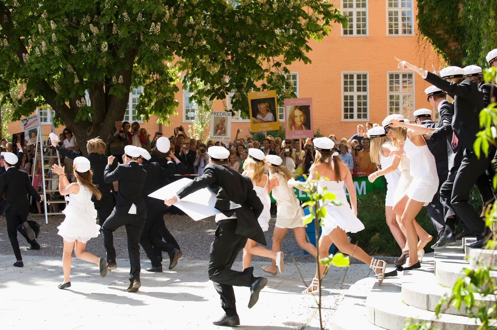
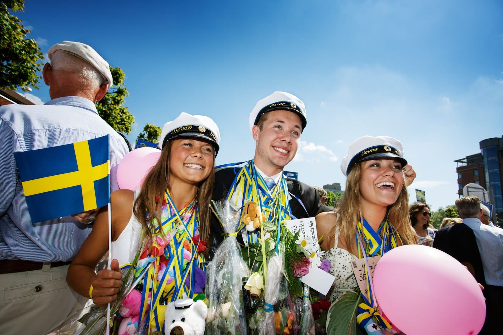
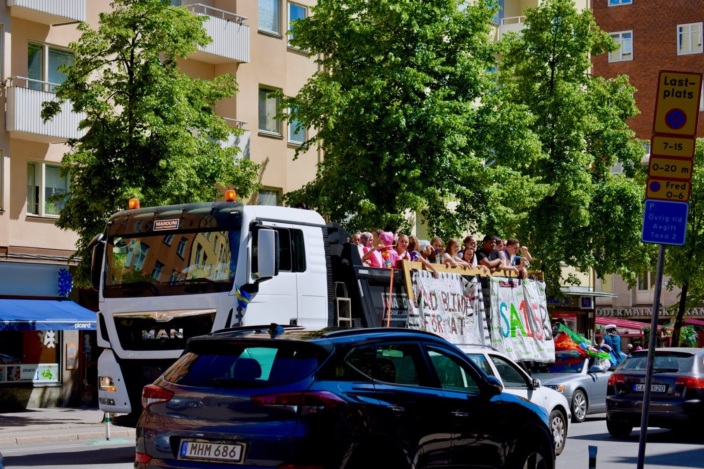
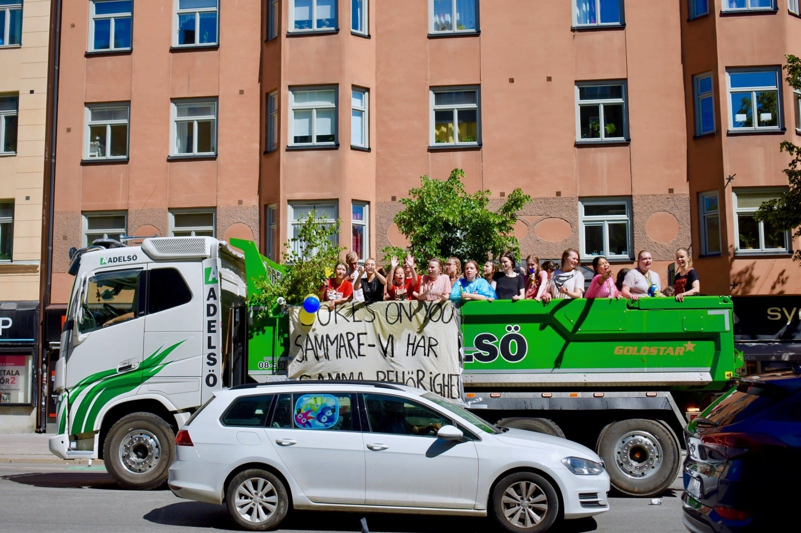
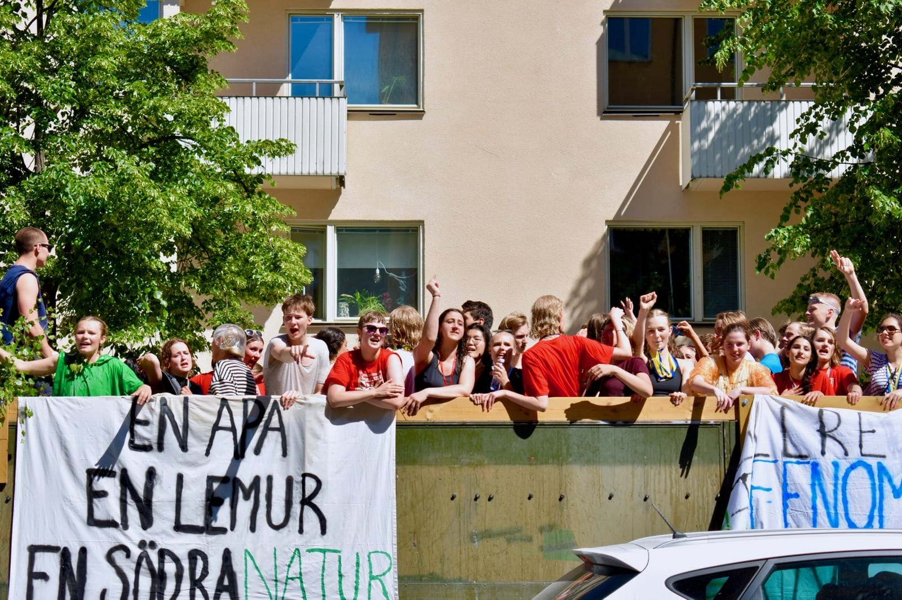
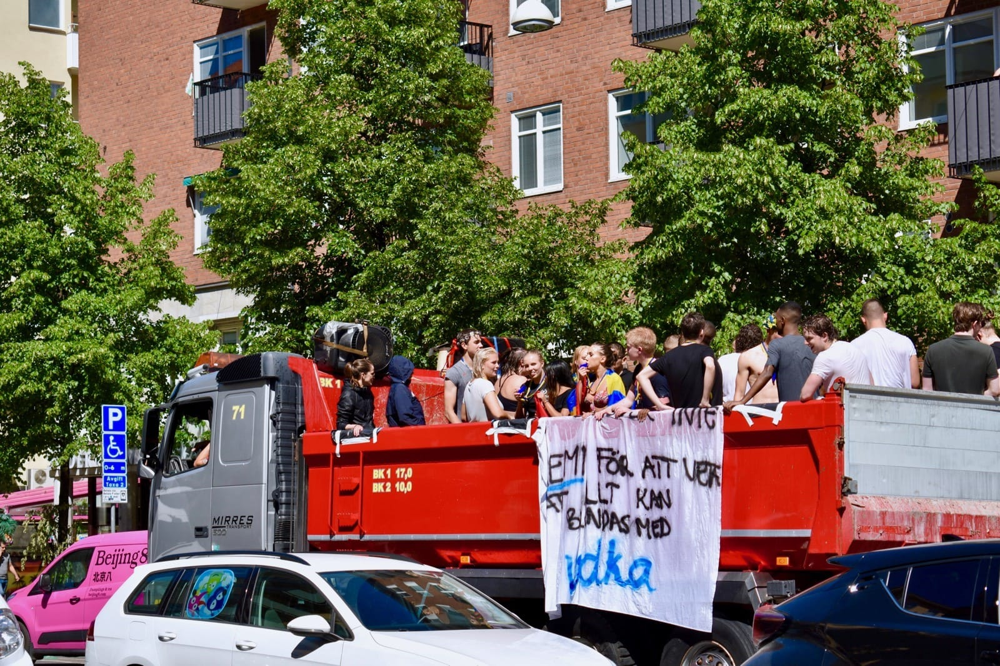
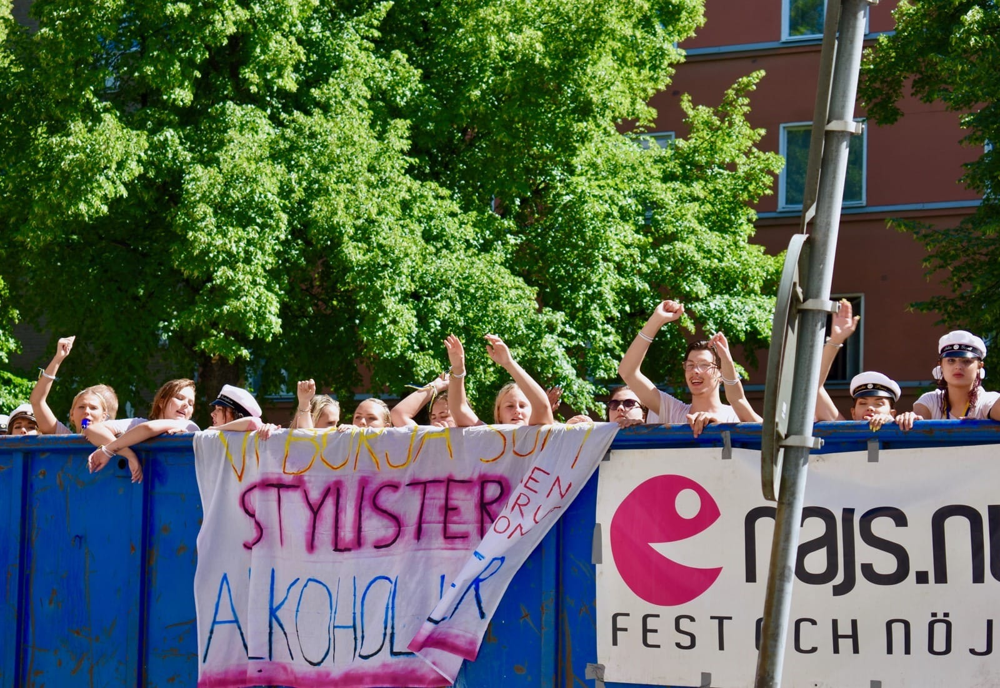
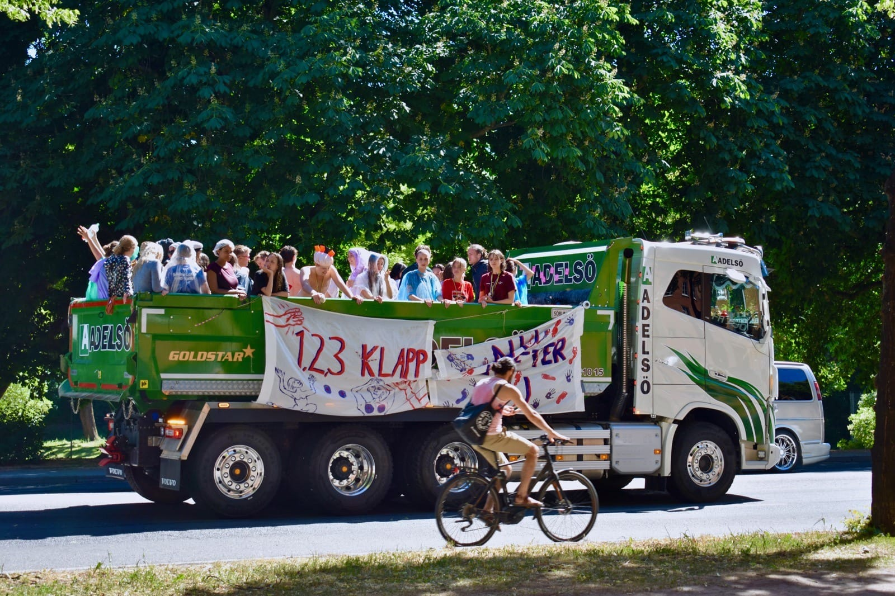
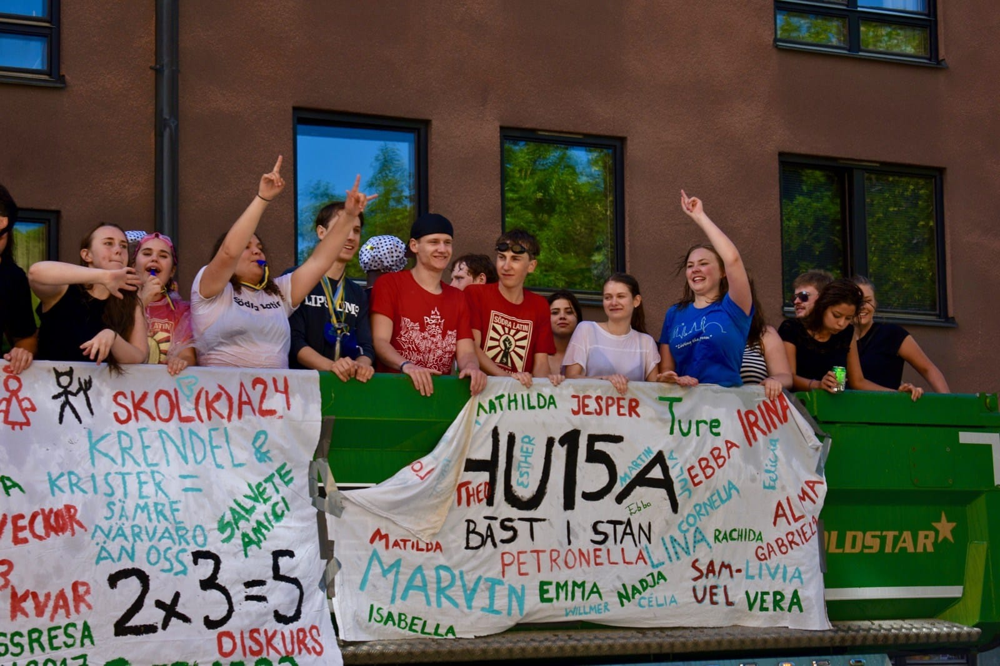
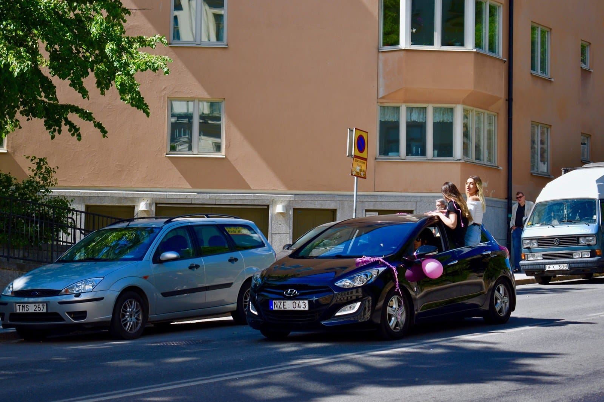

Jika kamu mengunjungi Swedia di awal Bulan Juni, jangan kaget apabila mendapati iring-iringan truk yang mengangkut anak-anak muda keliling kota. Klakson bersahutan. Musik diputar keras. Mereka bersorak dan bernyanyi di sepanjang jalan. Ini merupakan tradisi perayaan kelulusan siswa-siswi *gymnasium*—setara sekolah menengah atas—di Swedia.

Tradisi dan pesta seputar kelulusan ini disebut *studenten* yang berarti "siswa". Dalam sistem pendidikan Swedia seorang murid baru digelari "siswa" apabila ia telah menamatkan *gymnasium*.

Tradisi *studenten* ini bermula jauh sebelum tahun 60-an dimana setiap murid sekolah menengah atas diharuskan untuk mengikuti *studentexamen* atau "ujian siswa". Setelah dinyatakan lulus, siswa-siswi ini akan berpesta sebelum akhirnya harus masuk *lumpen* (*militär grundutbildning* atau pendidikan militer).

Namun pada tahun 1968, Pemerintah Swedia menghapuskan *studentexamen*dan tradisi *studenten* pun perlahan terhapus. Nyaris tidak ada perayaan besar-besaran sepanjang dekade 70-an. Baru pada tahun 80-an tradisi *studenten ini* hidup kembali. Terlebih pada awal 90-an saat Pemerintah Swedia kembali melakukan reformasi pada sistem pendidikannya.

Tradisi *studenten* ini dimulai dari rumah sang murid. Di hari kelulusannya, keluarga murid biasa menyiapkan *champagne breakfast*—sarapan dengan ditemani sampanye atau *sparkling wine*.

Si murid pun berangkat ke sekolah untuk mengikuti upacara kelulusannya. Murid laki-laki menggunakan setelan jas berwarna hitam. Sedang murid perempuan umumnya mengenakan gaun berwarna putih. Mereka juga mengenakan *studentmössa*—topi berwarna putih dengan lingkaran pita berwarna hitam atau biru tua.

Acara pemberian diploma ini hanya boleh dihadiri oleh murid-murid saja. Keluarga dan kerabat biasanya menuggu di lapangan sekolah. Keluarga juga biasanya membawa papan yang ditempeli foto sang murid sewaktu kecil.

{{}}

Tuntas upacara kelulusan, para murid yang kini telah menjadi siswa berhamburan ke lapangan menemui keluarganya. Siswa-siswi ini biasanya diberi hadiah yang dikalungkan ke lehernya: mulai dari bunga, boneka bintang, hingga kaleng-kaleng bir!

{{}}

Dari sekolah mereka akan keliling kota dengan menggunakan truk bak terbuka atau bahkan traktor. Banyak anggota keluarga yang juga turut serta mengikuti iring-iringan para siswa.

Dari atas truk mereka bernyanyi, bersorak, menyapa siapa saja yang mereka temui sepanjang jalan. Banyak juga yang sengaja memasang sistem audio untuk memutar musik kencang-kencang, menjadikan truk tersebut tempat pesta berjalan.

Puas keliling kota, siswa-siswi itu pun akhirnya akan pulang ke rumah atau ke bar untuk melanjutkan pestanya bersama keluarga ataupun kawan-kawan.


{{}}

{{}}

{{}}

{{}}

{{}}

{{}}

{{}}

{{}}

