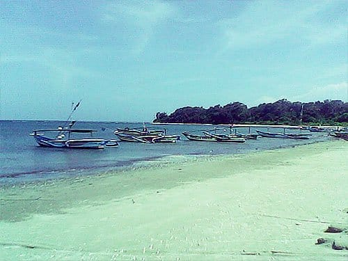
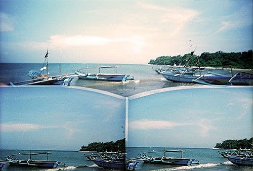
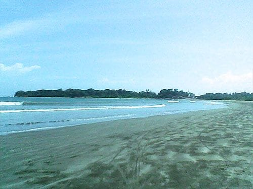
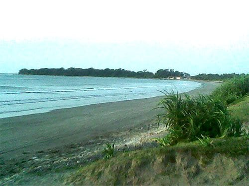

Siang itu langit sangat cerah, biru memulas angkasa tanpa cela. Hanya tampak awan gemawan tipis yang berarak tertiup angin. Lautan terhampar luas, seolah menyatu dengan kaki-kaki langit di batas cakrawala. Mentari terik bersinar, panasnya menyengat dan membakar tubuh kami. Beruntung angin selalu berhembus. Membawa kesejukan kala menyapa tubuh kami yang sudah berlumur peluh. Ombak-ombak kecil bergulung terhempas ke tepian. Menyisakan buih-buih kecil di atas pasir pantai.

Di tengah hari yang terik, kami berjalan menyisiri bibir pantai. Entah kemana. Pantai sangat sepi, hanya ada kami di sana. Tak heran karena kami memang sengaja datang bukan pada saat musim liburan.

Tidak jauh dari bibir pantai, ada sebuah perkampungan nelayan, lengkap dengan tempat pelelangan ikannya. Di perkampungan itupun suasananya sangat sepi. Perahu-perahu nelayan bersandar lesu di tepian. Tali-tali jangkarnya tertambat dan melintang di pantai. Sudah beberapa minggu para nelayan tidak melaut, katanya cuaca di tengah laut sedang buruk. Tangkapan ikan jauh merosot. Pantas saja kami kesulitan untuk menemukan hidangan laut di sini.

Kami terus berjalan, menyusuri garis pantai yang melengkung seperti bulan sabit. Ujung Genteng memang merupakan semenanjung yang menjorok langsung ke Samudera Hindia. Meski berhadapan langsung dengan samudera, daerah di pesisir Selatan Sukabumi ini memiliki perairan yang bersahabat. Tidak seperti tetangganya Pelabuhan Ratu. Ombak di pantai Ujung Genteng sangat kecil. Gelombang Samudera Hindia yang ganas pecah berserak oleh gugusan karang yang memagarinya jauh dari lepas pantai.

Di pantai Ujung Genteng, pengunjung bisa sepuasnya bermain air. Ombaknya sangat bersahabat, tingginya tidak sampai selutut. Bibir pantainya yang luas dan landai sangat cocok untuk dijadikan arena bermain bola atau voli bersama teman-teman. Garis pantainya yang sangat panjang dan melengkung dilindungi bukit-bukit kecil dan hutan-hutan yang lebat. Sebuah tempat tersembunyi yang benar-benar eksotis.

Foto cover dari [Unsplash](https://unsplash.com/photos/2PODhmrvLik) oleh [Mayur Gala](https://unsplash.com/@mayurgala).
