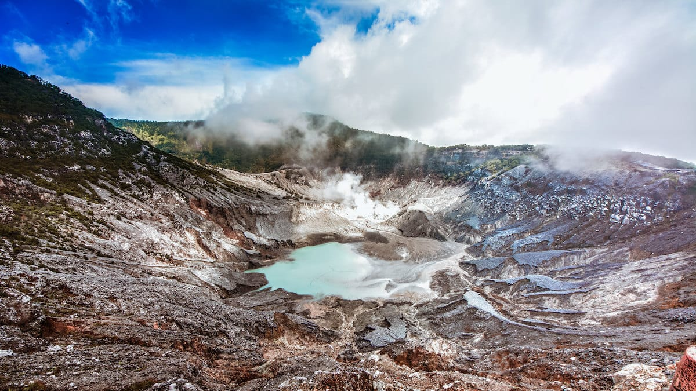
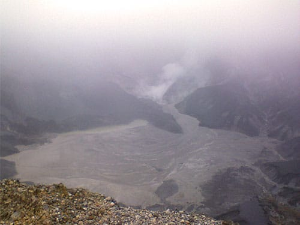
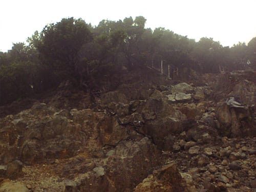
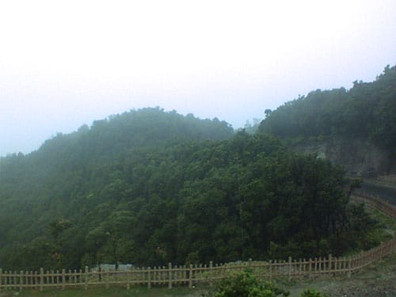
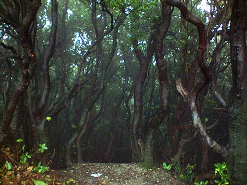

Siapa yang tidak kenal dengan Gunung Tangkuban Parahu? Gunung merapi yang masih aktif ini menjadi primadona wisata alam andalan Provinsi Jawa Barat. Selain aksesnya yang mudah dan dekat dari Kota Bandung, Gunung Tangkuban Perahu menawarkan eksotisme alam yang tiada duanya. Tidak heran begitu banyak wisatwan lokal ataupun mancanegara memadati kawasan Gunung Tangkuban Perahu ini.

Gunung dengan ketinggian 2.084 meter di atas permukaan laut ini memiliki beberapa kawah vulkanik yang masih aktif. Kawah-kawah yang terkenal diantaranya adalah Kawah Ratu, Kawah Upas dan Kawah Domas. Kepulan asap belerang dari dasar kawah menjadi sajian alam yang sangat menarik. Belum lagi bentang alam yang menghijau di sekitar kawasan ini, membuat para wisatawan betah berlama-lama di sini.

Beruntung karena aku tinggal tidak jauh dari kaki Gunung Tangkuban Perahu. Gunung yang juga terkenal dengan legenda Sangkuriang dan Dayang Sumbinya ini sudah menjadi tempat pelarian favorit kala jenuh.

## Kawah Ratu

Kawah Ratu merupakan kawah terbesar yang terdapat di Tangkuban Perahu. kawah inilah yang menjadi *icon* utama dari Tangkuban Perahu. Kawah Ratu ini sangat luas dan dalam. Untuk mengelilinginya saja dibutuhkan waktu dan tenaga yang tidak sedikit. Dari dasar Kawah Ratu pun mengepul asap belerang yang sangat pekat. Tidak heran di dekat bibir kawah selalu tercium aroma belerang yang menusuk.

Untuk mencapai Kawah Ratu, pengunjung tidak perlu bersusah payah, karena sudah bisa diakses oleh kendaraan bermotor. Di bibir kawah ratu juga terdapat *shelter* bagi para pengunjung. *Shelter* yang berada di ketinggian ini membuat pengunjung lebih leluasa menikmati keindahan Kawah Ratu. Di sekeliling bibir kawah juga terdapat berbagai penjaja makanan, suvenir, sampai jasa penyewaan kuda. Sebuah pilihan tepat untuk menghabiskan liburan anda.

Foto cover dari [Flickr](https://www.flickr.com/photos/ghailon/13032691044/in/photostream/) oleh [taufuuu](https://www.flickr.com/photos/ghailon/).
