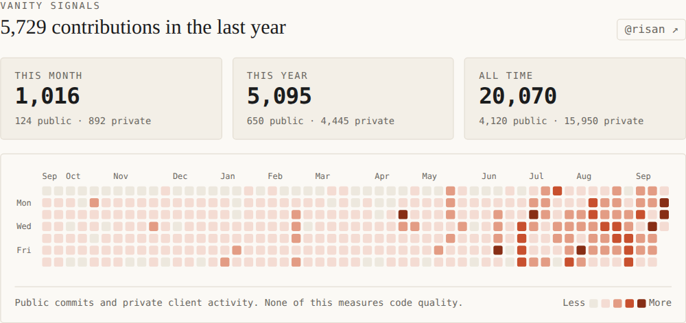

Instead of embedding a third-party iframe or loading a generic widget that pings external servers on every page visit, I wanted a native GitHub contribution map directly on this blog's homepage. One that matches our warm paper and terracotta monograph palette, loads with zero client-side network latency, and includes both public open-source commits and private client work.

The architecture is simple: fetch the contribution data at build time, save it as a local JSON snapshot, automate daily updates with a scheduled GitHub Actions workflow, and render the calendar grid using pure SVG.

Here is how to build it from scratch in five logical steps.



## 1. Pulling Contribution Data via GraphQL

GitHub's REST API does not provide a simple endpoint for your contribution calendar grid unless you scrape the HTML profile page. The [GitHub GraphQL API](https://docs.github.com/en/graphql), however, exposes the `contributionsCollection` object on the `User` and `viewer` types. This gives us exact week-by-week contribution counts, quartile intensity levels, and private activity numbers.

We wrote a Node.js script in `scripts/fetch-github-contributions.mjs`. First, it resolves an authentication token from the environment (`GITHUB_TOKEN`, `GH_TOKEN`) or falls back to your local GitHub CLI session (`gh auth token`):

```javascript
import { execSync } from 'node:child_process';

function resolveToken() {
  if (process.env.GITHUB_TOKEN?.trim()) return process.env.GITHUB_TOKEN.trim();
  if (process.env.GH_TOKEN?.trim()) return process.env.GH_TOKEN.trim();
  try {
    const out = execSync('gh auth token', {
      encoding: 'utf-8',
      stdio: ['ignore', 'pipe', 'ignore'],
    });
    if (out?.trim()) return out.trim();
  } catch {
    // gh CLI not authenticated or not installed
  }
  return null;
}
```

Next, we query the `contributionCalendar` for the trailing year, along with the stats for the current month and year:

```graphql
query GetOverview($monthStart: DateTime!, $yearStart: DateTime!, $now: DateTime!) {
  viewer {
    login
    calendar: contributionsCollection {
      contributionCalendar {
        totalContributions
        weeks {
          firstDay
          contributionDays {
            date
            contributionCount
            contributionLevel
            weekday
          }
        }
        months {
          name
          firstDay
          totalWeeks
        }
      }
      contributionYears
    }
    thisMonth: contributionsCollection(from: $monthStart, to: $now) {
      totalCommitContributions
      restrictedContributionsCount
      contributionCalendar { totalContributions }
    }
    thisYear: contributionsCollection(from: $yearStart, to: $now) {
      totalCommitContributions
      restrictedContributionsCount
      contributionCalendar { totalContributions }
    }
  }
}
```

### Batching All-Time History with GraphQL Aliases

To show total all-time contributions without sending separate HTTP requests for every year of account history, we use GraphQL query aliases. Given the array of `contributionYears` returned from the first query (e.g. `[2026, 2025, 2024, ...]`), we dynamically compose a single query:

```javascript
const yearAliases = years
  .map(
    (y) =>
      `y${y}: contributionsCollection(from: "${y}-01-01T00:00:00Z", to: "${y}-12-31T23:59:59Z") {
        contributionCalendar { totalContributions }
        totalCommitContributions
        restrictedContributionsCount
      }`,
  )
  .join('\n');

const queryAllYears = `query { viewer { ${yearAliases} } }`;
const dataAllYears = await graphql(token, queryAllYears);
```

This delivers our entire lifetime contribution tally—including private client contributions—in a single round trip.

Before writing the output, the script guards against corrupting our local cache: it asserts that the token user matches the expected login and refuses to overwrite existing data if the API returns 0 contributions. Finally, it writes `src/data/github-contributions.json`.

## 2. Automating Updates with GitHub Actions

To keep the calendar current without manual intervention, we set up a scheduled GitHub Actions workflow in `.github/workflows/update-contributions.yml`. It runs daily at 02:00 UTC and supports manual dispatch:

```yaml
name: Update GitHub Contributions

on:
  schedule:
    - cron: '0 2 * * *'
  workflow_dispatch:

permissions:
  contents: write

jobs:
  update:
    name: Refresh contribution snapshot
    runs-on: ubuntu-latest
    steps:
      - name: Checkout repository
        uses: actions/checkout@v7
        with:
          token: ${{ secrets.GH_PAT }}

      - name: Setup Node
        uses: actions/setup-node@v7
        with:
          node-version-file: .node-version
          cache: npm

      - name: Install dependencies
        run: npm ci

      - name: Fetch latest GitHub activity
        env:
          GH_TOKEN: ${{ secrets.GH_PAT }}
        run: node scripts/fetch-github-contributions.mjs

      - name: Commit and push if changed
        run: |
          git config --global user.name "github-actions[bot]"
          git config --global user.email "github-actions[bot]@users.noreply.github.com"
          if git diff --quiet src/data/github-contributions.json; then
            echo "No changes in contribution data."
          else
            git add src/data/github-contributions.json
            git commit -m "chore(data): update github contributions"
            git push origin main
          fi
```

The critical detail here is `git diff --quiet src/data/github-contributions.json`. If no new commits or pull requests occurred, the workflow exits cleanly without spamming git history with empty commits.

## 3. Drawing the Heatmap with Pure SVG

Rather than importing a charting library like D3 or Chart.js, the entire grid is rendered as a clean SVG inside an Astro component (`src/components/GithubHeatmap.astro`). Because Astro components execute at build time, the JSON data is imported statically:

```astro
---
import githubData from '../data/github-contributions.json';

const { stats, calendar, username } = githubData;
const weeks = calendar.weeks;
---
```

### Grid Geometry and Coordinates

The GitHub activity grid consists of 53 columns (weeks) and 7 rows (days of the week, Sunday through Saturday). We set up constants for sizing and spacing:

```javascript
const CELL_SIZE = 10;
const CELL_GAP = 3;
const STEP = CELL_SIZE + CELL_GAP; // 13px step per column/row
const X_OFFSET = 30; // Left margin for weekday labels
const Y_OFFSET = 20; // Top margin for month labels

const totalWeeks = weeks.length;
const svgWidth = X_OFFSET + totalWeeks * STEP; // 30 + (53 * 13) = 719px
const svgHeight = Y_OFFSET + 7 * STEP;         // 20 + (7 * 13) = 111px
```

Rendering the grid is a straightforward nested loop over weeks and days:

```astro
<svg viewBox={`0 0 ${svgWidth} ${svgHeight}`} class="heatmap-svg">
  {weeks.map((week, wIndex) => {
    const x = X_OFFSET + wIndex * STEP;
    return (
      <g class="heatmap-week">
        {week.contributionDays.map((day) => {
          const y = Y_OFFSET + day.weekday * STEP;
          const levelClass = levelClassMap[day.contributionLevel] || 'gh-cell-0';
          return (
            <rect
              x={x}
              y={y}
              width={CELL_SIZE}
              height={CELL_SIZE}
              rx={2}
              ry={2}
              class={`gh-cell ${levelClass}`}
              data-date={day.date}
              data-count={day.contributionCount}
            >
              <title>
                {`${day.contributionCount} contribution${day.contributionCount === 1 ? '' : 's'} on ${formatDate(day.date)}`}
              </title>
            </rect>
          );
        })}
      </g>
    );
  })}
</svg>
```

On mobile devices, a 719px SVG would either shrink until unreadable or break the viewport. We wrap it in a container with `overflow-x: auto` and add a tiny inline script to scroll to the right by default (`scroll.scrollLeft = scroll.scrollWidth`), ensuring readers see the most recent activity first.

## 4. Printing the Date and Labels

A heatmap without date reference points is just colored confetti. We need three levels of temporal information: weekday indicators, month labels along the top, and exact dates on each individual cell.

### Weekday Guides

Printing labels for all seven days creates visual clutter on a 10px grid. Following GitHub's convention, we only label Monday (day 1), Wednesday (day 3), and Friday (day 5) in the left gutter:

```astro
<text x={2} y={Y_OFFSET + 1 * STEP + 8} class="label-weekday">Mon</text>
<text x={2} y={Y_OFFSET + 3 * STEP + 8} class="label-weekday">Wed</text>
<text x={2} y={Y_OFFSET + 5 * STEP + 8} class="label-weekday">Fri</text>
```

The `+ 8` offset aligns the text baseline with the vertical center of the 10px square.

### Month Labels Along the Top

Month labels are calculated dynamically by iterating over the weeks and checking when a new month begins. To prevent adjacent month names from overlapping—especially at the start of the year—we enforce a minimum horizontal spacing of 24 pixels:

```javascript
const monthLabels = [];
let lastMonth = -1;
const monthNames = ['Jan', 'Feb', 'Mar', 'Apr', 'May', 'Jun', 'Jul', 'Aug', 'Sep', 'Oct', 'Nov', 'Dec'];

weeks.forEach((week, wIndex) => {
  const firstValidDay = week.contributionDays[0];
  if (firstValidDay) {
    const d = new Date(firstValidDay.date);
    const m = d.getUTCMonth();
    if (m !== lastMonth) {
      const prev = monthLabels[monthLabels.length - 1];
      const x = X_OFFSET + wIndex * STEP;
      if (!prev || x - prev.x >= 24) {
        monthLabels.push({ name: monthNames[m], x });
        lastMonth = m;
      }
    }
  }
});
```

Then we render them at `y={12}`:

```astro
{monthLabels.map((m) => (
  <text x={m.x} y={12} class="label-month">
    {m.name}
  </text>
))}
```

### Tooltips on Every Day

Instead of loading a heavy JavaScript popover library, we use the browser's native SVG `<title>` element inside each `<rect>`:

```astro
<title>
  {`${day.contributionCount} contribution${day.contributionCount === 1 ? '' : 's'} on ${formatDate(day.date)}`}
</title>
```

The date formatting helper outputs clean, unambiguous dates:

```javascript
const formatDate = (dateStr) => {
  const d = new Date(dateStr);
  return d.toLocaleDateString('en-GB', {
    day: 'numeric',
    month: 'short',
    year: 'numeric',
    timeZone: 'UTC',
  });
};
```

When a reader hovers over any cell, the browser displays a native tooltip like `7 contributions on 14 Sep 2026`. It costs zero bytes of JavaScript and is accessible to screen readers out of the box.

## 5. Crafting the Terracotta Palette

GitHub's signature green (`#216e39`) works well on GitHub, but it clashes with this blog's Technical Monograph design, which relies on warm newsprint paper (`#fbf9f5`), sunk cards (`#f3efe7`), and a terracotta clay accent (`#c8502e`).

GitHub's API categorizes contribution counts into five discrete levels:
- `NONE`
- `FIRST_QUARTILE`
- `SECOND_QUARTILE`
- `THIRD_QUARTILE`
- `FOURTH_QUARTILE`

We map these levels directly to CSS custom properties that shift harmoniously between light and dark modes:

```css
:root {
  --gh-level-0: #ede8de; /* Sunk warm paper */
  --gh-level-1: #f4dcd3; /* Pale blush tint */
  --gh-level-2: #e39c84; /* Soft terracotta */
  --gh-level-3: #c8502e; /* Primary clay accent */
  --gh-level-4: #872e15; /* Deep burnt brick */
}

html.dark {
  --gh-level-0: #222428; /* Charcoal base */
  --gh-level-1: #3d231b; /* Deep muted ember */
  --gh-level-2: #733725; /* Burnt umber */
  --gh-level-3: #c05435; /* Bright terracotta */
  --gh-level-4: #e06b47; /* Vivid flame accent */
}
```

And in CSS:

```css
.gh-cell-0 { fill: var(--gh-level-0); }
.gh-cell-1 { fill: var(--gh-level-1); }
.gh-cell-2 { fill: var(--gh-level-2); }
.gh-cell-3 { fill: var(--gh-level-3); }
.gh-cell-4 { fill: var(--gh-level-4); }

.gh-cell:hover {
  stroke: var(--ink);
  stroke-width: 1px;
}
```

By coupling SVG `fill` properties to CSS variables, theme switching is instantaneous and requires no JavaScript re-rendering.

## The Result

Here is the live rendered GitHub activity map built with this code:

<div class="github-activity-demo not-prose my-8 p-4 md:p-6 bg-[var(--paper)] border border-[var(--rule)] rounded">
  <div class="flex justify-between items-baseline flex-wrap gap-3 mb-4">
    <div>
      <span class="block font-mono text-[11px] tracking-wider uppercase text-[var(--ink-muted)]">Vanity Signals</span>
      <h3 class="font-serif text-xl font-medium text-[var(--ink)] m-0">5,729 contributions in the last year</h3>
    </div>
    <a href="https://github.com/risan" target="_blank" rel="noopener noreferrer" class="font-mono text-xs text-[var(--ink-muted)] px-2 py-1 border border-[var(--rule)] rounded bg-[var(--paper)] hover:text-[var(--accent)] hover:border-[var(--accent-soft)] transition-colors">@risan ↗</a>
  </div>

  <div class="grid grid-cols-1 sm:grid-cols-3 gap-3 mb-4">
    <div class="p-3 bg-[var(--sunk)] border border-[var(--rule)] rounded flex flex-col">
      <span class="font-mono text-[10px] uppercase tracking-wider text-[var(--ink-muted)] mb-1">This Month</span>
      <span class="font-mono text-2xl font-semibold text-[var(--ink)]">1,016</span>
      <span class="font-mono text-[10px] text-[var(--ink-muted)] mt-1">124 public · 892 private</span>
    </div>
    <div class="p-3 bg-[var(--sunk)] border border-[var(--rule)] rounded flex flex-col">
      <span class="font-mono text-[10px] uppercase tracking-wider text-[var(--ink-muted)] mb-1">This Year</span>
      <span class="font-mono text-2xl font-semibold text-[var(--ink)]">5,095</span>
      <span class="font-mono text-[10px] text-[var(--ink-muted)] mt-1">650 public · 4,445 private</span>
    </div>
    <div class="p-3 bg-[var(--sunk)] border border-[var(--rule)] rounded flex flex-col">
      <span class="font-mono text-[10px] uppercase tracking-wider text-[var(--ink-muted)] mb-1">All Time</span>
      <span class="font-mono text-2xl font-semibold text-[var(--ink)]">20,070</span>
      <span class="font-mono text-[10px] text-[var(--ink-muted)] mt-1">4,120 public · 15,950 private</span>
    </div>
  </div>

  <div class="border border-[var(--rule)] rounded p-4 bg-[var(--paper)]">
    <div class="overflow-x-auto pb-2 scrollbar-thin" tabindex="0" role="region" aria-label="GitHub contribution calendar">
      <svg viewBox="0 0 719 111" class="block w-full min-w-[680px] h-auto" role="img" aria-label="GitHub contribution heatmap">
        <style>
          .label-month, .label-weekday { font-family: var(--font-mono); font-size: 9px; fill: var(--ink-muted); user-select: none; }
          .gh-cell { transition: opacity 0.1s ease; cursor: pointer; }
          .gh-cell:hover { stroke: var(--ink); stroke-width: 1px; }
          .gh-cell-0 { fill: var(--gh-level-0); }
          .gh-cell-1 { fill: var(--gh-level-1); }
          .gh-cell-2 { fill: var(--gh-level-2); }
          .gh-cell-3 { fill: var(--gh-level-3); }
          .gh-cell-4 { fill: var(--gh-level-4); }
        </style>
        <text x="30" y="12" class="label-month">Sep</text><text x="56" y="12" class="label-month">Oct</text><text x="108" y="12" class="label-month">Nov</text><text x="173" y="12" class="label-month">Dec</text><text x="225" y="12" class="label-month">Jan</text><text x="277" y="12" class="label-month">Feb</text><text x="329" y="12" class="label-month">Mar</text><text x="394" y="12" class="label-month">Apr</text><text x="446" y="12" class="label-month">May</text><text x="511" y="12" class="label-month">Jun</text><text x="563" y="12" class="label-month">Jul</text><text x="615" y="12" class="label-month">Aug</text><text x="680" y="12" class="label-month">Sep</text>
        <text x="2" y="41" class="label-weekday">Mon</text>
        <text x="2" y="67" class="label-weekday">Wed</text>
        <text x="2" y="93" class="label-weekday">Fri</text>
        <g class="heatmap-week"><rect x="30" y="20" width="10" height="10" rx="2" ry="2" class="gh-cell gh-cell-0" data-date="2025-09-21" data-count="0"><title>0 contributions on 21 Sept 2025</title></rect><rect x="30" y="33" width="10" height="10" rx="2" ry="2" class="gh-cell gh-cell-1" data-date="2025-09-22" data-count="3"><title>3 contributions on 22 Sept 2025</title></rect><rect x="30" y="46" width="10" height="10" rx="2" ry="2" class="gh-cell gh-cell-1" data-date="2025-09-23" data-count="2"><title>2 contributions on 23 Sept 2025</title></rect><rect x="30" y="59" width="10" height="10" rx="2" ry="2" class="gh-cell gh-cell-1" data-date="2025-09-24" data-count="3"><title>3 contributions on 24 Sept 2025</title></rect><rect x="30" y="72" width="10" height="10" rx="2" ry="2" class="gh-cell gh-cell-1" data-date="2025-09-25" data-count="1"><title>1 contribution on 25 Sept 2025</title></rect><rect x="30" y="85" width="10" height="10" rx="2" ry="2" class="gh-cell gh-cell-1" data-date="2025-09-26" data-count="7"><title>7 contributions on 26 Sept 2025</title></rect><rect x="30" y="98" width="10" height="10" rx="2" ry="2" class="gh-cell gh-cell-1" data-date="2025-09-27" data-count="7"><title>7 contributions on 27 Sept 2025</title></rect></g><g class="heatmap-week"><rect x="43" y="20" width="10" height="10" rx="2" ry="2" class="gh-cell gh-cell-0" data-date="2025-09-28" data-count="0"><title>0 contributions on 28 Sept 2025</title></rect><rect x="43" y="33" width="10" height="10" rx="2" ry="2" class="gh-cell gh-cell-1" data-date="2025-09-29" data-count="21"><title>21 contributions on 29 Sept 2025</title></rect><rect x="43" y="46" width="10" height="10" rx="2" ry="2" class="gh-cell gh-cell-1" data-date="2025-09-30" data-count="18"><title>18 contributions on 30 Sept 2025</title></rect><rect x="43" y="59" width="10" height="10" rx="2" ry="2" class="gh-cell gh-cell-1" data-date="2025-10-01" data-count="25"><title>25 contributions on 1 Oct 2025</title></rect><rect x="43" y="72" width="10" height="10" rx="2" ry="2" class="gh-cell gh-cell-1" data-date="2025-10-02" data-count="2"><title>2 contributions on 2 Oct 2025</title></rect><rect x="43" y="85" width="10" height="10" rx="2" ry="2" class="gh-cell gh-cell-1" data-date="2025-10-03" data-count="12"><title>12 contributions on 3 Oct 2025</title></rect><rect x="43" y="98" width="10" height="10" rx="2" ry="2" class="gh-cell gh-cell-1" data-date="2025-10-04" data-count="7"><title>7 contributions on 4 Oct 2025</title></rect></g><g class="heatmap-week"><rect x="56" y="20" width="10" height="10" rx="2" ry="2" class="gh-cell gh-cell-0" data-date="2025-10-05" data-count="0"><title>0 contributions on 5 Oct 2025</title></rect><rect x="56" y="33" width="10" height="10" rx="2" ry="2" class="gh-cell gh-cell-1" data-date="2025-10-06" data-count="3"><title>3 contributions on 6 Oct 2025</title></rect><rect x="56" y="46" width="10" height="10" rx="2" ry="2" class="gh-cell gh-cell-1" data-date="2025-10-07" data-count="14"><title>14 contributions on 7 Oct 2025</title></rect><rect x="56" y="59" width="10" height="10" rx="2" ry="2" class="gh-cell gh-cell-0" data-date="2025-10-08" data-count="0"><title>0 contributions on 8 Oct 2025</title></rect><rect x="56" y="72" width="10" height="10" rx="2" ry="2" class="gh-cell gh-cell-1" data-date="2025-10-09" data-count="4"><title>4 contributions on 9 Oct 2025</title></rect><rect x="56" y="85" width="10" height="10" rx="2" ry="2" class="gh-cell gh-cell-1" data-date="2025-10-10" data-count="5"><title>5 contributions on 10 Oct 2025</title></rect><rect x="56" y="98" width="10" height="10" rx="2" ry="2" class="gh-cell gh-cell-0" data-date="2025-10-11" data-count="0"><title>0 contributions on 11 Oct 2025</title></rect></g><g class="heatmap-week"><rect x="69" y="20" width="10" height="10" rx="2" ry="2" class="gh-cell gh-cell-0" data-date="2025-10-12" data-count="0"><title>0 contributions on 12 Oct 2025</title></rect><rect x="69" y="33" width="10" height="10" rx="2" ry="2" class="gh-cell gh-cell-0" data-date="2025-10-13" data-count="0"><title>0 contributions on 13 Oct 2025</title></rect><rect x="69" y="46" width="10" height="10" rx="2" ry="2" class="gh-cell gh-cell-1" data-date="2025-10-14" data-count="19"><title>19 contributions on 14 Oct 2025</title></rect><rect x="69" y="59" width="10" height="10" rx="2" ry="2" class="gh-cell gh-cell-1" data-date="2025-10-15" data-count="2"><title>2 contributions on 15 Oct 2025</title></rect><rect x="69" y="72" width="10" height="10" rx="2" ry="2" class="gh-cell gh-cell-1" data-date="2025-10-16" data-count="4"><title>4 contributions on 16 Oct 2025</title></rect><rect x="69" y="85" width="10" height="10" rx="2" ry="2" class="gh-cell gh-cell-1" data-date="2025-10-17" data-count="15"><title>15 contributions on 17 Oct 2025</title></rect><rect x="69" y="98" width="10" height="10" rx="2" ry="2" class="gh-cell gh-cell-0" data-date="2025-10-18" data-count="0"><title>0 contributions on 18 Oct 2025</title></rect></g><g class="heatmap-week"><rect x="82" y="20" width="10" height="10" rx="2" ry="2" class="gh-cell gh-cell-0" data-date="2025-10-19" data-count="0"><title>0 contributions on 19 Oct 2025</title></rect><rect x="82" y="33" width="10" height="10" rx="2" ry="2" class="gh-cell gh-cell-2" data-date="2025-10-20" data-count="26"><title>26 contributions on 20 Oct 2025</title></rect><rect x="82" y="46" width="10" height="10" rx="2" ry="2" class="gh-cell gh-cell-1" data-date="2025-10-21" data-count="5"><title>5 contributions on 21 Oct 2025</title></rect><rect x="82" y="59" width="10" height="10" rx="2" ry="2" class="gh-cell gh-cell-1" data-date="2025-10-22" data-count="13"><title>13 contributions on 22 Oct 2025</title></rect><rect x="82" y="72" width="10" height="10" rx="2" ry="2" class="gh-cell gh-cell-0" data-date="2025-10-23" data-count="0"><title>0 contributions on 23 Oct 2025</title></rect><rect x="82" y="85" width="10" height="10" rx="2" ry="2" class="gh-cell gh-cell-1" data-date="2025-10-24" data-count="2"><title>2 contributions on 24 Oct 2025</title></rect><rect x="82" y="98" width="10" height="10" rx="2" ry="2" class="gh-cell gh-cell-1" data-date="2025-10-25" data-count="3"><title>3 contributions on 25 Oct 2025</title></rect></g><g class="heatmap-week"><rect x="95" y="20" width="10" height="10" rx="2" ry="2" class="gh-cell gh-cell-0" data-date="2025-10-26" data-count="0"><title>0 contributions on 26 Oct 2025</title></rect><rect x="95" y="33" width="10" height="10" rx="2" ry="2" class="gh-cell gh-cell-1" data-date="2025-10-27" data-count="15"><title>15 contributions on 27 Oct 2025</title></rect><rect x="95" y="46" width="10" height="10" rx="2" ry="2" class="gh-cell gh-cell-1" data-date="2025-10-28" data-count="13"><title>13 contributions on 28 Oct 2025</title></rect><rect x="95" y="59" width="10" height="10" rx="2" ry="2" class="gh-cell gh-cell-0" data-date="2025-10-29" data-count="0"><title>0 contributions on 29 Oct 2025</title></rect><rect x="95" y="72" width="10" height="10" rx="2" ry="2" class="gh-cell gh-cell-1" data-date="2025-10-30" data-count="7"><title>7 contributions on 30 Oct 2025</title></rect><rect x="95" y="85" width="10" height="10" rx="2" ry="2" class="gh-cell gh-cell-1" data-date="2025-10-31" data-count="1"><title>1 contribution on 31 Oct 2025</title></rect><rect x="95" y="98" width="10" height="10" rx="2" ry="2" class="gh-cell gh-cell-1" data-date="2025-11-01" data-count="5"><title>5 contributions on 1 Nov 2025</title></rect></g><g class="heatmap-week"><rect x="108" y="20" width="10" height="10" rx="2" ry="2" class="gh-cell gh-cell-0" data-date="2025-11-02" data-count="0"><title>0 contributions on 2 Nov 2025</title></rect><rect x="108" y="33" width="10" height="10" rx="2" ry="2" class="gh-cell gh-cell-1" data-date="2025-11-03" data-count="8"><title>8 contributions on 3 Nov 2025</title></rect><rect x="108" y="46" width="10" height="10" rx="2" ry="2" class="gh-cell gh-cell-1" data-date="2025-11-04" data-count="1"><title>1 contribution on 4 Nov 2025</title></rect><rect x="108" y="59" width="10" height="10" rx="2" ry="2" class="gh-cell gh-cell-1" data-date="2025-11-05" data-count="10"><title>10 contributions on 5 Nov 2025</title></rect><rect x="108" y="72" width="10" height="10" rx="2" ry="2" class="gh-cell gh-cell-1" data-date="2025-11-06" data-count="6"><title>6 contributions on 6 Nov 2025</title></rect><rect x="108" y="85" width="10" height="10" rx="2" ry="2" class="gh-cell gh-cell-1" data-date="2025-11-07" data-count="2"><title>2 contributions on 7 Nov 2025</title></rect><rect x="108" y="98" width="10" height="10" rx="2" ry="2" class="gh-cell gh-cell-1" data-date="2025-11-08" data-count="1"><title>1 contribution on 8 Nov 2025</title></rect></g><g class="heatmap-week"><rect x="121" y="20" width="10" height="10" rx="2" ry="2" class="gh-cell gh-cell-0" data-date="2025-11-09" data-count="0"><title>0 contributions on 9 Nov 2025</title></rect><rect x="121" y="33" width="10" height="10" rx="2" ry="2" class="gh-cell gh-cell-1" data-date="2025-11-10" data-count="10"><title>10 contributions on 10 Nov 2025</title></rect><rect x="121" y="46" width="10" height="10" rx="2" ry="2" class="gh-cell gh-cell-1" data-date="2025-11-11" data-count="5"><title>5 contributions on 11 Nov 2025</title></rect><rect x="121" y="59" width="10" height="10" rx="2" ry="2" class="gh-cell gh-cell-1" data-date="2025-11-12" data-count="2"><title>2 contributions on 12 Nov 2025</title></rect><rect x="121" y="72" width="10" height="10" rx="2" ry="2" class="gh-cell gh-cell-1" data-date="2025-11-13" data-count="18"><title>18 contributions on 13 Nov 2025</title></rect><rect x="121" y="85" width="10" height="10" rx="2" ry="2" class="gh-cell gh-cell-1" data-date="2025-11-14" data-count="10"><title>10 contributions on 14 Nov 2025</title></rect><rect x="121" y="98" width="10" height="10" rx="2" ry="2" class="gh-cell gh-cell-0" data-date="2025-11-15" data-count="0"><title>0 contributions on 15 Nov 2025</title></rect></g><g class="heatmap-week"><rect x="134" y="20" width="10" height="10" rx="2" ry="2" class="gh-cell gh-cell-0" data-date="2025-11-16" data-count="0"><title>0 contributions on 16 Nov 2025</title></rect><rect x="134" y="33" width="10" height="10" rx="2" ry="2" class="gh-cell gh-cell-1" data-date="2025-11-17" data-count="1"><title>1 contribution on 17 Nov 2025</title></rect><rect x="134" y="46" width="10" height="10" rx="2" ry="2" class="gh-cell gh-cell-1" data-date="2025-11-18" data-count="8"><title>8 contributions on 18 Nov 2025</title></rect><rect x="134" y="59" width="10" height="10" rx="2" ry="2" class="gh-cell gh-cell-1" data-date="2025-11-19" data-count="2"><title>2 contributions on 19 Nov 2025</title></rect><rect x="134" y="72" width="10" height="10" rx="2" ry="2" class="gh-cell gh-cell-1" data-date="2025-11-20" data-count="13"><title>13 contributions on 20 Nov 2025</title></rect><rect x="134" y="85" width="10" height="10" rx="2" ry="2" class="gh-cell gh-cell-1" data-date="2025-11-21" data-count="9"><title>9 contributions on 21 Nov 2025</title></rect><rect x="134" y="98" width="10" height="10" rx="2" ry="2" class="gh-cell gh-cell-0" data-date="2025-11-22" data-count="0"><title>0 contributions on 22 Nov 2025</title></rect></g><g class="heatmap-week"><rect x="147" y="20" width="10" height="10" rx="2" ry="2" class="gh-cell gh-cell-0" data-date="2025-11-23" data-count="0"><title>0 contributions on 23 Nov 2025</title></rect><rect x="147" y="33" width="10" height="10" rx="2" ry="2" class="gh-cell gh-cell-1" data-date="2025-11-24" data-count="8"><title>8 contributions on 24 Nov 2025</title></rect><rect x="147" y="46" width="10" height="10" rx="2" ry="2" class="gh-cell gh-cell-1" data-date="2025-11-25" data-count="24"><title>24 contributions on 25 Nov 2025</title></rect><rect x="147" y="59" width="10" height="10" rx="2" ry="2" class="gh-cell gh-cell-2" data-date="2025-11-26" data-count="28"><title>28 contributions on 26 Nov 2025</title></rect><rect x="147" y="72" width="10" height="10" rx="2" ry="2" class="gh-cell gh-cell-1" data-date="2025-11-27" data-count="4"><title>4 contributions on 27 Nov 2025</title></rect><rect x="147" y="85" width="10" height="10" rx="2" ry="2" class="gh-cell gh-cell-1" data-date="2025-11-28" data-count="1"><title>1 contribution on 28 Nov 2025</title></rect><rect x="147" y="98" width="10" height="10" rx="2" ry="2" class="gh-cell gh-cell-1" data-date="2025-11-29" data-count="1"><title>1 contribution on 29 Nov 2025</title></rect></g><g class="heatmap-week"><rect x="160" y="20" width="10" height="10" rx="2" ry="2" class="gh-cell gh-cell-1" data-date="2025-11-30" data-count="5"><title>5 contributions on 30 Nov 2025</title></rect><rect x="160" y="33" width="10" height="10" rx="2" ry="2" class="gh-cell gh-cell-1" data-date="2025-12-01" data-count="5"><title>5 contributions on 1 Dec 2025</title></rect><rect x="160" y="46" width="10" height="10" rx="2" ry="2" class="gh-cell gh-cell-1" data-date="2025-12-02" data-count="5"><title>5 contributions on 2 Dec 2025</title></rect><rect x="160" y="59" width="10" height="10" rx="2" ry="2" class="gh-cell gh-cell-1" data-date="2025-12-03" data-count="15"><title>15 contributions on 3 Dec 2025</title></rect><rect x="160" y="72" width="10" height="10" rx="2" ry="2" class="gh-cell gh-cell-1" data-date="2025-12-04" data-count="9"><title>9 contributions on 4 Dec 2025</title></rect><rect x="160" y="85" width="10" height="10" rx="2" ry="2" class="gh-cell gh-cell-1" data-date="2025-12-05" data-count="19"><title>19 contributions on 5 Dec 2025</title></rect><rect x="160" y="98" width="10" height="10" rx="2" ry="2" class="gh-cell gh-cell-0" data-date="2025-12-06" data-count="0"><title>0 contributions on 6 Dec 2025</title></rect></g><g class="heatmap-week"><rect x="173" y="20" width="10" height="10" rx="2" ry="2" class="gh-cell gh-cell-0" data-date="2025-12-07" data-count="0"><title>0 contributions on 7 Dec 2025</title></rect><rect x="173" y="33" width="10" height="10" rx="2" ry="2" class="gh-cell gh-cell-1" data-date="2025-12-08" data-count="8"><title>8 contributions on 8 Dec 2025</title></rect><rect x="173" y="46" width="10" height="10" rx="2" ry="2" class="gh-cell gh-cell-1" data-date="2025-12-09" data-count="20"><title>20 contributions on 9 Dec 2025</title></rect><rect x="173" y="59" width="10" height="10" rx="2" ry="2" class="gh-cell gh-cell-0" data-date="2025-12-10" data-count="0"><title>0 contributions on 10 Dec 2025</title></rect><rect x="173" y="72" width="10" height="10" rx="2" ry="2" class="gh-cell gh-cell-1" data-date="2025-12-11" data-count="15"><title>15 contributions on 11 Dec 2025</title></rect><rect x="173" y="85" width="10" height="10" rx="2" ry="2" class="gh-cell gh-cell-1" data-date="2025-12-12" data-count="2"><title>2 contributions on 12 Dec 2025</title></rect><rect x="173" y="98" width="10" height="10" rx="2" ry="2" class="gh-cell gh-cell-1" data-date="2025-12-13" data-count="9"><title>9 contributions on 13 Dec 2025</title></rect></g><g class="heatmap-week"><rect x="186" y="20" width="10" height="10" rx="2" ry="2" class="gh-cell gh-cell-0" data-date="2025-12-14" data-count="0"><title>0 contributions on 14 Dec 2025</title></rect><rect x="186" y="33" width="10" height="10" rx="2" ry="2" class="gh-cell gh-cell-1" data-date="2025-12-15" data-count="14"><title>14 contributions on 15 Dec 2025</title></rect><rect x="186" y="46" width="10" height="10" rx="2" ry="2" class="gh-cell gh-cell-1" data-date="2025-12-16" data-count="2"><title>2 contributions on 16 Dec 2025</title></rect><rect x="186" y="59" width="10" height="10" rx="2" ry="2" class="gh-cell gh-cell-1" data-date="2025-12-17" data-count="5"><title>5 contributions on 17 Dec 2025</title></rect><rect x="186" y="72" width="10" height="10" rx="2" ry="2" class="gh-cell gh-cell-1" data-date="2025-12-18" data-count="5"><title>5 contributions on 18 Dec 2025</title></rect><rect x="186" y="85" width="10" height="10" rx="2" ry="2" class="gh-cell gh-cell-1" data-date="2025-12-19" data-count="2"><title>2 contributions on 19 Dec 2025</title></rect><rect x="186" y="98" width="10" height="10" rx="2" ry="2" class="gh-cell gh-cell-1" data-date="2025-12-20" data-count="3"><title>3 contributions on 20 Dec 2025</title></rect></g><g class="heatmap-week"><rect x="199" y="20" width="10" height="10" rx="2" ry="2" class="gh-cell gh-cell-0" data-date="2025-12-21" data-count="0"><title>0 contributions on 21 Dec 2025</title></rect><rect x="199" y="33" width="10" height="10" rx="2" ry="2" class="gh-cell gh-cell-1" data-date="2025-12-22" data-count="6"><title>6 contributions on 22 Dec 2025</title></rect><rect x="199" y="46" width="10" height="10" rx="2" ry="2" class="gh-cell gh-cell-1" data-date="2025-12-23" data-count="5"><title>5 contributions on 23 Dec 2025</title></rect><rect x="199" y="59" width="10" height="10" rx="2" ry="2" class="gh-cell gh-cell-1" data-date="2025-12-24" data-count="2"><title>2 contributions on 24 Dec 2025</title></rect><rect x="199" y="72" width="10" height="10" rx="2" ry="2" class="gh-cell gh-cell-1" data-date="2025-12-25" data-count="2"><title>2 contributions on 25 Dec 2025</title></rect><rect x="199" y="85" width="10" height="10" rx="2" ry="2" class="gh-cell gh-cell-1" data-date="2025-12-26" data-count="13"><title>13 contributions on 26 Dec 2025</title></rect><rect x="199" y="98" width="10" height="10" rx="2" ry="2" class="gh-cell gh-cell-0" data-date="2025-12-27" data-count="0"><title>0 contributions on 27 Dec 2025</title></rect></g><g class="heatmap-week"><rect x="212" y="20" width="10" height="10" rx="2" ry="2" class="gh-cell gh-cell-0" data-date="2025-12-28" data-count="0"><title>0 contributions on 28 Dec 2025</title></rect><rect x="212" y="33" width="10" height="10" rx="2" ry="2" class="gh-cell gh-cell-1" data-date="2025-12-29" data-count="11"><title>11 contributions on 29 Dec 2025</title></rect><rect x="212" y="46" width="10" height="10" rx="2" ry="2" class="gh-cell gh-cell-1" data-date="2025-12-30" data-count="6"><title>6 contributions on 30 Dec 2025</title></rect><rect x="212" y="59" width="10" height="10" rx="2" ry="2" class="gh-cell gh-cell-1" data-date="2025-12-31" data-count="10"><title>10 contributions on 31 Dec 2025</title></rect><rect x="212" y="72" width="10" height="10" rx="2" ry="2" class="gh-cell gh-cell-1" data-date="2026-01-01" data-count="2"><title>2 contributions on 1 Jan 2026</title></rect><rect x="212" y="85" width="10" height="10" rx="2" ry="2" class="gh-cell gh-cell-1" data-date="2026-01-02" data-count="25"><title>25 contributions on 2 Jan 2026</title></rect><rect x="212" y="98" width="10" height="10" rx="2" ry="2" class="gh-cell gh-cell-1" data-date="2026-01-03" data-count="13"><title>13 contributions on 3 Jan 2026</title></rect></g><g class="heatmap-week"><rect x="225" y="20" width="10" height="10" rx="2" ry="2" class="gh-cell gh-cell-0" data-date="2026-01-04" data-count="0"><title>0 contributions on 4 Jan 2026</title></rect><rect x="225" y="33" width="10" height="10" rx="2" ry="2" class="gh-cell gh-cell-1" data-date="2026-01-05" data-count="9"><title>9 contributions on 5 Jan 2026</title></rect><rect x="225" y="46" width="10" height="10" rx="2" ry="2" class="gh-cell gh-cell-1" data-date="2026-01-06" data-count="5"><title>5 contributions on 6 Jan 2026</title></rect><rect x="225" y="59" width="10" height="10" rx="2" ry="2" class="gh-cell gh-cell-1" data-date="2026-01-07" data-count="6"><title>6 contributions on 7 Jan 2026</title></rect><rect x="225" y="72" width="10" height="10" rx="2" ry="2" class="gh-cell gh-cell-1" data-date="2026-01-08" data-count="19"><title>19 contributions on 8 Jan 2026</title></rect><rect x="225" y="85" width="10" height="10" rx="2" ry="2" class="gh-cell gh-cell-1" data-date="2026-01-09" data-count="18"><title>18 contributions on 9 Jan 2026</title></rect><rect x="225" y="98" width="10" height="10" rx="2" ry="2" class="gh-cell gh-cell-2" data-date="2026-01-10" data-count="34"><title>34 contributions on 10 Jan 2026</title></rect></g><g class="heatmap-week"><rect x="238" y="20" width="10" height="10" rx="2" ry="2" class="gh-cell gh-cell-0" data-date="2026-01-11" data-count="0"><title>0 contributions on 11 Jan 2026</title></rect><rect x="238" y="33" width="10" height="10" rx="2" ry="2" class="gh-cell gh-cell-0" data-date="2026-01-12" data-count="0"><title>0 contributions on 12 Jan 2026</title></rect><rect x="238" y="46" width="10" height="10" rx="2" ry="2" class="gh-cell gh-cell-0" data-date="2026-01-13" data-count="0"><title>0 contributions on 13 Jan 2026</title></rect><rect x="238" y="59" width="10" height="10" rx="2" ry="2" class="gh-cell gh-cell-1" data-date="2026-01-14" data-count="8"><title>8 contributions on 14 Jan 2026</title></rect><rect x="238" y="72" width="10" height="10" rx="2" ry="2" class="gh-cell gh-cell-1" data-date="2026-01-15" data-count="6"><title>6 contributions on 15 Jan 2026</title></rect><rect x="238" y="85" width="10" height="10" rx="2" ry="2" class="gh-cell gh-cell-2" data-date="2026-01-16" data-count="38"><title>38 contributions on 16 Jan 2026</title></rect><rect x="238" y="98" width="10" height="10" rx="2" ry="2" class="gh-cell gh-cell-1" data-date="2026-01-17" data-count="5"><title>5 contributions on 17 Jan 2026</title></rect></g><g class="heatmap-week"><rect x="251" y="20" width="10" height="10" rx="2" ry="2" class="gh-cell gh-cell-1" data-date="2026-01-18" data-count="24"><title>24 contributions on 18 Jan 2026</title></rect><rect x="251" y="33" width="10" height="10" rx="2" ry="2" class="gh-cell gh-cell-1" data-date="2026-01-19" data-count="10"><title>10 contributions on 19 Jan 2026</title></rect><rect x="251" y="46" width="10" height="10" rx="2" ry="2" class="gh-cell gh-cell-1" data-date="2026-01-20" data-count="19"><title>19 contributions on 20 Jan 2026</title></rect><rect x="251" y="59" width="10" height="10" rx="2" ry="2" class="gh-cell gh-cell-1" data-date="2026-01-21" data-count="12"><title>12 contributions on 21 Jan 2026</title></rect><rect x="251" y="72" width="10" height="10" rx="2" ry="2" class="gh-cell gh-cell-1" data-date="2026-01-22" data-count="16"><title>16 contributions on 22 Jan 2026</title></rect><rect x="251" y="85" width="10" height="10" rx="2" ry="2" class="gh-cell gh-cell-1" data-date="2026-01-23" data-count="8"><title>8 contributions on 23 Jan 2026</title></rect><rect x="251" y="98" width="10" height="10" rx="2" ry="2" class="gh-cell gh-cell-1" data-date="2026-01-24" data-count="7"><title>7 contributions on 24 Jan 2026</title></rect></g><g class="heatmap-week"><rect x="264" y="20" width="10" height="10" rx="2" ry="2" class="gh-cell gh-cell-0" data-date="2026-01-25" data-count="0"><title>0 contributions on 25 Jan 2026</title></rect><rect x="264" y="33" width="10" height="10" rx="2" ry="2" class="gh-cell gh-cell-1" data-date="2026-01-26" data-count="2"><title>2 contributions on 26 Jan 2026</title></rect><rect x="264" y="46" width="10" height="10" rx="2" ry="2" class="gh-cell gh-cell-1" data-date="2026-01-27" data-count="1"><title>1 contribution on 27 Jan 2026</title></rect><rect x="264" y="59" width="10" height="10" rx="2" ry="2" class="gh-cell gh-cell-1" data-date="2026-01-28" data-count="3"><title>3 contributions on 28 Jan 2026</title></rect><rect x="264" y="72" width="10" height="10" rx="2" ry="2" class="gh-cell gh-cell-1" data-date="2026-01-29" data-count="17"><title>17 contributions on 29 Jan 2026</title></rect><rect x="264" y="85" width="10" height="10" rx="2" ry="2" class="gh-cell gh-cell-1" data-date="2026-01-30" data-count="11"><title>11 contributions on 30 Jan 2026</title></rect><rect x="264" y="98" width="10" height="10" rx="2" ry="2" class="gh-cell gh-cell-1" data-date="2026-01-31" data-count="22"><title>22 contributions on 31 Jan 2026</title></rect></g><g class="heatmap-week"><rect x="277" y="20" width="10" height="10" rx="2" ry="2" class="gh-cell gh-cell-1" data-date="2026-02-01" data-count="2"><title>2 contributions on 1 Feb 2026</title></rect><rect x="277" y="33" width="10" height="10" rx="2" ry="2" class="gh-cell gh-cell-1" data-date="2026-02-02" data-count="18"><title>18 contributions on 2 Feb 2026</title></rect><rect x="277" y="46" width="10" height="10" rx="2" ry="2" class="gh-cell gh-cell-1" data-date="2026-02-03" data-count="2"><title>2 contributions on 3 Feb 2026</title></rect><rect x="277" y="59" width="10" height="10" rx="2" ry="2" class="gh-cell gh-cell-1" data-date="2026-02-04" data-count="23"><title>23 contributions on 4 Feb 2026</title></rect><rect x="277" y="72" width="10" height="10" rx="2" ry="2" class="gh-cell gh-cell-1" data-date="2026-02-05" data-count="19"><title>19 contributions on 5 Feb 2026</title></rect><rect x="277" y="85" width="10" height="10" rx="2" ry="2" class="gh-cell gh-cell-1" data-date="2026-02-06" data-count="23"><title>23 contributions on 6 Feb 2026</title></rect><rect x="277" y="98" width="10" height="10" rx="2" ry="2" class="gh-cell gh-cell-1" data-date="2026-02-07" data-count="9"><title>9 contributions on 7 Feb 2026</title></rect></g><g class="heatmap-week"><rect x="290" y="20" width="10" height="10" rx="2" ry="2" class="gh-cell gh-cell-0" data-date="2026-02-08" data-count="0"><title>0 contributions on 8 Feb 2026</title></rect><rect x="290" y="33" width="10" height="10" rx="2" ry="2" class="gh-cell gh-cell-1" data-date="2026-02-09" data-count="1"><title>1 contribution on 9 Feb 2026</title></rect><rect x="290" y="46" width="10" height="10" rx="2" ry="2" class="gh-cell gh-cell-1" data-date="2026-02-10" data-count="13"><title>13 contributions on 10 Feb 2026</title></rect><rect x="290" y="59" width="10" height="10" rx="2" ry="2" class="gh-cell gh-cell-1" data-date="2026-02-11" data-count="22"><title>22 contributions on 11 Feb 2026</title></rect><rect x="290" y="72" width="10" height="10" rx="2" ry="2" class="gh-cell gh-cell-1" data-date="2026-02-12" data-count="11"><title>11 contributions on 12 Feb 2026</title></rect><rect x="290" y="85" width="10" height="10" rx="2" ry="2" class="gh-cell gh-cell-1" data-date="2026-02-13" data-count="4"><title>4 contributions on 13 Feb 2026</title></rect><rect x="290" y="98" width="10" height="10" rx="2" ry="2" class="gh-cell gh-cell-1" data-date="2026-02-14" data-count="1"><title>1 contribution on 14 Feb 2026</title></rect></g><g class="heatmap-week"><rect x="303" y="20" width="10" height="10" rx="2" ry="2" class="gh-cell gh-cell-0" data-date="2026-02-15" data-count="0"><title>0 contributions on 15 Feb 2026</title></rect><rect x="303" y="33" width="10" height="10" rx="2" ry="2" class="gh-cell gh-cell-1" data-date="2026-02-16" data-count="4"><title>4 contributions on 16 Feb 2026</title></rect><rect x="303" y="46" width="10" height="10" rx="2" ry="2" class="gh-cell gh-cell-2" data-date="2026-02-17" data-count="29"><title>29 contributions on 17 Feb 2026</title></rect><rect x="303" y="59" width="10" height="10" rx="2" ry="2" class="gh-cell gh-cell-2" data-date="2026-02-18" data-count="33"><title>33 contributions on 18 Feb 2026</title></rect><rect x="303" y="72" width="10" height="10" rx="2" ry="2" class="gh-cell gh-cell-2" data-date="2026-02-19" data-count="39"><title>39 contributions on 19 Feb 2026</title></rect><rect x="303" y="85" width="10" height="10" rx="2" ry="2" class="gh-cell gh-cell-1" data-date="2026-02-20" data-count="7"><title>7 contributions on 20 Feb 2026</title></rect><rect x="303" y="98" width="10" height="10" rx="2" ry="2" class="gh-cell gh-cell-2" data-date="2026-02-21" data-count="28"><title>28 contributions on 21 Feb 2026</title></rect></g><g class="heatmap-week"><rect x="316" y="20" width="10" height="10" rx="2" ry="2" class="gh-cell gh-cell-0" data-date="2026-02-22" data-count="0"><title>0 contributions on 22 Feb 2026</title></rect><rect x="316" y="33" width="10" height="10" rx="2" ry="2" class="gh-cell gh-cell-1" data-date="2026-02-23" data-count="1"><title>1 contribution on 23 Feb 2026</title></rect><rect x="316" y="46" width="10" height="10" rx="2" ry="2" class="gh-cell gh-cell-1" data-date="2026-02-24" data-count="13"><title>13 contributions on 24 Feb 2026</title></rect><rect x="316" y="59" width="10" height="10" rx="2" ry="2" class="gh-cell gh-cell-0" data-date="2026-02-25" data-count="0"><title>0 contributions on 25 Feb 2026</title></rect><rect x="316" y="72" width="10" height="10" rx="2" ry="2" class="gh-cell gh-cell-1" data-date="2026-02-26" data-count="5"><title>5 contributions on 26 Feb 2026</title></rect><rect x="316" y="85" width="10" height="10" rx="2" ry="2" class="gh-cell gh-cell-1" data-date="2026-02-27" data-count="7"><title>7 contributions on 27 Feb 2026</title></rect><rect x="316" y="98" width="10" height="10" rx="2" ry="2" class="gh-cell gh-cell-1" data-date="2026-02-28" data-count="4"><title>4 contributions on 28 Feb 2026</title></rect></g><g class="heatmap-week"><rect x="329" y="20" width="10" height="10" rx="2" ry="2" class="gh-cell gh-cell-0" data-date="2026-03-01" data-count="0"><title>0 contributions on 1 Mar 2026</title></rect><rect x="329" y="33" width="10" height="10" rx="2" ry="2" class="gh-cell gh-cell-1" data-date="2026-03-02" data-count="3"><title>3 contributions on 2 Mar 2026</title></rect><rect x="329" y="46" width="10" height="10" rx="2" ry="2" class="gh-cell gh-cell-1" data-date="2026-03-03" data-count="4"><title>4 contributions on 3 Mar 2026</title></rect><rect x="329" y="59" width="10" height="10" rx="2" ry="2" class="gh-cell gh-cell-1" data-date="2026-03-04" data-count="11"><title>11 contributions on 4 Mar 2026</title></rect><rect x="329" y="72" width="10" height="10" rx="2" ry="2" class="gh-cell gh-cell-1" data-date="2026-03-05" data-count="23"><title>23 contributions on 5 Mar 2026</title></rect><rect x="329" y="85" width="10" height="10" rx="2" ry="2" class="gh-cell gh-cell-1" data-date="2026-03-06" data-count="21"><title>21 contributions on 6 Mar 2026</title></rect><rect x="329" y="98" width="10" height="10" rx="2" ry="2" class="gh-cell gh-cell-1" data-date="2026-03-07" data-count="18"><title>18 contributions on 7 Mar 2026</title></rect></g><g class="heatmap-week"><rect x="342" y="20" width="10" height="10" rx="2" ry="2" class="gh-cell gh-cell-1" data-date="2026-03-08" data-count="6"><title>6 contributions on 8 Mar 2026</title></rect><rect x="342" y="33" width="10" height="10" rx="2" ry="2" class="gh-cell gh-cell-0" data-date="2026-03-09" data-count="0"><title>0 contributions on 9 Mar 2026</title></rect><rect x="342" y="46" width="10" height="10" rx="2" ry="2" class="gh-cell gh-cell-1" data-date="2026-03-10" data-count="23"><title>23 contributions on 10 Mar 2026</title></rect><rect x="342" y="59" width="10" height="10" rx="2" ry="2" class="gh-cell gh-cell-1" data-date="2026-03-11" data-count="20"><title>20 contributions on 11 Mar 2026</title></rect><rect x="342" y="72" width="10" height="10" rx="2" ry="2" class="gh-cell gh-cell-1" data-date="2026-03-12" data-count="2"><title>2 contributions on 12 Mar 2026</title></rect><rect x="342" y="85" width="10" height="10" rx="2" ry="2" class="gh-cell gh-cell-1" data-date="2026-03-13" data-count="6"><title>6 contributions on 13 Mar 2026</title></rect><rect x="342" y="98" width="10" height="10" rx="2" ry="2" class="gh-cell gh-cell-1" data-date="2026-03-14" data-count="6"><title>6 contributions on 14 Mar 2026</title></rect></g><g class="heatmap-week"><rect x="355" y="20" width="10" height="10" rx="2" ry="2" class="gh-cell gh-cell-1" data-date="2026-03-15" data-count="4"><title>4 contributions on 15 Mar 2026</title></rect><rect x="355" y="33" width="10" height="10" rx="2" ry="2" class="gh-cell gh-cell-1" data-date="2026-03-16" data-count="12"><title>12 contributions on 16 Mar 2026</title></rect><rect x="355" y="46" width="10" height="10" rx="2" ry="2" class="gh-cell gh-cell-1" data-date="2026-03-17" data-count="7"><title>7 contributions on 17 Mar 2026</title></rect><rect x="355" y="59" width="10" height="10" rx="2" ry="2" class="gh-cell gh-cell-1" data-date="2026-03-18" data-count="7"><title>7 contributions on 18 Mar 2026</title></rect><rect x="355" y="72" width="10" height="10" rx="2" ry="2" class="gh-cell gh-cell-1" data-date="2026-03-19" data-count="14"><title>14 contributions on 19 Mar 2026</title></rect><rect x="355" y="85" width="10" height="10" rx="2" ry="2" class="gh-cell gh-cell-1" data-date="2026-03-20" data-count="15"><title>15 contributions on 20 Mar 2026</title></rect><rect x="355" y="98" width="10" height="10" rx="2" ry="2" class="gh-cell gh-cell-1" data-date="2026-03-21" data-count="7"><title>7 contributions on 21 Mar 2026</title></rect></g><g class="heatmap-week"><rect x="368" y="20" width="10" height="10" rx="2" ry="2" class="gh-cell gh-cell-0" data-date="2026-03-22" data-count="0"><title>0 contributions on 22 Mar 2026</title></rect><rect x="368" y="33" width="10" height="10" rx="2" ry="2" class="gh-cell gh-cell-0" data-date="2026-03-23" data-count="0"><title>0 contributions on 23 Mar 2026</title></rect><rect x="368" y="46" width="10" height="10" rx="2" ry="2" class="gh-cell gh-cell-1" data-date="2026-03-24" data-count="7"><title>7 contributions on 24 Mar 2026</title></rect><rect x="368" y="59" width="10" height="10" rx="2" ry="2" class="gh-cell gh-cell-1" data-date="2026-03-25" data-count="11"><title>11 contributions on 25 Mar 2026</title></rect><rect x="368" y="72" width="10" height="10" rx="2" ry="2" class="gh-cell gh-cell-1" data-date="2026-03-26" data-count="11"><title>11 contributions on 26 Mar 2026</title></rect><rect x="368" y="85" width="10" height="10" rx="2" ry="2" class="gh-cell gh-cell-1" data-date="2026-03-27" data-count="6"><title>6 contributions on 27 Mar 2026</title></rect><rect x="368" y="98" width="10" height="10" rx="2" ry="2" class="gh-cell gh-cell-1" data-date="2026-03-28" data-count="4"><title>4 contributions on 28 Mar 2026</title></rect></g><g class="heatmap-week"><rect x="381" y="20" width="10" height="10" rx="2" ry="2" class="gh-cell gh-cell-0" data-date="2026-03-29" data-count="0"><title>0 contributions on 29 Mar 2026</title></rect><rect x="381" y="33" width="10" height="10" rx="2" ry="2" class="gh-cell gh-cell-1" data-date="2026-03-30" data-count="1"><title>1 contribution on 30 Mar 2026</title></rect><rect x="381" y="46" width="10" height="10" rx="2" ry="2" class="gh-cell gh-cell-1" data-date="2026-03-31" data-count="10"><title>10 contributions on 31 Mar 2026</title></rect><rect x="381" y="59" width="10" height="10" rx="2" ry="2" class="gh-cell gh-cell-1" data-date="2026-04-01" data-count="13"><title>13 contributions on 1 Apr 2026</title></rect><rect x="381" y="72" width="10" height="10" rx="2" ry="2" class="gh-cell gh-cell-1" data-date="2026-04-02" data-count="22"><title>22 contributions on 2 Apr 2026</title></rect><rect x="381" y="85" width="10" height="10" rx="2" ry="2" class="gh-cell gh-cell-1" data-date="2026-04-03" data-count="15"><title>15 contributions on 3 Apr 2026</title></rect><rect x="381" y="98" width="10" height="10" rx="2" ry="2" class="gh-cell gh-cell-0" data-date="2026-04-04" data-count="0"><title>0 contributions on 4 Apr 2026</title></rect></g><g class="heatmap-week"><rect x="394" y="20" width="10" height="10" rx="2" ry="2" class="gh-cell gh-cell-0" data-date="2026-04-05" data-count="0"><title>0 contributions on 5 Apr 2026</title></rect><rect x="394" y="33" width="10" height="10" rx="2" ry="2" class="gh-cell gh-cell-0" data-date="2026-04-06" data-count="0"><title>0 contributions on 6 Apr 2026</title></rect><rect x="394" y="46" width="10" height="10" rx="2" ry="2" class="gh-cell gh-cell-0" data-date="2026-04-07" data-count="0"><title>0 contributions on 7 Apr 2026</title></rect><rect x="394" y="59" width="10" height="10" rx="2" ry="2" class="gh-cell gh-cell-1" data-date="2026-04-08" data-count="13"><title>13 contributions on 8 Apr 2026</title></rect><rect x="394" y="72" width="10" height="10" rx="2" ry="2" class="gh-cell gh-cell-1" data-date="2026-04-09" data-count="2"><title>2 contributions on 9 Apr 2026</title></rect><rect x="394" y="85" width="10" height="10" rx="2" ry="2" class="gh-cell gh-cell-1" data-date="2026-04-10" data-count="4"><title>4 contributions on 10 Apr 2026</title></rect><rect x="394" y="98" width="10" height="10" rx="2" ry="2" class="gh-cell gh-cell-0" data-date="2026-04-11" data-count="0"><title>0 contributions on 11 Apr 2026</title></rect></g><g class="heatmap-week"><rect x="407" y="20" width="10" height="10" rx="2" ry="2" class="gh-cell gh-cell-0" data-date="2026-04-12" data-count="0"><title>0 contributions on 12 Apr 2026</title></rect><rect x="407" y="33" width="10" height="10" rx="2" ry="2" class="gh-cell gh-cell-0" data-date="2026-04-13" data-count="0"><title>0 contributions on 13 Apr 2026</title></rect><rect x="407" y="46" width="10" height="10" rx="2" ry="2" class="gh-cell gh-cell-1" data-date="2026-04-14" data-count="12"><title>12 contributions on 14 Apr 2026</title></rect><rect x="407" y="59" width="10" height="10" rx="2" ry="2" class="gh-cell gh-cell-1" data-date="2026-04-15" data-count="14"><title>14 contributions on 15 Apr 2026</title></rect><rect x="407" y="72" width="10" height="10" rx="2" ry="2" class="gh-cell gh-cell-1" data-date="2026-04-16" data-count="9"><title>9 contributions on 16 Apr 2026</title></rect><rect x="407" y="85" width="10" height="10" rx="2" ry="2" class="gh-cell gh-cell-1" data-date="2026-04-17" data-count="4"><title>4 contributions on 17 Apr 2026</title></rect><rect x="407" y="98" width="10" height="10" rx="2" ry="2" class="gh-cell gh-cell-1" data-date="2026-04-18" data-count="3"><title>3 contributions on 18 Apr 2026</title></rect></g><g class="heatmap-week"><rect x="420" y="20" width="10" height="10" rx="2" ry="2" class="gh-cell gh-cell-0" data-date="2026-04-19" data-count="0"><title>0 contributions on 19 Apr 2026</title></rect><rect x="420" y="33" width="10" height="10" rx="2" ry="2" class="gh-cell gh-cell-1" data-date="2026-04-20" data-count="1"><title>1 contribution on 20 Apr 2026</title></rect><rect x="420" y="46" width="10" height="10" rx="2" ry="2" class="gh-cell gh-cell-4" data-date="2026-04-21" data-count="105"><title>105 contributions on 21 Apr 2026</title></rect><rect x="420" y="59" width="10" height="10" rx="2" ry="2" class="gh-cell gh-cell-2" data-date="2026-04-22" data-count="32"><title>32 contributions on 22 Apr 2026</title></rect><rect x="420" y="72" width="10" height="10" rx="2" ry="2" class="gh-cell gh-cell-1" data-date="2026-04-23" data-count="9"><title>9 contributions on 23 Apr 2026</title></rect><rect x="420" y="85" width="10" height="10" rx="2" ry="2" class="gh-cell gh-cell-1" data-date="2026-04-24" data-count="3"><title>3 contributions on 24 Apr 2026</title></rect><rect x="420" y="98" width="10" height="10" rx="2" ry="2" class="gh-cell gh-cell-1" data-date="2026-04-25" data-count="9"><title>9 contributions on 25 Apr 2026</title></rect></g><g class="heatmap-week"><rect x="433" y="20" width="10" height="10" rx="2" ry="2" class="gh-cell gh-cell-1" data-date="2026-04-26" data-count="3"><title>3 contributions on 26 Apr 2026</title></rect><rect x="433" y="33" width="10" height="10" rx="2" ry="2" class="gh-cell gh-cell-1" data-date="2026-04-27" data-count="3"><title>3 contributions on 27 Apr 2026</title></rect><rect x="433" y="46" width="10" height="10" rx="2" ry="2" class="gh-cell gh-cell-1" data-date="2026-04-28" data-count="7"><title>7 contributions on 28 Apr 2026</title></rect><rect x="433" y="59" width="10" height="10" rx="2" ry="2" class="gh-cell gh-cell-2" data-date="2026-04-29" data-count="27"><title>27 contributions on 29 Apr 2026</title></rect><rect x="433" y="72" width="10" height="10" rx="2" ry="2" class="gh-cell gh-cell-1" data-date="2026-04-30" data-count="1"><title>1 contribution on 30 Apr 2026</title></rect><rect x="433" y="85" width="10" height="10" rx="2" ry="2" class="gh-cell gh-cell-1" data-date="2026-05-01" data-count="3"><title>3 contributions on 1 May 2026</title></rect><rect x="433" y="98" width="10" height="10" rx="2" ry="2" class="gh-cell gh-cell-1" data-date="2026-05-02" data-count="2"><title>2 contributions on 2 May 2026</title></rect></g><g class="heatmap-week"><rect x="446" y="20" width="10" height="10" rx="2" ry="2" class="gh-cell gh-cell-0" data-date="2026-05-03" data-count="0"><title>0 contributions on 3 May 2026</title></rect><rect x="446" y="33" width="10" height="10" rx="2" ry="2" class="gh-cell gh-cell-1" data-date="2026-05-04" data-count="6"><title>6 contributions on 4 May 2026</title></rect><rect x="446" y="46" width="10" height="10" rx="2" ry="2" class="gh-cell gh-cell-1" data-date="2026-05-05" data-count="17"><title>17 contributions on 5 May 2026</title></rect><rect x="446" y="59" width="10" height="10" rx="2" ry="2" class="gh-cell gh-cell-1" data-date="2026-05-06" data-count="4"><title>4 contributions on 6 May 2026</title></rect><rect x="446" y="72" width="10" height="10" rx="2" ry="2" class="gh-cell gh-cell-1" data-date="2026-05-07" data-count="7"><title>7 contributions on 7 May 2026</title></rect><rect x="446" y="85" width="10" height="10" rx="2" ry="2" class="gh-cell gh-cell-1" data-date="2026-05-08" data-count="21"><title>21 contributions on 8 May 2026</title></rect><rect x="446" y="98" width="10" height="10" rx="2" ry="2" class="gh-cell gh-cell-0" data-date="2026-05-09" data-count="0"><title>0 contributions on 9 May 2026</title></rect></g><g class="heatmap-week"><rect x="459" y="20" width="10" height="10" rx="2" ry="2" class="gh-cell gh-cell-0" data-date="2026-05-10" data-count="0"><title>0 contributions on 10 May 2026</title></rect><rect x="459" y="33" width="10" height="10" rx="2" ry="2" class="gh-cell gh-cell-1" data-date="2026-05-11" data-count="4"><title>4 contributions on 11 May 2026</title></rect><rect x="459" y="46" width="10" height="10" rx="2" ry="2" class="gh-cell gh-cell-1" data-date="2026-05-12" data-count="17"><title>17 contributions on 12 May 2026</title></rect><rect x="459" y="59" width="10" height="10" rx="2" ry="2" class="gh-cell gh-cell-1" data-date="2026-05-13" data-count="12"><title>12 contributions on 13 May 2026</title></rect><rect x="459" y="72" width="10" height="10" rx="2" ry="2" class="gh-cell gh-cell-1" data-date="2026-05-14" data-count="13"><title>13 contributions on 14 May 2026</title></rect><rect x="459" y="85" width="10" height="10" rx="2" ry="2" class="gh-cell gh-cell-2" data-date="2026-05-15" data-count="26"><title>26 contributions on 15 May 2026</title></rect><rect x="459" y="98" width="10" height="10" rx="2" ry="2" class="gh-cell gh-cell-1" data-date="2026-05-16" data-count="16"><title>16 contributions on 16 May 2026</title></rect></g><g class="heatmap-week"><rect x="472" y="20" width="10" height="10" rx="2" ry="2" class="gh-cell gh-cell-2" data-date="2026-05-17" data-count="26"><title>26 contributions on 17 May 2026</title></rect><rect x="472" y="33" width="10" height="10" rx="2" ry="2" class="gh-cell gh-cell-2" data-date="2026-05-18" data-count="28"><title>28 contributions on 18 May 2026</title></rect><rect x="472" y="46" width="10" height="10" rx="2" ry="2" class="gh-cell gh-cell-2" data-date="2026-05-19" data-count="27"><title>27 contributions on 19 May 2026</title></rect><rect x="472" y="59" width="10" height="10" rx="2" ry="2" class="gh-cell gh-cell-1" data-date="2026-05-20" data-count="21"><title>21 contributions on 20 May 2026</title></rect><rect x="472" y="72" width="10" height="10" rx="2" ry="2" class="gh-cell gh-cell-2" data-date="2026-05-21" data-count="39"><title>39 contributions on 21 May 2026</title></rect><rect x="472" y="85" width="10" height="10" rx="2" ry="2" class="gh-cell gh-cell-1" data-date="2026-05-22" data-count="19"><title>19 contributions on 22 May 2026</title></rect><rect x="472" y="98" width="10" height="10" rx="2" ry="2" class="gh-cell gh-cell-1" data-date="2026-05-23" data-count="13"><title>13 contributions on 23 May 2026</title></rect></g><g class="heatmap-week"><rect x="485" y="20" width="10" height="10" rx="2" ry="2" class="gh-cell gh-cell-1" data-date="2026-05-24" data-count="7"><title>7 contributions on 24 May 2026</title></rect><rect x="485" y="33" width="10" height="10" rx="2" ry="2" class="gh-cell gh-cell-1" data-date="2026-05-25" data-count="8"><title>8 contributions on 25 May 2026</title></rect><rect x="485" y="46" width="10" height="10" rx="2" ry="2" class="gh-cell gh-cell-1" data-date="2026-05-26" data-count="22"><title>22 contributions on 26 May 2026</title></rect><rect x="485" y="59" width="10" height="10" rx="2" ry="2" class="gh-cell gh-cell-2" data-date="2026-05-27" data-count="29"><title>29 contributions on 27 May 2026</title></rect><rect x="485" y="72" width="10" height="10" rx="2" ry="2" class="gh-cell gh-cell-1" data-date="2026-05-28" data-count="11"><title>11 contributions on 28 May 2026</title></rect><rect x="485" y="85" width="10" height="10" rx="2" ry="2" class="gh-cell gh-cell-1" data-date="2026-05-29" data-count="19"><title>19 contributions on 29 May 2026</title></rect><rect x="485" y="98" width="10" height="10" rx="2" ry="2" class="gh-cell gh-cell-1" data-date="2026-05-30" data-count="6"><title>6 contributions on 30 May 2026</title></rect></g><g class="heatmap-week"><rect x="498" y="20" width="10" height="10" rx="2" ry="2" class="gh-cell gh-cell-0" data-date="2026-05-31" data-count="0"><title>0 contributions on 31 May 2026</title></rect><rect x="498" y="33" width="10" height="10" rx="2" ry="2" class="gh-cell gh-cell-1" data-date="2026-06-01" data-count="3"><title>3 contributions on 1 Jun 2026</title></rect><rect x="498" y="46" width="10" height="10" rx="2" ry="2" class="gh-cell gh-cell-1" data-date="2026-06-02" data-count="7"><title>7 contributions on 2 Jun 2026</title></rect><rect x="498" y="59" width="10" height="10" rx="2" ry="2" class="gh-cell gh-cell-0" data-date="2026-06-03" data-count="0"><title>0 contributions on 3 Jun 2026</title></rect><rect x="498" y="72" width="10" height="10" rx="2" ry="2" class="gh-cell gh-cell-1" data-date="2026-06-04" data-count="2"><title>2 contributions on 4 Jun 2026</title></rect><rect x="498" y="85" width="10" height="10" rx="2" ry="2" class="gh-cell gh-cell-1" data-date="2026-06-05" data-count="2"><title>2 contributions on 5 Jun 2026</title></rect><rect x="498" y="98" width="10" height="10" rx="2" ry="2" class="gh-cell gh-cell-0" data-date="2026-06-06" data-count="0"><title>0 contributions on 6 Jun 2026</title></rect></g><g class="heatmap-week"><rect x="511" y="20" width="10" height="10" rx="2" ry="2" class="gh-cell gh-cell-0" data-date="2026-06-07" data-count="0"><title>0 contributions on 7 Jun 2026</title></rect><rect x="511" y="33" width="10" height="10" rx="2" ry="2" class="gh-cell gh-cell-1" data-date="2026-06-08" data-count="15"><title>15 contributions on 8 Jun 2026</title></rect><rect x="511" y="46" width="10" height="10" rx="2" ry="2" class="gh-cell gh-cell-1" data-date="2026-06-09" data-count="17"><title>17 contributions on 9 Jun 2026</title></rect><rect x="511" y="59" width="10" height="10" rx="2" ry="2" class="gh-cell gh-cell-1" data-date="2026-06-10" data-count="11"><title>11 contributions on 10 Jun 2026</title></rect><rect x="511" y="72" width="10" height="10" rx="2" ry="2" class="gh-cell gh-cell-1" data-date="2026-06-11" data-count="17"><title>17 contributions on 11 Jun 2026</title></rect><rect x="511" y="85" width="10" height="10" rx="2" ry="2" class="gh-cell gh-cell-1" data-date="2026-06-12" data-count="7"><title>7 contributions on 12 Jun 2026</title></rect><rect x="511" y="98" width="10" height="10" rx="2" ry="2" class="gh-cell gh-cell-1" data-date="2026-06-13" data-count="7"><title>7 contributions on 13 Jun 2026</title></rect></g><g class="heatmap-week"><rect x="524" y="20" width="10" height="10" rx="2" ry="2" class="gh-cell gh-cell-0" data-date="2026-06-14" data-count="0"><title>0 contributions on 14 Jun 2026</title></rect><rect x="524" y="33" width="10" height="10" rx="2" ry="2" class="gh-cell gh-cell-1" data-date="2026-06-15" data-count="4"><title>4 contributions on 15 Jun 2026</title></rect><rect x="524" y="46" width="10" height="10" rx="2" ry="2" class="gh-cell gh-cell-2" data-date="2026-06-16" data-count="30"><title>30 contributions on 16 Jun 2026</title></rect><rect x="524" y="59" width="10" height="10" rx="2" ry="2" class="gh-cell gh-cell-2" data-date="2026-06-17" data-count="28"><title>28 contributions on 17 Jun 2026</title></rect><rect x="524" y="72" width="10" height="10" rx="2" ry="2" class="gh-cell gh-cell-2" data-date="2026-06-18" data-count="30"><title>30 contributions on 18 Jun 2026</title></rect><rect x="524" y="85" width="10" height="10" rx="2" ry="2" class="gh-cell gh-cell-4" data-date="2026-06-19" data-count="135"><title>135 contributions on 19 Jun 2026</title></rect><rect x="524" y="98" width="10" height="10" rx="2" ry="2" class="gh-cell gh-cell-1" data-date="2026-06-20" data-count="14"><title>14 contributions on 20 Jun 2026</title></rect></g><g class="heatmap-week"><rect x="537" y="20" width="10" height="10" rx="2" ry="2" class="gh-cell gh-cell-1" data-date="2026-06-21" data-count="12"><title>12 contributions on 21 Jun 2026</title></rect><rect x="537" y="33" width="10" height="10" rx="2" ry="2" class="gh-cell gh-cell-1" data-date="2026-06-22" data-count="1"><title>1 contribution on 22 Jun 2026</title></rect><rect x="537" y="46" width="10" height="10" rx="2" ry="2" class="gh-cell gh-cell-1" data-date="2026-06-23" data-count="4"><title>4 contributions on 23 Jun 2026</title></rect><rect x="537" y="59" width="10" height="10" rx="2" ry="2" class="gh-cell gh-cell-1" data-date="2026-06-24" data-count="1"><title>1 contribution on 24 Jun 2026</title></rect><rect x="537" y="72" width="10" height="10" rx="2" ry="2" class="gh-cell gh-cell-1" data-date="2026-06-25" data-count="2"><title>2 contributions on 25 Jun 2026</title></rect><rect x="537" y="85" width="10" height="10" rx="2" ry="2" class="gh-cell gh-cell-0" data-date="2026-06-26" data-count="0"><title>0 contributions on 26 Jun 2026</title></rect><rect x="537" y="98" width="10" height="10" rx="2" ry="2" class="gh-cell gh-cell-0" data-date="2026-06-27" data-count="0"><title>0 contributions on 27 Jun 2026</title></rect></g><g class="heatmap-week"><rect x="550" y="20" width="10" height="10" rx="2" ry="2" class="gh-cell gh-cell-0" data-date="2026-06-28" data-count="0"><title>0 contributions on 28 Jun 2026</title></rect><rect x="550" y="33" width="10" height="10" rx="2" ry="2" class="gh-cell gh-cell-1" data-date="2026-06-29" data-count="2"><title>2 contributions on 29 Jun 2026</title></rect><rect x="550" y="46" width="10" height="10" rx="2" ry="2" class="gh-cell gh-cell-1" data-date="2026-06-30" data-count="16"><title>16 contributions on 30 Jun 2026</title></rect><rect x="550" y="59" width="10" height="10" rx="2" ry="2" class="gh-cell gh-cell-3" data-date="2026-07-01" data-count="69"><title>69 contributions on 1 Jul 2026</title></rect><rect x="550" y="72" width="10" height="10" rx="2" ry="2" class="gh-cell gh-cell-3" data-date="2026-07-02" data-count="51"><title>51 contributions on 2 Jul 2026</title></rect><rect x="550" y="85" width="10" height="10" rx="2" ry="2" class="gh-cell gh-cell-3" data-date="2026-07-03" data-count="68"><title>68 contributions on 3 Jul 2026</title></rect><rect x="550" y="98" width="10" height="10" rx="2" ry="2" class="gh-cell gh-cell-3" data-date="2026-07-04" data-count="55"><title>55 contributions on 4 Jul 2026</title></rect></g><g class="heatmap-week"><rect x="563" y="20" width="10" height="10" rx="2" ry="2" class="gh-cell gh-cell-1" data-date="2026-07-05" data-count="4"><title>4 contributions on 5 Jul 2026</title></rect><rect x="563" y="33" width="10" height="10" rx="2" ry="2" class="gh-cell gh-cell-2" data-date="2026-07-06" data-count="31"><title>31 contributions on 6 Jul 2026</title></rect><rect x="563" y="46" width="10" height="10" rx="2" ry="2" class="gh-cell gh-cell-4" data-date="2026-07-07" data-count="91"><title>91 contributions on 7 Jul 2026</title></rect><rect x="563" y="59" width="10" height="10" rx="2" ry="2" class="gh-cell gh-cell-2" data-date="2026-07-08" data-count="30"><title>30 contributions on 8 Jul 2026</title></rect><rect x="563" y="72" width="10" height="10" rx="2" ry="2" class="gh-cell gh-cell-1" data-date="2026-07-09" data-count="6"><title>6 contributions on 9 Jul 2026</title></rect><rect x="563" y="85" width="10" height="10" rx="2" ry="2" class="gh-cell gh-cell-1" data-date="2026-07-10" data-count="13"><title>13 contributions on 10 Jul 2026</title></rect><rect x="563" y="98" width="10" height="10" rx="2" ry="2" class="gh-cell gh-cell-2" data-date="2026-07-11" data-count="32"><title>32 contributions on 11 Jul 2026</title></rect></g><g class="heatmap-week"><rect x="576" y="20" width="10" height="10" rx="2" ry="2" class="gh-cell gh-cell-2" data-date="2026-07-12" data-count="49"><title>49 contributions on 12 Jul 2026</title></rect><rect x="576" y="33" width="10" height="10" rx="2" ry="2" class="gh-cell gh-cell-2" data-date="2026-07-13" data-count="48"><title>48 contributions on 13 Jul 2026</title></rect><rect x="576" y="46" width="10" height="10" rx="2" ry="2" class="gh-cell gh-cell-2" data-date="2026-07-14" data-count="28"><title>28 contributions on 14 Jul 2026</title></rect><rect x="576" y="59" width="10" height="10" rx="2" ry="2" class="gh-cell gh-cell-1" data-date="2026-07-15" data-count="14"><title>14 contributions on 15 Jul 2026</title></rect><rect x="576" y="72" width="10" height="10" rx="2" ry="2" class="gh-cell gh-cell-1" data-date="2026-07-16" data-count="8"><title>8 contributions on 16 Jul 2026</title></rect><rect x="576" y="85" width="10" height="10" rx="2" ry="2" class="gh-cell gh-cell-1" data-date="2026-07-17" data-count="11"><title>11 contributions on 17 Jul 2026</title></rect><rect x="576" y="98" width="10" height="10" rx="2" ry="2" class="gh-cell gh-cell-2" data-date="2026-07-18" data-count="28"><title>28 contributions on 18 Jul 2026</title></rect></g><g class="heatmap-week"><rect x="589" y="20" width="10" height="10" rx="2" ry="2" class="gh-cell gh-cell-3" data-date="2026-07-19" data-count="57"><title>57 contributions on 19 Jul 2026</title></rect><rect x="589" y="33" width="10" height="10" rx="2" ry="2" class="gh-cell gh-cell-1" data-date="2026-07-20" data-count="17"><title>17 contributions on 20 Jul 2026</title></rect><rect x="589" y="46" width="10" height="10" rx="2" ry="2" class="gh-cell gh-cell-1" data-date="2026-07-21" data-count="24"><title>24 contributions on 21 Jul 2026</title></rect><rect x="589" y="59" width="10" height="10" rx="2" ry="2" class="gh-cell gh-cell-2" data-date="2026-07-22" data-count="29"><title>29 contributions on 22 Jul 2026</title></rect><rect x="589" y="72" width="10" height="10" rx="2" ry="2" class="gh-cell gh-cell-2" data-date="2026-07-23" data-count="44"><title>44 contributions on 23 Jul 2026</title></rect><rect x="589" y="85" width="10" height="10" rx="2" ry="2" class="gh-cell gh-cell-1" data-date="2026-07-24" data-count="14"><title>14 contributions on 24 Jul 2026</title></rect><rect x="589" y="98" width="10" height="10" rx="2" ry="2" class="gh-cell gh-cell-0" data-date="2026-07-25" data-count="0"><title>0 contributions on 25 Jul 2026</title></rect></g><g class="heatmap-week"><rect x="602" y="20" width="10" height="10" rx="2" ry="2" class="gh-cell gh-cell-1" data-date="2026-07-26" data-count="4"><title>4 contributions on 26 Jul 2026</title></rect><rect x="602" y="33" width="10" height="10" rx="2" ry="2" class="gh-cell gh-cell-1" data-date="2026-07-27" data-count="13"><title>13 contributions on 27 Jul 2026</title></rect><rect x="602" y="46" width="10" height="10" rx="2" ry="2" class="gh-cell gh-cell-2" data-date="2026-07-28" data-count="39"><title>39 contributions on 28 Jul 2026</title></rect><rect x="602" y="59" width="10" height="10" rx="2" ry="2" class="gh-cell gh-cell-2" data-date="2026-07-29" data-count="45"><title>45 contributions on 29 Jul 2026</title></rect><rect x="602" y="72" width="10" height="10" rx="2" ry="2" class="gh-cell gh-cell-2" data-date="2026-07-30" data-count="31"><title>31 contributions on 30 Jul 2026</title></rect><rect x="602" y="85" width="10" height="10" rx="2" ry="2" class="gh-cell gh-cell-2" data-date="2026-07-31" data-count="42"><title>42 contributions on 31 Jul 2026</title></rect><rect x="602" y="98" width="10" height="10" rx="2" ry="2" class="gh-cell gh-cell-3" data-date="2026-08-01" data-count="53"><title>53 contributions on 1 Aug 2026</title></rect></g><g class="heatmap-week"><rect x="615" y="20" width="10" height="10" rx="2" ry="2" class="gh-cell gh-cell-1" data-date="2026-08-02" data-count="15"><title>15 contributions on 2 Aug 2026</title></rect><rect x="615" y="33" width="10" height="10" rx="2" ry="2" class="gh-cell gh-cell-1" data-date="2026-08-03" data-count="23"><title>23 contributions on 3 Aug 2026</title></rect><rect x="615" y="46" width="10" height="10" rx="2" ry="2" class="gh-cell gh-cell-2" data-date="2026-08-04" data-count="38"><title>38 contributions on 4 Aug 2026</title></rect><rect x="615" y="59" width="10" height="10" rx="2" ry="2" class="gh-cell gh-cell-2" data-date="2026-08-05" data-count="29"><title>29 contributions on 5 Aug 2026</title></rect><rect x="615" y="72" width="10" height="10" rx="2" ry="2" class="gh-cell gh-cell-1" data-date="2026-08-06" data-count="25"><title>25 contributions on 6 Aug 2026</title></rect><rect x="615" y="85" width="10" height="10" rx="2" ry="2" class="gh-cell gh-cell-4" data-date="2026-08-07" data-count="88"><title>88 contributions on 7 Aug 2026</title></rect><rect x="615" y="98" width="10" height="10" rx="2" ry="2" class="gh-cell gh-cell-2" data-date="2026-08-08" data-count="28"><title>28 contributions on 8 Aug 2026</title></rect></g><g class="heatmap-week"><rect x="628" y="20" width="10" height="10" rx="2" ry="2" class="gh-cell gh-cell-1" data-date="2026-08-09" data-count="4"><title>4 contributions on 9 Aug 2026</title></rect><rect x="628" y="33" width="10" height="10" rx="2" ry="2" class="gh-cell gh-cell-3" data-date="2026-08-10" data-count="58"><title>58 contributions on 10 Aug 2026</title></rect><rect x="628" y="46" width="10" height="10" rx="2" ry="2" class="gh-cell gh-cell-3" data-date="2026-08-11" data-count="61"><title>61 contributions on 11 Aug 2026</title></rect><rect x="628" y="59" width="10" height="10" rx="2" ry="2" class="gh-cell gh-cell-2" data-date="2026-08-12" data-count="48"><title>48 contributions on 12 Aug 2026</title></rect><rect x="628" y="72" width="10" height="10" rx="2" ry="2" class="gh-cell gh-cell-2" data-date="2026-08-13" data-count="29"><title>29 contributions on 13 Aug 2026</title></rect><rect x="628" y="85" width="10" height="10" rx="2" ry="2" class="gh-cell gh-cell-2" data-date="2026-08-14" data-count="29"><title>29 contributions on 14 Aug 2026</title></rect><rect x="628" y="98" width="10" height="10" rx="2" ry="2" class="gh-cell gh-cell-1" data-date="2026-08-15" data-count="8"><title>8 contributions on 15 Aug 2026</title></rect></g><g class="heatmap-week"><rect x="641" y="20" width="10" height="10" rx="2" ry="2" class="gh-cell gh-cell-1" data-date="2026-08-16" data-count="13"><title>13 contributions on 16 Aug 2026</title></rect><rect x="641" y="33" width="10" height="10" rx="2" ry="2" class="gh-cell gh-cell-2" data-date="2026-08-17" data-count="30"><title>30 contributions on 17 Aug 2026</title></rect><rect x="641" y="46" width="10" height="10" rx="2" ry="2" class="gh-cell gh-cell-2" data-date="2026-08-18" data-count="31"><title>31 contributions on 18 Aug 2026</title></rect><rect x="641" y="59" width="10" height="10" rx="2" ry="2" class="gh-cell gh-cell-3" data-date="2026-08-19" data-count="73"><title>73 contributions on 19 Aug 2026</title></rect><rect x="641" y="72" width="10" height="10" rx="2" ry="2" class="gh-cell gh-cell-2" data-date="2026-08-20" data-count="30"><title>30 contributions on 20 Aug 2026</title></rect><rect x="641" y="85" width="10" height="10" rx="2" ry="2" class="gh-cell gh-cell-2" data-date="2026-08-21" data-count="27"><title>27 contributions on 21 Aug 2026</title></rect><rect x="641" y="98" width="10" height="10" rx="2" ry="2" class="gh-cell gh-cell-1" data-date="2026-08-22" data-count="8"><title>8 contributions on 22 Aug 2026</title></rect></g><g class="heatmap-week"><rect x="654" y="20" width="10" height="10" rx="2" ry="2" class="gh-cell gh-cell-2" data-date="2026-08-23" data-count="31"><title>31 contributions on 23 Aug 2026</title></rect><rect x="654" y="33" width="10" height="10" rx="2" ry="2" class="gh-cell gh-cell-2" data-date="2026-08-24" data-count="48"><title>48 contributions on 24 Aug 2026</title></rect><rect x="654" y="46" width="10" height="10" rx="2" ry="2" class="gh-cell gh-cell-2" data-date="2026-08-25" data-count="40"><title>40 contributions on 25 Aug 2026</title></rect><rect x="654" y="59" width="10" height="10" rx="2" ry="2" class="gh-cell gh-cell-3" data-date="2026-08-26" data-count="69"><title>69 contributions on 26 Aug 2026</title></rect><rect x="654" y="72" width="10" height="10" rx="2" ry="2" class="gh-cell gh-cell-3" data-date="2026-08-27" data-count="71"><title>71 contributions on 27 Aug 2026</title></rect><rect x="654" y="85" width="10" height="10" rx="2" ry="2" class="gh-cell gh-cell-2" data-date="2026-08-28" data-count="35"><title>35 contributions on 28 Aug 2026</title></rect><rect x="654" y="98" width="10" height="10" rx="2" ry="2" class="gh-cell gh-cell-1" data-date="2026-08-29" data-count="10"><title>10 contributions on 29 Aug 2026</title></rect></g><g class="heatmap-week"><rect x="667" y="20" width="10" height="10" rx="2" ry="2" class="gh-cell gh-cell-0" data-date="2026-08-30" data-count="0"><title>0 contributions on 30 Aug 2026</title></rect><rect x="667" y="33" width="10" height="10" rx="2" ry="2" class="gh-cell gh-cell-1" data-date="2026-08-31" data-count="14"><title>14 contributions on 31 Aug 2026</title></rect><rect x="667" y="46" width="10" height="10" rx="2" ry="2" class="gh-cell gh-cell-2" data-date="2026-09-01" data-count="35"><title>35 contributions on 1 Sept 2026</title></rect><rect x="667" y="59" width="10" height="10" rx="2" ry="2" class="gh-cell gh-cell-2" data-date="2026-09-02" data-count="27"><title>27 contributions on 2 Sept 2026</title></rect><rect x="667" y="72" width="10" height="10" rx="2" ry="2" class="gh-cell gh-cell-3" data-date="2026-09-03" data-count="58"><title>58 contributions on 3 Sept 2026</title></rect><rect x="667" y="85" width="10" height="10" rx="2" ry="2" class="gh-cell gh-cell-3" data-date="2026-09-04" data-count="62"><title>62 contributions on 4 Sept 2026</title></rect><rect x="667" y="98" width="10" height="10" rx="2" ry="2" class="gh-cell gh-cell-3" data-date="2026-09-05" data-count="71"><title>71 contributions on 5 Sept 2026</title></rect></g><g class="heatmap-week"><rect x="680" y="20" width="10" height="10" rx="2" ry="2" class="gh-cell gh-cell-2" data-date="2026-09-06" data-count="45"><title>45 contributions on 6 Sept 2026</title></rect><rect x="680" y="33" width="10" height="10" rx="2" ry="2" class="gh-cell gh-cell-2" data-date="2026-09-07" data-count="48"><title>48 contributions on 7 Sept 2026</title></rect><rect x="680" y="46" width="10" height="10" rx="2" ry="2" class="gh-cell gh-cell-3" data-date="2026-09-08" data-count="75"><title>75 contributions on 8 Sept 2026</title></rect><rect x="680" y="59" width="10" height="10" rx="2" ry="2" class="gh-cell gh-cell-1" data-date="2026-09-09" data-count="22"><title>22 contributions on 9 Sept 2026</title></rect><rect x="680" y="72" width="10" height="10" rx="2" ry="2" class="gh-cell gh-cell-2" data-date="2026-09-10" data-count="31"><title>31 contributions on 10 Sept 2026</title></rect><rect x="680" y="85" width="10" height="10" rx="2" ry="2" class="gh-cell gh-cell-2" data-date="2026-09-11" data-count="46"><title>46 contributions on 11 Sept 2026</title></rect><rect x="680" y="98" width="10" height="10" rx="2" ry="2" class="gh-cell gh-cell-1" data-date="2026-09-12" data-count="19"><title>19 contributions on 12 Sept 2026</title></rect></g><g class="heatmap-week"><rect x="693" y="20" width="10" height="10" rx="2" ry="2" class="gh-cell gh-cell-2" data-date="2026-09-13" data-count="32"><title>32 contributions on 13 Sept 2026</title></rect><rect x="693" y="33" width="10" height="10" rx="2" ry="2" class="gh-cell gh-cell-2" data-date="2026-09-14" data-count="33"><title>33 contributions on 14 Sept 2026</title></rect><rect x="693" y="46" width="10" height="10" rx="2" ry="2" class="gh-cell gh-cell-1" data-date="2026-09-15" data-count="17"><title>17 contributions on 15 Sept 2026</title></rect><rect x="693" y="59" width="10" height="10" rx="2" ry="2" class="gh-cell gh-cell-4" data-date="2026-09-16" data-count="84"><title>84 contributions on 16 Sept 2026</title></rect><rect x="693" y="72" width="10" height="10" rx="2" ry="2" class="gh-cell gh-cell-2" data-date="2026-09-17" data-count="49"><title>49 contributions on 17 Sept 2026</title></rect><rect x="693" y="85" width="10" height="10" rx="2" ry="2" class="gh-cell gh-cell-2" data-date="2026-09-18" data-count="27"><title>27 contributions on 18 Sept 2026</title></rect><rect x="693" y="98" width="10" height="10" rx="2" ry="2" class="gh-cell gh-cell-1" data-date="2026-09-19" data-count="8"><title>8 contributions on 19 Sept 2026</title></rect></g><g class="heatmap-week"><rect x="706" y="20" width="10" height="10" rx="2" ry="2" class="gh-cell gh-cell-1" data-date="2026-09-20" data-count="25"><title>25 contributions on 20 Sept 2026</title></rect><rect x="706" y="33" width="10" height="10" rx="2" ry="2" class="gh-cell gh-cell-4" data-date="2026-09-21" data-count="100"><title>100 contributions on 21 Sept 2026</title></rect><rect x="706" y="46" width="10" height="10" rx="2" ry="2" class="gh-cell gh-cell-4" data-date="2026-09-22" data-count="98"><title>98 contributions on 22 Sept 2026</title></rect><rect x="706" y="59" width="10" height="10" rx="2" ry="2" class="gh-cell gh-cell-1" data-date="2026-09-23" data-count="4"><title>4 contributions on 23 Sept 2026</title></rect></g>
      </svg>
    </div>
    <div class="flex justify-between items-center mt-3 pt-3 border-t border-[var(--rule)] flex-wrap gap-2 font-mono text-[11px] text-[var(--ink-muted)]">
      <span>Public commits and private client activity. None of this measures code quality.</span>
      <div class="inline-flex items-center gap-1">
        <span>Less</span>
        <span class="inline-block w-2.5 h-2.5 rounded-[2px] bg-[var(--gh-level-0)]"></span>
        <span class="inline-block w-2.5 h-2.5 rounded-[2px] bg-[var(--gh-level-1)]"></span>
        <span class="inline-block w-2.5 h-2.5 rounded-[2px] bg-[var(--gh-level-2)]"></span>
        <span class="inline-block w-2.5 h-2.5 rounded-[2px] bg-[var(--gh-level-3)]"></span>
        <span class="inline-block w-2.5 h-2.5 rounded-[2px] bg-[var(--gh-level-4)]"></span>
        <span>More</span>
      </div>
    </div>
  </div>
</div>

You can also see the rendered component with its vanity metrics cards in action:



## Summary

By shifting data collection to build time with a scheduled GitHub Action and rendering through pure SVG in Astro:
- The page ships **zero client-side JavaScript** for data fetching or chart rendering.
- The layout is completely static—eliminating cumulative layout shifts (CLS).
- Private contributions are included without exposing secret tokens to the client.
- The visual styling integrates seamlessly with the site's design system.
