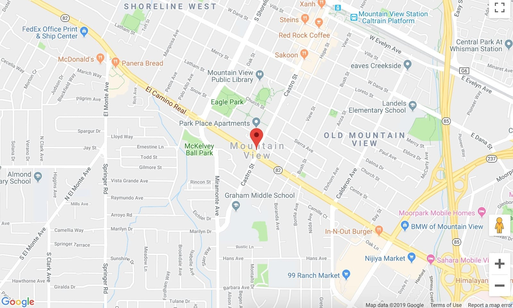
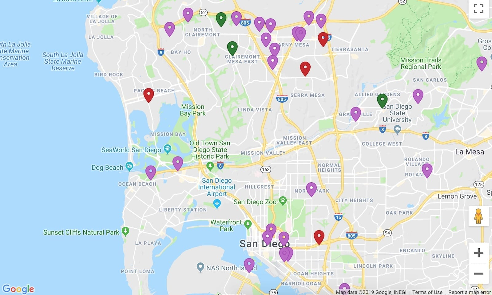

When we're using the Google Maps API and adding a marker into our map instance, by default we'll end up with this red pin figure.



However, when we're displaying a bunch of markers that can be grouped into different categories, it's useful that each marker category has a different visual cue. In the past, I usually use a PNG image to replace the default marker; where each category has different image URL. We can pass the image URL to the `icon` property like so:

```js
const marker1 = new google.maps.Marker({
  map: myMapInstance,
  position: { lat: 40, lng: -100 },
  icon: './path/to/image1.png',
});

const marker2 = new google.maps.Marker({
  map: myMapInstance,
  position: { lat: 41, lng: -100 },
  icon: {
    url: './path/to/image2.png', // Or pass it as an object
  },
});
```

But this approach is not flexible. When there's a new marker category added, we have to find or create a new marker image and tweak the color to suit our need. Luckily we can now pass a [`Symbol`](https://developers.google.com/maps/documentation/javascript/reference/marker#Symbol) to the marker's `icon` property. With `Symbol`, we can pass an SVG path notation to use as a marker. This way we can easily configure each marker's color programmatically.

```js
// Marker SVG Path: https://material.io/tools/icons/?icon=place&style=baseline
const MAP_MARKER = 'M12 2C8.13 2 5 5.13 5 9c0 5.25 7 13 7 13s7-7.75 7-13c0-3.87-3.13-7-7-7zm0 9.5c-1.38 0-2.5-1.12-2.5-2.5s1.12-2.5 2.5-2.5 2.5 1.12 2.5 2.5-1.12 2.5-2.5 2.5z';

const marker = new google.maps.Marker({
  map: myMapInstance,
  position: { lat: 40, lng: -100 },
  icon: {
    path: MAP_MARKER,
    fillColor: '#BA68C8',
    fillOpacity: 1,
    strokeColor: '#AB47BC',
    anchor: { x: 12, y: 24 },
  },
});
```

The `path` property is the SVG path notation. In the example above we use the SVG path for the place icon from the [Material Icons](https://material.io/tools/icons/?icon=place&style=baseline) bundle. We also set the `anchor` property to place the tip of the icon precisely at the given `position` (The default SVG dimension from Material Icons is 24x24).

Now, all we have to do is set the `fillColor` and `strokeColor` properties to configure the marker's color. Both `fillColor` and `strokeColor` accept all CSS3 color values. We can use either hex notation, RGBa function, or even HSLa function.

If the marker is too small, we can also set the `scale` property to make it bigger.

```js
const marker = new google.maps.Marker({
  map: myMapInstance,
  position: { lat: 40, lng: -100 },
  icon: {
    path: MAP_MARKER,
    scale: 1.4, // > 1 to make it bigger
    fillColor: 'rgba(186,104,200,1)', // Use RGBa function
    fillOpacity: 1,
    strokeColor: 'hsla(291,47%,51%,1)', // Use HSLa function
    anchor: { x: 12, y: 24 },
  },
});
```

Our marker's color is easily configurable now. No need to edit the image when we need to change the marker's color.


